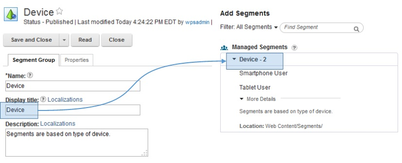
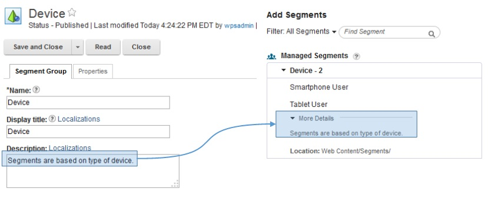

# Creating managed segments in your web content library

You can create managed segments in your web content library so that you can target content to specific segments of users.

Before you create **Segments**, ensure that your system administrator has set up the proper access control permissions. Go to the *Access permissions for Business Rules* table in [Access permissions](../../../../../../deployment/manage/security/controlling_access/resources_roles/sec_acc_rights.md) for more information.

Managed segments help you split your audience into meaningful groups that share characteristics. You can create segment groups and segments by completing the **Segment Group** form. The information that you provide on the form appears in the Add Segments dialog when you configure a spot for targeted content.

1.  Click the **Applications menu** icon. Then, click **Content** \> **Web Content Authoring**.

2.  From the Library Explorer, click **New** \> **Segment Group**.

3.  Enter the **Name** and **Display title** of the new segment group. The **Display title** is the text that is displayed as the segment group name in the Add Segments dialog when you configure a spot for targeted content. If you do not enter a display title, the name of the segment group is displayed by default.

    

4.  You can enter a description of the segment group in **Description**. Descriptions are especially useful if multiple content authors are creating targeted content and need to understand what kinds of segments are included in each segment group. If you enter a description, it appears in the More Details section of the Add Segments dialog.

    

5.  Select the **Location** where you want to save the segment group.

6.  Add segments to the segment group. You can add one or multiple segments to the group. After you click **Save**, a summary view of your new segments appears. For example, if you add segments that are called Smartphone User and Tablet User to the segment group, you see the name, attribute, and condition of each new segment in the summary view. To learn more about adding segments through an example, see [Example: Creating managed segments](contarget_segments_mgd_example.md).

    

7.  Click **Save and Close**.

You can now use this segment group to target different content to different segments.

**CF08 limitation:** A segment, that is stored in a segment group, is used to target content. Therefore, a content item is associated with this segment in a content targeting rule. When this content targeting rule is run when the page that contains that web content viewer portlet is loaded, the segment group is cached by Personalization. Afterward, the cached segment group is used until the cached entry times out. Any edits to the segment group do not invalidate the cache. Therefore, any updates to any segments are not reflected with the content targeting until the cached entry is expired due to timeout. This timeout takes approximately 5 minutes by default. This limitation will be addressed in a future Combined Cumulative Fix. Contact your Administrator to change the cache timeout in the Personalization settings file. You can also refresh the cache by running the Personalization rule in preview.

!!! note
    If you do not want to see managed segments in the Add Segments view, your developer can disable the managed segments. Learn more about enabling and disabling managed segmentsat [Enabling and disabling segments in the Add Segments view](../../../../site_prep_content_author/contarget_enable_disable_segments.md) in the HCL Product Documentation.

<!--- 
-   **[Example: Creating managed segments](contarget_segments_mgd_example.md)**  
Learn more about creating managed segments through an example. --->

