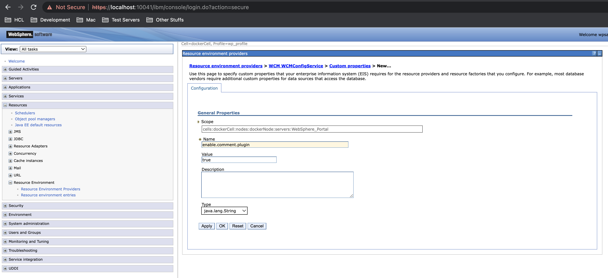
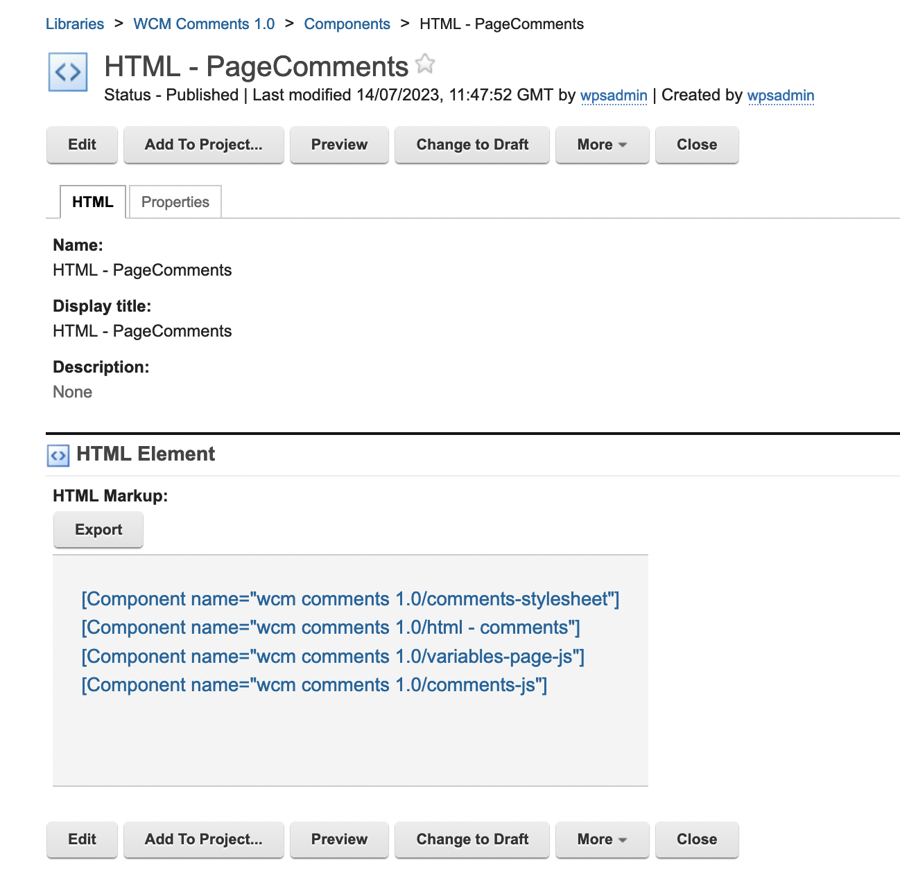
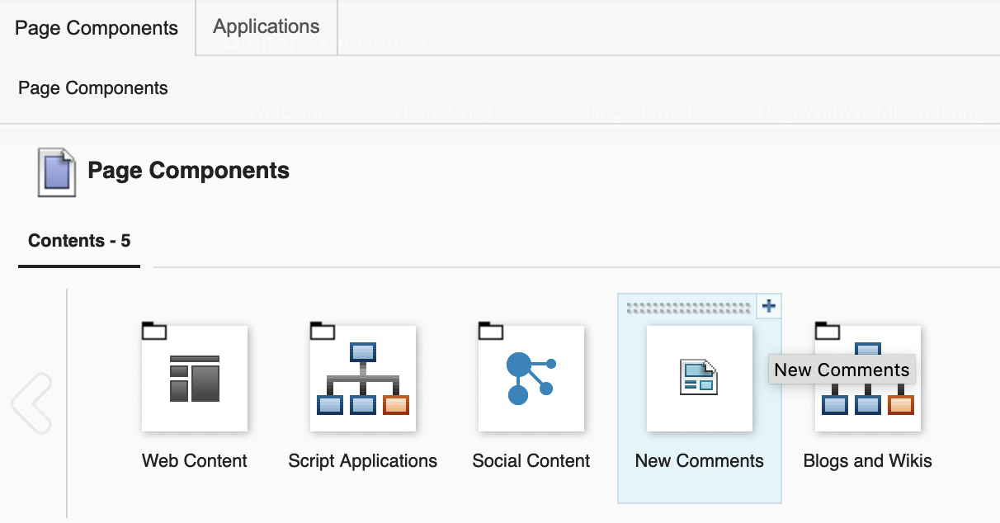
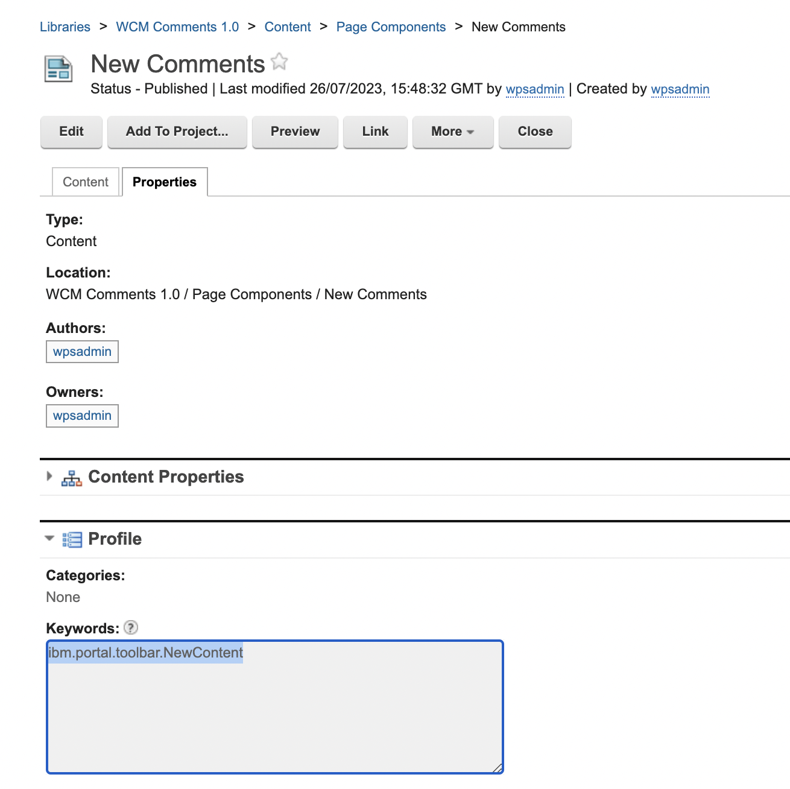
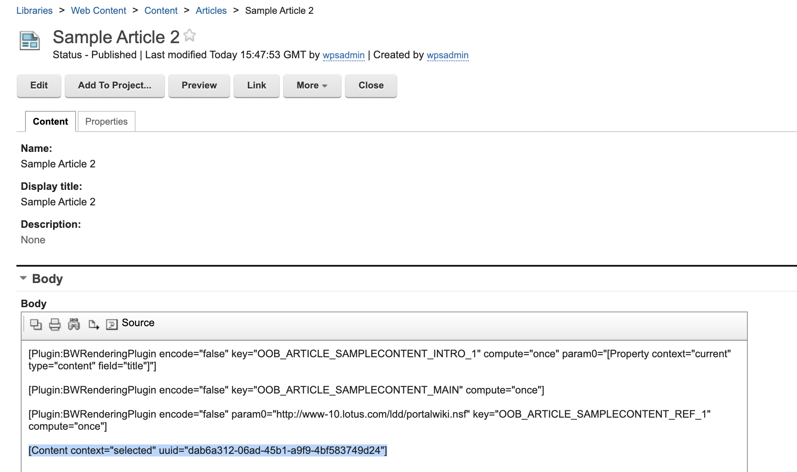
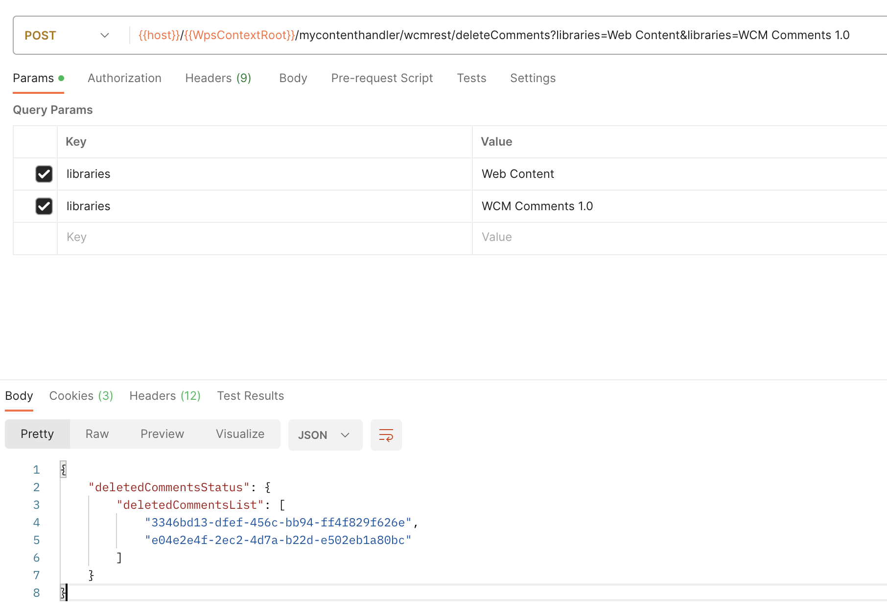

# Comments in WCM

Starting from CF213, the product contains a new solution that allows users to leave comments for Web Content Manager (WCM).
These comments can be used in Intranet scenarios or in controlled settings allowing external comments. 

## WCM Comments as Custom Plugin Component

Starting from CF213, WCM Comments can be enabled as Custom Plugin Component for a WCM content which can be rendered on page and Web Content Viewer​ Portlet.

This section describes how to enable, configure, and disable the WCM commenting solution as as Custom Plugin Component for a WCM content.

### Overview

WCM Comments is a feature that allows customers to enhance their presentation template by adding in a plugin for commenting. The actual comments are also stored in WCM and can be managed like regular content. You can choose which library is being used for storing the comments.

Note that this solution is not related to the existing comments for blogs/wikis ability.

### Enabling the comments plugin in WAS Console 

To make the comments plugin visible in the plugin component tag which should be added to presentation template, you must first add the configuraton in WAS Console. In WAS Console, go to **Resources > Resources Environment Providers > WCM_WCMConfigService > Custom properties > New Property**. Enter the following details:

- Name: enable.comment.plugin
- Value: true
- Type: String

!!!important
    After adding the configuration, a JVM restart is required.



### Adding Admin User Group Configuration in WAS Console for User Access Control (Optional)

By default, if the configuration for the admin user group is not present in the console, only users with manager-level access can delete comments.

For security purposes, if you need to limit the delete comments option to a specific user group, you must add the following configuration. In WAS Console, go to **Resources > Resources Environment Providers > WCM_WCMConfigService > Custom properties > New Property**. Enter the details below:

- Name: comments.admin.group
- Value: cn={user-group},o=defaultWIMFileBasedRealm
- Type: String

**user-group** can be any user group such as managers, admins, editors, etc.


### Adding Custom Plugin

1. To use the custom plugin, add it to **Libraries > Web Content > Presentation Templates > Article Presentation**.
2. In the **Presentation Template Options**, click the **Insert Tag** button to add the custom plugin.
3. In the **Insert Tag** window, select the following values:
    - In **Select a tag type** field, select **Plugin Component**.
    - In **Select a plugin type** field, select **Content**.
    - In **Select plugin to reference** field, select **NewCommentRenderPlugin**. 

4. Click **OK** after selecting all the values.
5. The plugin tag for custom plugin is added on the Article Presentation body. Click **Save and Close** to save changes.

!!!note
    You can specify the library you want to use for storing comments in the commentsLibrary field.
6. Set up and view the Comments UI on the page. 
    1. Click **Create Page** and add the content created in Step 5. 
    2. Using the Web Content Viewer portlet, select the content to render.
    3. Click **OK**.

After setting up the comments UI on the page, you can now add, reply, like/unlike, and delete comments. You can also view the total comments count on the content item.


## Render WCM comments in external components

Starting from CF214, WCM comments can be rendered in the external components like Page Components, Rich Text or Script applications etc. In this case, enabling and configuring Custom Plugin Component for WCM comments as described in the previous section is not required.

This section gives an overview about the page component shipped as a part of CF214 and also describes how to configure WCM comments in the external components like Rich Text Editor and Script Application.

### Overview on Custom Page Component for WCM Comments

Starting from CF214, the default WCM Comments library is shipped with a new custom page component, additional authoring template that uses newly added presentation template for rendering the WCM comments HTML markup component inside the newly added page component.

This section gives an overview on the components related to the newly shipped page component.

#### Authoring Template of Page Component


#### Presentation Template of Page Component


#### WCM comments HTML markup component



#### Newly added Custom Page Component


#### Page Component accessible in Site Manager

Only admin users can view the new page component mentioned above in the site manager under "Page Components Tab"



#### Showing and Hiding Comments Page Component in Site Manager

For showing comments page component in Site Manager, we need to add a keyword with the value ```ibm.portal.toolbar.NewContent``` for Keywords property under the Profile section. Removing the keyword will hide the comments page component from Site Manager.



### Rendering and Configuring New Page Component having WCM comments HTML markup component on the Page

1. Open the site manager in the edit mode and add the newly shipped page component mentioned above to any page where comments functionality needs to be enabled. Once page component is added to the page, WCM comments UI will be visible. 
2. Specify the library name to be used for storing the comments in the below text field.

3. Specify the content UUID to which comments need to be added in the below text field.


After setting up the page component with comments UI on the page, add, reply, like/unlike, and delete comments operations can be done. Also the total comments count on the content item can be viewed. 

### Rendering and Configuring WCM comments HTML markup component in Rich Text Editor

1. Navgate to the content to which WCM comments feature needs to be available and edit the content. Now, add New Page Component having WCM comments HTML markup component to Rich Text Editor

2. In the **Rich Text Editor**, click the **Insert Tag** button to add the WCM tag.
3. In the **Insert Tag** helper window, select the following values:
    - In **Select a tag type** field, select **Content**.
    - In **Context** field, select **Selected**.
    - In **Content Reference** field, select **New Comments content under WCM Comments 1.0/Page Component**. 

4. Click **OK** after selecting all the values. 
5. Currently, we have some CSS alignment issue as limtation while rendering comments inside Rich Text. To avoid it, follow the below instruction.
    - Click on **Source** button in the **Rich Text Editor**
    - Remove **<p dir="ltr" style="margin: 0px;"></p>** from the last line of the body 
    - Enclose Content tag which you added as a part of Step 3, inside the div blocks exactly as mentioned below ```</div><div>[Content context="selected" uuid="dab6a312-06ad-45b1-a9f9-4bf583749d24"]</div><div>```
6. Save the content to enable the commenting feature for that particular content and after setting up the comments UI on the rich text editor, this content can be added to any page.
7. Once WCM Comments UI is rendered for the content on the page, specify the library name to be used for storing the comments in and current content UUID similar to the steps mentioned in the previous section.
8. After following the above configuration steps, add, reply, like/unlike, and delete comments operations can be done. Also the total comments count on the content item can be viewed. 

Status on Step 4:


Status after Step 5:


### Configuring WCM comments in Script Application

1. In the Edit mode, Open the Site manager and navigate to Applications tab > Script Application and add it to the page

2. Edit > Actions (top right of the page) > Insert WCM Tag which opens **Insert Tag** helper window
then select our page component (WCM Comments 1.0/Page Component)

3. In the **Insert Tag** helper window, select the following values:
    - In **Select a tag type** field, select **Content**.
    - In **Context** field, select **Selected**.
    - In **Content Reference** field, select **New Comments content under WCM Comments 1.0/Page Component**. 

4. Click **OK** after selecting all the values.
5. Save (Top right)

6. Close the Script Applications Editor Window
7. Once WCM Comments UI is rendered in the script application added to the page, specify the library name to be used for storing the comments in and current content UUID similar to the steps mentioned in the previous section.
8. After following the above configuration steps, add, reply, like/unlike, and delete comments operations can be done. Also the total comments count on the content item can be viewed. 

## Access Roles and Permissions for WCM Comments

Only authorized users can view, edit, and delete the comments in the library where the comments are stored. Also, the users should have atleast view access to WCM content library. For more information, see [Managing users and groups](../../../deployment/manage/security/people/authorization/controlling_access/managing_users_groups/index.md). 

The actions available for a user depend on their role:

- The **User** role or higher is required to see the comments.
- The **Contributor** role or higher is required to create comments.
- The **Manager** role or higher is required to delete comments. In addition to the Manager role, you can configure a specific group solely for deleting comments.

## Limitations

- Nested replies to comments are yet supported.
- Posting and replying are limited to 500 characters. 
- Rendering Comments outside the WCM rendering process (for example, from REST or a custom Servlet or JSP via the java WCM API) is not yet supported.

## Update global "Article" presentation template

If you want to perform a replacement of the OOB components that are shipped, see [Adding the sample web content libraries in the authoring portlet](../../../manage_content/wcm_delivery/deliver_webcontent_on_dx/getting_started/creating_contentsamples/wcm_delivery_ctsamples_libraries.md).

## Cleanup orphaned comments data stored in the comment's library.​

Starting from CF214, a new API is available for soft deleting all the comments data that do not have mapping with actual content.

Pass all the library names that contain the orphaned comments data, in libraries query paramater. Note that the orphaned comment data will be inside ```Comments``` site area of each of the library that is being passed.  


Sample request is as follows:

{{host}}/{{WpsContextRoot}}/mycontenthandler/wcmrest/deleteComments?libraries=Web Content&libraries=Demo Library​

Sample Response body is as follows: 

```
{
    "deletedCommentsStatus": {
        "deletedCommentsList": [
            "3346bd13-dfef-456c-bb94-ff4f829f626e",
            "e04e2e4f-2ec2-4d7a-b22d-e502eb1a80bc"
        ]
    }
}
```




Leverages existing feature for purging WCM deleted content: https://opensource.hcltechsw.com/digital-experience/CF212/manage_content/wcm_development/wcm_rest/wcm_rest_deleted_content/wcm_rest_crud_purge_deleted/?h=purge
