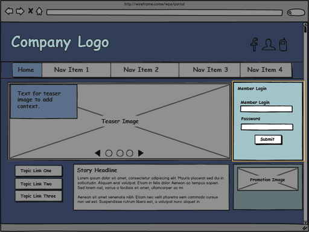

<!---  --->

Portlets are small applications that are independently developed, deployed, managed, and displayed. After the portlet is deployed, you can use it multiple times on different pages.

Almost everything on a page is rendered through a portlet. The portlet can provide access to enterprise data, content that is stored in HCL Web Content Manager, and external content from third-party sources. In the following image, there are five portlets on the page, but only one is highlighted. The highlighted Member Login Portlet is providing access to the enterprise LDAP user registry to enable members to authenticate.

## Application palette

Content authors access portlets from the **Applications** palette \(**Create** \> **Applications**\).

## Content portlets

Specialized portlets are available to render content.

-   **Web Content Viewer**

    Renders content from Web Content Manager. When an author drags content from the **Content** palette onto a page, the content is rendered by using the Web Content Viewer Portlet.

-   **Web Dock Portlet**

    Renders content from third-party sources. And administrator must configure the content provider source and associate it with a Web Dock application. Then, content authors can add the Web Dock Portlet to a page.

-   **Syndicated Feed Portlet**

    Gets feeds from third-party feeds.

## Administration portlets

Use administrations portlets to configure portal. Administrations portlets are immediately available after you install the portal. To get to the administration portlets, click the **Administration menu** icon in the toolbar. Administration portlets are also available in the **Applications** palette.

