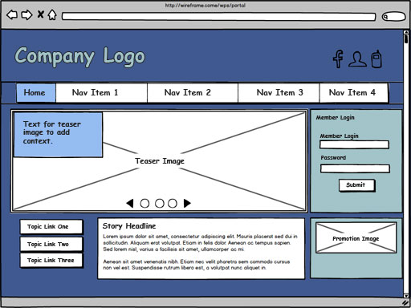

# Themes

The theme controls the presentation layer of your website. The theme profile contains modules and controls which modules load per page. A skin surrounds the portlet on a page.

To some extent, the theme governs aspects of the entire website. In the following wireframe, the theme controls the navigation placement, the styles and branding, the visual treatment of portlets on the page, the JavaScript modules that are available, and more.

## Introduction

In addition to branding, themes provide a wide range of capability. The theme includes page layouts, styles, and modules. The page layouts and styles are visible to content authors from the site toolbar. Modules within a theme are grouped into profiles. Profiles are associated with pages to ensure each page loads the appropriate modules.

The default theme, Portal 8.5, is designed using Responsive Web Design principles. Therefore, the site renders well on mobile devices. You can make a copy of this theme and customize it.

## Theme profiles

Use profiles to load only the modules that are required for a page. If a portlet require specific extra modules, you can group those modules into a profile. Then, assign the profile to the page that contains the portlet. For example, the Web Dock Portlet requires extra modules to render third-party content in an iFrame. Those modules are grouped into a profile called Web Dock profile. Only the pages that contain Web Dock Portlets need to load the additional modules. Assign the Web Dock profile to pages that contain the Web Dock Portlet. Pages that do not contain a Web Dock Portlet do not need to waste resources loading extra modules.

!!! note 
    Starting with CF03, the Web Dock profile no longer exists. If you are using the Resource Aggregator for Portlets, no additional steps are necessary. If you are not using the Resource Aggregator for Portlets, add the **wp\_webdock** module to an existing profile on your page. You do not need any extra profiles when module autoLoad is turned on.

## Skins

Skins include more capability and can be used to visually indicate portlets on a page. However, depending on your website design that might not be wanted. The skin that is immediately available and active is a hidden skin. On the rendered website, the skin is not visible. However, the hidden skin is visible when Edit Mode is on. The outline of each portlet helps the author identify the portlets on the page. The skin also includes capability for inline editing.

<!---
-   **[JavaScript libraries](site_jslib.md)**  
HCL includes JavaScript libraries to support various features. --->

???+ info "Related information:"
    - [Included profiles](../../../themes_skins/the_module_framework/specify_profiles/themeopt_mod_oob_profile.md)
    - [Modules that are provided with the modularized theme](../../../themes_skins/the_module_framework/oob_modules/index.md)
    - [Default skins](../../../themes_skins/customizing_theme/skins/themeopt_cust_skindefault.md)
    - [Customizing the theme](../../../themes_skins/customizing_theme/index.md)

