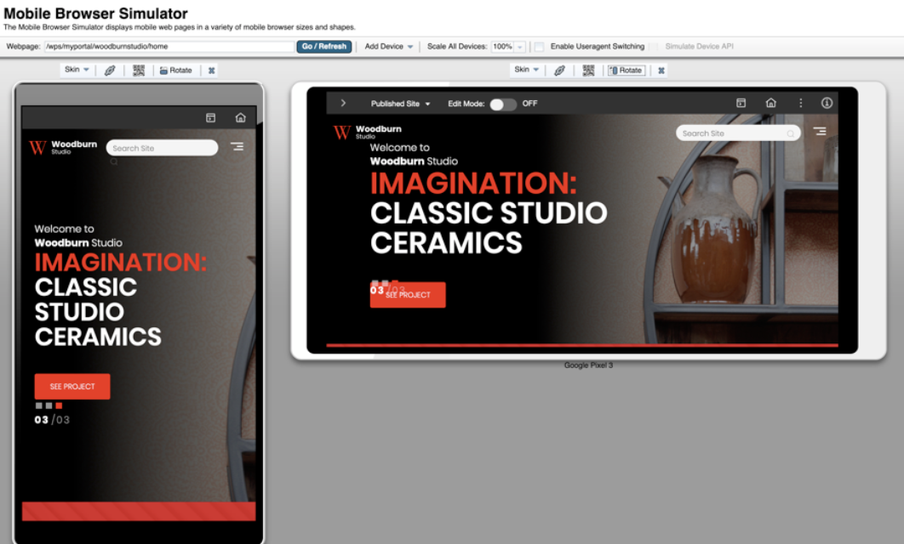

# Mobile Preview

Use the Mobile Preview simulator to view the presentation of Digital Experience site page components on select mobile devices.

!!! note
    The Mobile Preview simulator is provided with HCL Digital Experience CF19 release as a sample and is not yet supported for production use. The support policy for this HCL DX component will be updated at a future CF update release.

!!! note
    To enable user switching in the Mobile Preview, you must enable [Mobile Browser Simulator UserAgent Switcher](https://chrome.google.com/webstore/detail/mobile-browser-simulator/dcljefehlpjmoefgoohaobehbenocmkg) extension in Chrome.

## Mobile Preview Simulator Installation and Usage

This section provides information on the usage of the Mobile Preview Simulator in websites developed using HCL Digital Experience software.

## Installation

The Mobile Preview Simulator is enabled by default in HCL Digital Experience 9.5 CF19 and later releases and deployed along with the [Practitioner Studio](../practitioner_studio/index.md) and [Woodburn Studio demo site](../woodburn_studio/index.md).

Access the Mobile Preview Simulator

After verifying access to Practitioner Studio, the Mobile Preview Simulator can be accessed with the following URL:

/wps/mobilepreview/MobileBrowserSimulator/index.html

The Mobile Preview image and action appears at the top right, just below the Woodburn Studio site menu as shown in the following figure.


Append the following query to the URL to set the HCL Digital Experience page to display initially:

`?webpage=<URL-to-page>`

For example, this URL example shows a specific page URL request to present using the Mobile Preview Simulator:

`/wps/mobilepreview/MobileBrowserSimulator/index.html?webpage=<URL-to-page\>`

## Usage

There are multiple ways to apply and use the Mobile Preview Simulator on HCL Digital Experience sites. Options created for use are listed as follows.

Option 1: Add an icon to a content or page template to launch the Mobile Preview simulator

An icon can be used in a DX Content or Page template to launch the Mobile Preview simulator:

1.  **Create a new Content Item** \(reference the [Create Content Items](../../manage_content/wcm/mng_content_with_auth_portlet/creating_items/creating_content_items/index.md) topic for additional information\) for use with the designated Authoring Template or Page Template, that renders the following HTML:

    ```
    [IfEditMode]
    <h2>Mobile Preview Icon</h2>
    [/IfEditMode]
    
    [IfNotEditMode]
    [Plugin:ifNotDevice class="smartphone" class="tablet"]
    <link rel="stylesheet" type="text/css" href="https://cdnjs.cloudflare.com/ajax/libs/font-awesome/4.7.0/css/font-awesome.min.css">
    
    <style>
    #mobile-preview-[Property field="id" type="content" context="current"] {
        position: fixed;
        bottom: 10px;
        left: 10px;
        width: 36px;
        height: 36px;
        background-color: #eeeeee;
        text-align: center;
        border: 0px solid transparent;
        border-radius: 5px;
    }
    #mobile-preview-[Property field="id" type="content" context="current"] a {
        background-color: transparent;
        border: none;
        color: #272727;
    }
    </style>
    
    <div id="mobile-preview-[Property field="id" type="content" context="current"]" class="stBannerIcon stLeft visible-lg">
        <a href="#" onclick="javascript:void(window.open('/wps/mobilepreview/MobileBrowserSimulator/index.html?webpage='+window.location.pathname,'_blank'))" title="Mobile Preview">
            <i class="fa fa-3x fa-mobile"></i>
        </a>
    </div>
    [/Plugin:ifNotDevice]
    [/IfNotEditMode]
    ```

2.  In the specified Content or Page template, include the Content item created in Step 1 as a Content Item that launches the Mobile Preview simulator as a button directly on a page \(by using Specified Content on the Web Content Viewer\).

    ```
    <c:set var="mobilePreview" value="${pageContext.request.contextPath}/mobilepreview/MobileBrowserSimulator/index.html?webpage=${fn:escapeXml(wp.selectionModel.selected.urlGeneration.noNavigationalState.allowRelativeURL)}"/>
    
    <portal-logic:if loggedIn="yes">
      <div class="wb-mobile-preview-container">
        <a href="${mobilePreview}" id="mobile-preview-link" target="_blank">
          
        </a>
      </div>
    </portal-logic:if>
    ```


Option 2: Reference the Mobile Preview simulator for launch in an HCL DX theme

!!! note
    Option 2 requires the content item created in Option 1 as shown previously.

1.  As shown in the following example, the Mobile Preview simulator can be referenced for launch in a Simple Theme, using the `st_wcm_content` Dynamic Content spot:

    ```
    <a rel="dynamic-content" href="dyn-cs:id:st_wcm_content?path=myLibrary/mySiteArea/mobilePreview.html"></a>
    ```


Option 3: Access the Mobile Preview simulator from a Dynamic Content Spot configured to the Woodburn Studio demonstration site

In Woodburn Studio demonstration site delivered in HCL DX 9.5 CF19 and later releases, the Mobile Preview Simulator is added as a Dynamic Content Spot in the default theme.html. This serves to make the simulator capability available to all of the Woodburn Studio demonstration site pages by default. The code example below shows how the Dynamic Content Spot is added to the Woodburn Studio demonstration site:

```
<c:set var="mobilePreview" value="${pageContext.request.contextPath}/mobilepreview/MobileBrowserSimulator/index.html?webpage=${fn:escapeXml(wp.selectionModel.selected.urlGeneration.noNavigationalState.allowRelativeURL)}"/>

<portal-logic:if loggedIn="yes">
  <div class="wb-mobile-preview-container">
    <a href="${mobilePreview}" id="mobile-preview-link" target="_blank">
      
    </a>
  </div>
</portal-logic:if>  
```

```
<!-- mobile preview button -->
<a rel="dynamic-content" href="dyn-cs:id:MP_button"></a>
```

The following examples demonstrate use of the Mobile Preview simulator to view display of the Woodburn Studio demonstration site on mobile device displays.




