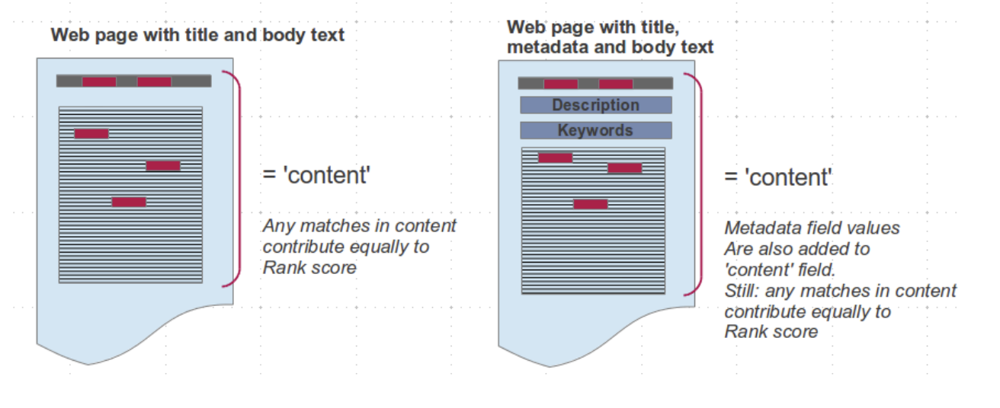

# Applying boost factors to specific fields (metadata)

The relevancy calculation does not account for the structural information of the content and the informative weight of keywords stored in individual metadata fields. For example if a search term appears in the title of a document, its contribution to the relevance score should be higher than an occurrence of that search term somewhere in a sentence in the body text of that document.

Values from metadata fields like 'title', 'description' or 'keywords' are automatically added to the generic 'content' field in the search index. When you perform a simple search without specifically pointing at a certain field, the search algorithm will contain hits in any of the mentioned default metadata fields. However, the information as to where the actual occurrence of a search term is, is not taken into account.

A feature is introduced (with HCL DX V8.0.0.1 CF209) which allows administrators to define which metadata fields to additionally focus on and how that field contributes to relevance calculation for a qualifying document.

To enable this field, the following search service configuration parameter is available:

Name: boostingSettings

Value: {"phraseBoost": {"Enabled":"true"}, "fieldBoost": [{"field":"title", "boost": 3.0}, 
{"field":"description", "boost":3.0}, {"field":"keywords", "boost":2.0}]}

`phraseboost`: not mandatory, but could add value (which is language dependent)

`fieldboost`: sample provided for default/commonly found metadata fields

This can also include other metadata fields with string-based values.

`boost` should be specified in a range between 1.0 to 10.0, and be used with care. This value is suggested to stay in the range between 1.0 and 3.0.

Example:
A user searches for the terms “Editing content in web content management”.

A qualifying document contains the terms 'edit' and 'content' in its title. In addition, all the terms appear in the 'description' field as well as the phrases 'editing content' and 'web content management' in the body text.

This document will have a very high relevance score because of the terms boosted due to their occurrences in 'title' and 'description', and the occurrences of the respective phrases in the body of the document.

About phraseboost and language dependency: if the "phrase" were a name, like 'John Smith', then an exact match on that phrase would get boosted. However, some languages also represent that same name as "Smith, John" which is not counted as a match given the order of the terms is reversed, and thus not a phrase.                                                                                                                                                                                                                                                                                                                                                                                                                                                                                                                                                                                                                                                                                                                                                                                                                                                      