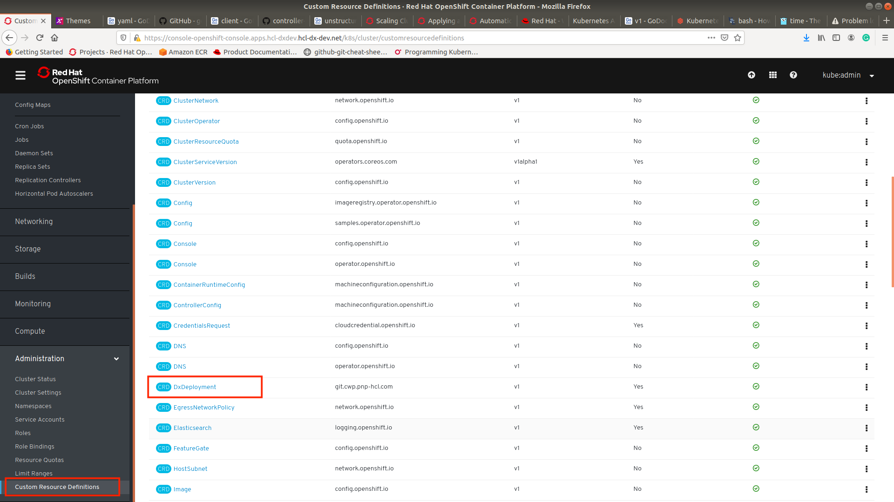
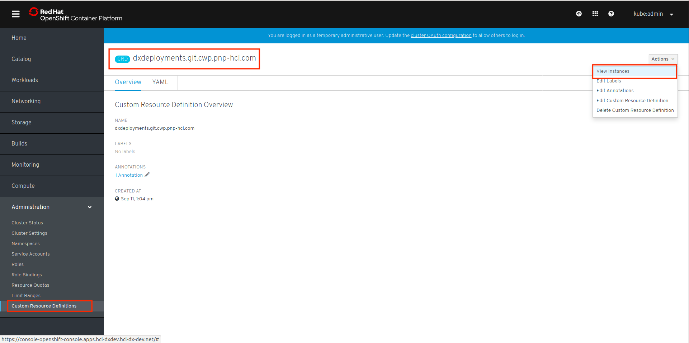

# Finding the OpenShift deployment \| HCL Digital Experience {#container_docker_deployment .task}

This section describes how to find your HCL Portal deployment.

Follow this procedure to find your HCL Portal deployment.

As an administrator, you can easily display a list of the DxDeployment instances in your environment.

-   Access the OpenShift console and navigate to **Administrator** \> **Custom Resource Definitions** and scroll to **DxDeployments**.

    

-   Click on the DxDeployment Custom Resource Definition.

    

-   In the upper right of the previous screen, in the **Actions** drop down, select **view images**. You will then see a list of the instances of DxDeployment.

    

**Parent topic:**[Deploy DX 9.5 Container to Red Hat OpenShift \| HCL Digital Experience](../containerization/openshift.md)

