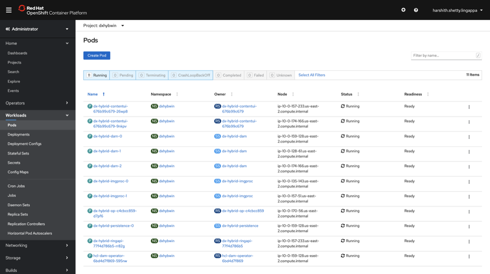
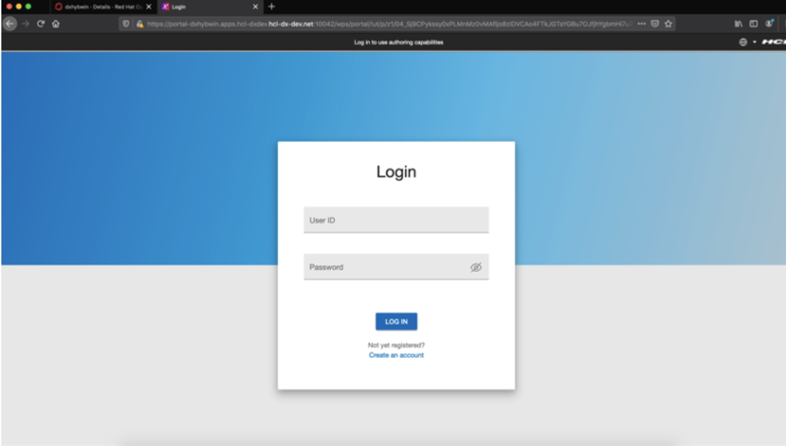
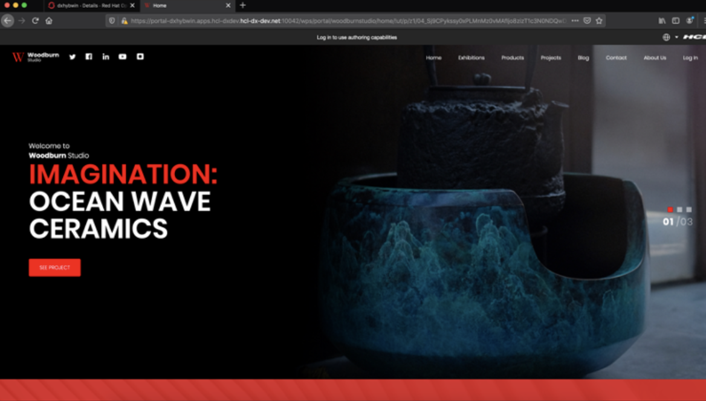
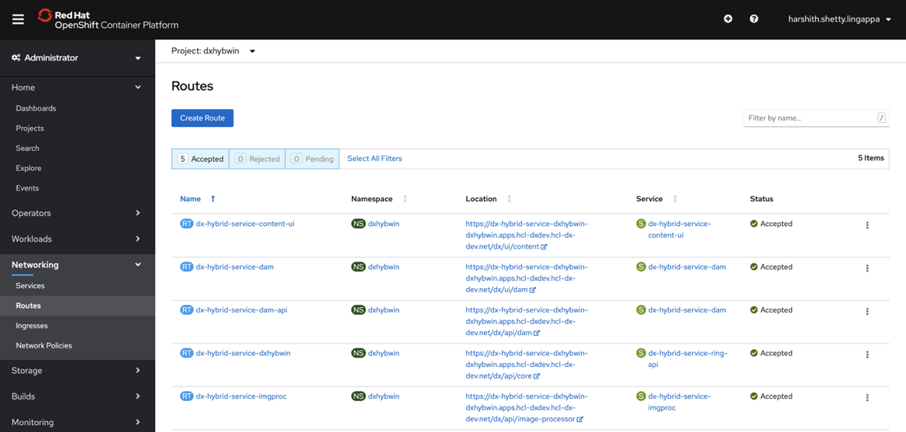
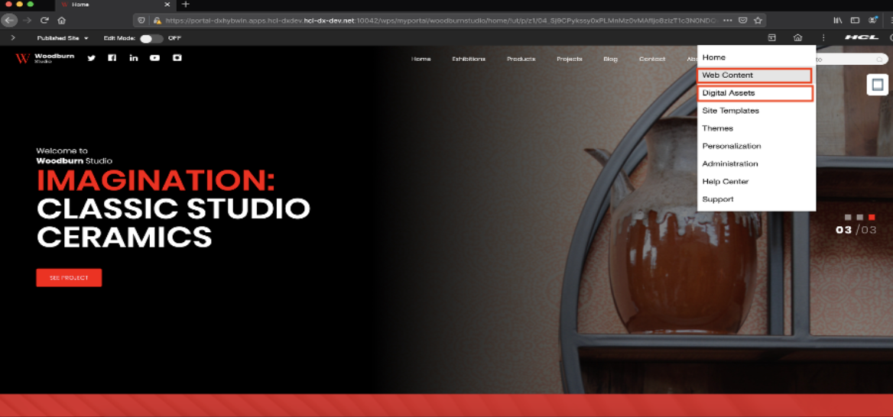

# Hybrid deployment - Operator \| HCL Digital Experience {#hybrid_deployment}

This section describes how to install HCL Digital Experience 9.5 Portal Server and Web Content Manager services to on-premises platforms, operating with Digital Asset Management, Content Composer, Experience API deployed to cloud-based Kubernetes and OpenShift platforms deployed using the Operator \(dxctl\) method.

## Overview {#section_hyq_vl4_pnb .section}

Many organizations are using cloud and containerized deployments as part of their overall systems environments. In parallel, organizations continue to operate software applications and processes on-premises. The HCL Digital Experience 9.5 Hybrid deployment reference architecture and topics describe an approach to deploy and manage HCL Digital Experience 9.5 core Portal Server and Web Content Manager services on premises, and connect to cloud native components Digital Asset Management, Content Composer, Experience API and related services in a production environment.

**Notes:**

-   The hybrid deployment of cloud-based components HCL Digital Asset Management, Content Composer, and Experience API is supported on Red Hat OpenShift with the HCL DX 9.5 CF19 release. It is not yet supported with an on-premises clustered environment. The HCL DX hybrid deployment model will be supported on additional Kubernetes platforms in later release updates.
-   Virtual Portal support with Content Composer is not yet supported. Support for this component in a virtual portal deployment model will be available in later releases.


## Prerequisites {#section_rkr_yn4_pnb .section}

-   HCL Digital Experience V9.5 CF19 or higher is deployed to supported on-premises platforms, in a standalone, cluster, or farm topology. See the [Roadmaps to deploy your Digital Experience 9.5 system](../../9.5/install/deployment_patterns.html) topic for more information.
-   Practitioner Studio has been enabled in the Digital Experience 9.5 CF19 or higher installation. See the [How to enable Practitioner Studio](../../9.5/practitioner_studio/enable_prac_studio.html) topic for instructions.
-   A common domain, using an SSL connection, is established for both the on premise HCL DX 9.5 CF19 and higher on-premises environment, and the target Red Hat Open Shift platform deployment to contain cloud native components HCL DX Experience API, Digital Asset Management and Content Composer. For example, mytargetcloud.dx.com and myonprem.dx.com would have the same domain: dx.com.
-   Single sign-on must be enabled on HCL DX 9.5 CF19 or higher on-premises environment. On DMGR or WAS Admin console under **Security** \> **Global Security** \> **Web & SIP Security** \> **Single Sign-On**, **Enabled** is checked and **Domain name** is set to common domain. For example, dx.com.
-   A high-performance network connection is established between the HCL DX 9.5 CF19 and higher on-premises environment, and the target DX Red Hat Open Shift platform deployment.
-   dxctl tool.
-   **Volume Requirement**: Requires an AccessMode of ReadWriteMany. Reference the [Storage Class and Volume](../../9.5/containerization/sample_storage_class_volume.html) topic for more information.

Ensure you have obtained a backup of the HCL DX 9.5 on-premises deployment. See the [Backup and Restore](../admin-system/i_wadm_c_bkup_restr_winlinux.html) topic for additional information.

## Enabling Hybrid Deployment support in the HCL Digital Experience 9.5 on-premises environment {#section_jbw_lmp_pnb .section}

Follow the steps below to enable Hybrid deployment support in the HCL Digital Experience 9.5 on-premises environment.

1.  Access the latest HCL DX 9.5 CF19 or higher release software from the [HCL Software License Portal](https://hclsoftware.flexnetoperations.com/flexnet/operationsportal/logon.do).

    The package will include the file hcl-dx-cloud-scripts, which should be downloaded and extracted to your local system. This will present the following deploy, dxctl and scripts directories as shown below:

    

2.  Configure Properties of the dxctl tool.

    Navigate to the dxctl/properties directory and open the hybrid-deployment.properties file in your favorite editor.

    

    Sample properties for deploying Digital Asset Management, Content Composer, and the Experience API for use with an on-premise DX environment are shown below. Use following example to modify the values in the dxctl/properties/hybrid-deployment.properties file to reflect your target Red Hat Open Shift environment to deploy the Content Composer, Digital Asset Management, and the Experience API components.

    **Note:** For a Hybrid deployment, the following items should be enabled and/or not included in the deployment:

    Enable
    :   `api.enabled(eAPI), composer.enabled(Content Composer)` and/or `dam.enabled(DAM)` to true.

    Not included
    :   **`**dx.tag**`**

    :   This is not required for a hybrid deployment as DX Portal and WCM is installed on premises.

    :   **`**dx.database**`**

    :   This is not required for a hybrid deployment as it is installed with DX Portal and WCM on premises.

    See the *Reference list* below for explanations of the file items.

    ```
    dx.namespace: dxhybwin
    dx.config.cors: https://portal-dxhybwin.apps.dxdev.dx-dev.net:10042
    hybrid.enabled: true
    hybrid.host: portal-dxhybwin.apps.dxdev.dx-dev.net
    hybrd.port: 10042
    api.enabled: true
    api.tag: v1.3.0_20201019-1240_develop
    composer.enabled: true
    composer.tag: v1.3.0_20201019-1239_develop
    dam.enabled: true
    dam.volume: dxhybwin-dam
    dam.stgclass: dx-deploy-stg
    dam.tag: v1.3.0_20201019-1259_develop
    imgproc.tag: v1.3.0_20201015-1133_develop
    override.ingress.host: dx-hybrid-service-dxhybwin-dxhybwin.apps.hcl-dxdev.dx-dev.net
    dam.operator.tag: v95_CF19_20201020_dev_build
    ```

    **Reference list**:

    -   `dx.namespace` - The project or the namespace to create or use for deployment.
    -   `dx.tag` - Tag of the latest DX HCL DX 9.5 Portal and Web Content Manager image.
    -   `dx.database` - By default, and initially, this is Derby. HCL DX 9.5 supports Apache Derby, Oracle Database, IBM DB2, or Microsoft SQL Server. Acceptable values are `derby`, `oracle`, `db2`, or `msSql`.
    -   `dx.config.cors` - URL of the on-premises HCL DX 9.5 CF19 or higher Portal and Web Content Manager server.
    -   `hybrid.enabled` - Boolean value to enable/disable.
    -   `hybrid.host` - URL of On-premises DX 9.5 Portal and Web Content Manager server without port.
    -   `hybrd.port` - Port of the on-premises HCL DX 9.5 CF19 or higher Portal and Web Content Manager server.
    -   `api.enabled` - Boolean value to enable/disable the Experience API.
    -   `api.tag` - Tag of the your Experience API image.
    -   `composer.enabled` - Boolean value to enable/disable Content Composer.
    -   `composer.tag` - Tag of the latest Content Composer image.
    -   `dam.enabled` - Boolean value to enable/disable Digital Asset Management.
    -   `dam.volume` - Volume for Digital Asset Management.
    -   `dam.stgclass` - Storage class for Digital Asset Management.
    -   `dam.tag` - Tag of your Digital Asset Management image.
    -   `imgproc.tag` - Tag of your Image-Processor image.
    -   `override.ingress.host` - Generated base URL of the route.
    -   `dx.operator.tag` - Tag of your hcldx-cloud-operator image.
    -   `dam.operator.tag` - Tag of your `Docker hcl-dam-operator` tag.

## Deploy using the dxctl tool {#section_flv_rmp_pnb .section}

1.  Login to the Red Hat OpenShift platform using Kubectl.

    Log in to the target Red Hat OpenShift platform using the following OpenShift command:

    ```
    $ oc login
    ```

    Enter your username and password in response to system prompts. See the example below:

    

2.  Deploy using dxctl.

    On your local workstation, navigate to the dxctl folder:

    ```
    $ cd ./hcl-dx-cloud-scripts/dxctl
    ```

    Execute the below command to deploy from the local workstation to the target Red Hat OpenShift platform to contain the HCL DX 9.5 CF19 and higher cloud native components using the dxctl tool based on configured properties:

    -   From a MacOS workstation:

        ```
        MacBook-Pro:macuser$ ./mac/dxctl --deploy -p properties/hybrid-deployment.properties
        ```

    -   From a Windows workstation:

        ```
        Cmd> ./win/dxctl -–deploy -p properties/hybrid-deployment.properties
        ```

        **Note:** On Windows 10 MD and PowerShell, rename the dxctl file to dxctl.exe and run the deploy command.

    -   From a Linux workstation:

        ```
        $ ./linux/dxctl –deploy -p properties/hybrid-deployment.properties
        ```


## Validate the Deployment {#section_xjq_wmp_pnb .section}

1.  Login to the Red Hat OpenShift Console.

    Login to OpenShift Dashboard Console with your credentials:

    

    Once logged in, search for the HCL DX 9.5 project:

    

    Ensure the deployment and pods are running and in a ready state.

    

2.  Access the HCL Digital Experience 9.5 on-premises server.

    Access the host URL of the HCL Digital Experience 9.5 on-premises deployment, which is defined in the hybrid-deployment.properties file and add the path below to the URL: /wps/myportal.

    

    Login to the HCL DX 9.5 on-premises deployment using your appropriate credentials.

    

    Once logged in, click the **Open Applications Menu** in the right top corner.

    

    If the **Web Content** and **Digital Assets** menu items do not appear in the menu selections, follow the steps below to enable Content Composer and Digital Asset Management using the Configuration Engine.


## Enable Content Composer and Digital Asset Management {#section_qzf_hnp_pnb .section}

1.  Locate the Content Composer and Digital Asset Management URLs.

    The URLs will match the location values of the Red Hat OpenShift route of the component.

    Copy the Content Composer and Digital Asset Management URL from the Red Hat OpenShift dashboard console and add the suffix/static as in the example below:

    

    -   **Content Composer – Content UI URL Example**: https://dx-hybrid-service-dxhybwin-dxhybwin.apps.comp-dxdev.hcl-dx-dev.net/dx/ui/content/static
    -   **Digital Asset Management UI URL Example**: https://dx-hybrid-service-dxhybwin-dxhybwin.apps.comp-dxdev.hcl-dx-dev.net/dx/ui/dam/static
2.  Navigate to the ConfigEngine service.

    Connect/login to the HCL DX 9.5 on-premises system and open a command line prompt. Navigate to the following path on your deployment:

    ```
    C:\> cd  <path to wp_profile>\ConfigEngine
    ```

3.  Enable Content Composer and Digital Asset Management to the Hybrid deployment.

    If the on-premises HCL DX 9.5 Portal and Web Content Manager deployment is installed to a Windows platform, execute:

    -   **Enable Content Composer**:

        ```
        <Path to wp_profile>\ConfigEngine\ConfigEngine.bat enable-headless-content -Dstatic.ui.url=CONTENT_UI_URL -DWasPassword=... -DPortalAdminPwd=...
        ```

        **Note:** In the command above, the CONTENT\_UI\_URL=Route URL is copied from the Red Hat OpenShift dashboard with `/static`.  `-DWasPassword=type` is the IBM WebSphere Application Server password and `-DPortalAdminPwd=type` is the DX admin password.

    -   **Enable Digital Asset Management**:

        ```
        <Path to wp_profile>\ConfigEngine\ConfigEngine.bat enable-media-library -Dstatic.ui.url=DAM_URL -DWasPassword=... -DPortalAdminPwd=...
        ```

        **Note:** In the command above, the DAM\_URL=Route URL is copied from the Red Hat OpenShift dashboard with `/static`. `-DWasPassword=type` is the IBM WebSphere Application Server password and `-DPortalAdminPwd=type` is the DX admin password.

    If the on-premises HCL DX 9.5 Portal and Web Content Manager deployment is installed to a Linux platform, execute:

    -   **Enable Content Composer**:

        ```
        <Path to wp_profile>\ConfigEngine\ConfigEngine.sh enable-headless-content -Dstatic.ui.url=CONTENT_UI_URL -DWasPassword=... -DPortalAdminPwd=...
        ```

        **Note:** In the command above, the CONTENT\_UI\_URL=Route URL is copied from the Red Hat OpenShift dashboard with `/static`.  `-DWasPassword=type` is the IBM WebSphere Application Server password and `-DPortalAdminPwd=type` is the DX admin password.

    -   **Enable Digital Asset Management**:

        ```
        <Path to wp_profile>\ConfigEngine\ConfigEngine.sh enable-media-library -Dstatic.ui.url=DAM_URL -DWasPassword=... -DPortalAdminPwd=...
        ```

        **Note:** In the command above, the DAM\_URL=Route URL is copied from the Red Hat OpenShift dashboard with `/static`. `-DWasPassword=type` is the IBM WebSphere Application Server password and `-DPortalAdminPwd=type` is the DX admin password.

    Once the above steps are completed, log in to the Digital Experience 9.5 deployment and validate the Web Content and Digital Assets menu items appear.

    **Example**:

    


**Parent topic:**[Digital Experience on containerized platforms](../containerization/deployment.md)

