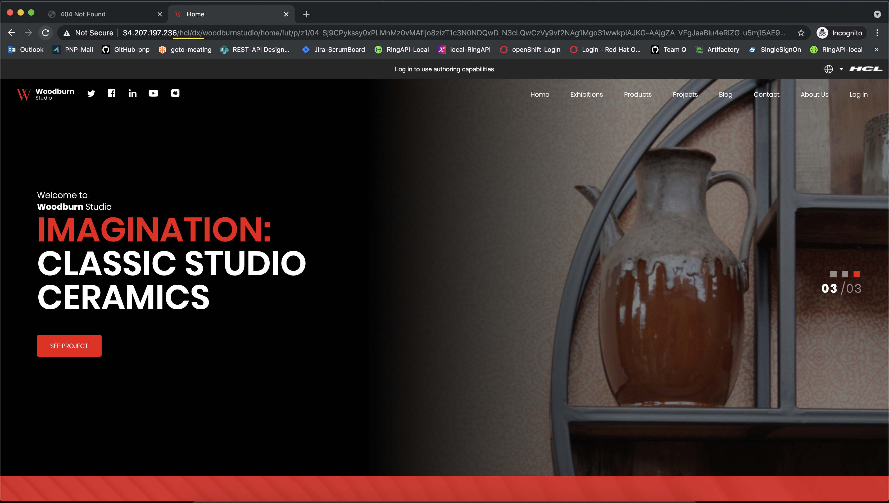
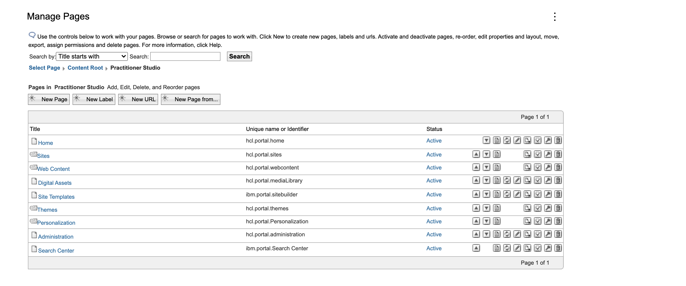
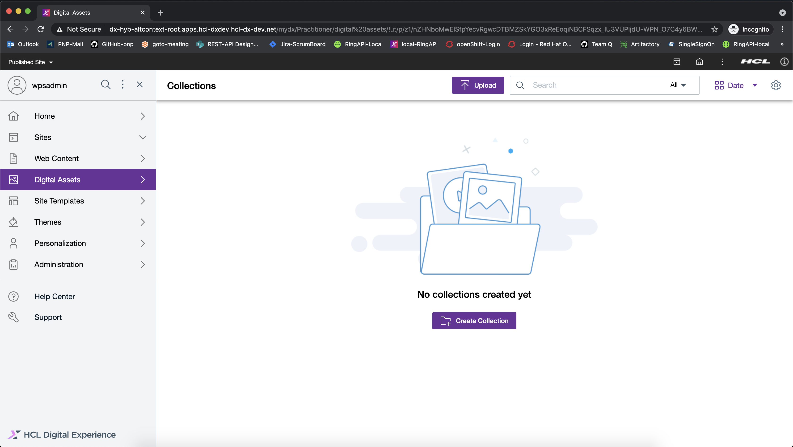

# Customizing the HCL DX URL for hybrid deployment \| HCL Digital Experience {#t_customize_dx_url_hybrid_deployment .concept}

HCL Digital Experience and Web Services for Remote Portlets are installed with a default URI or context root. This section describes how to change default URI or context root of the portal and hybrid deployment.

## Prerequisites {#section_uz1_rnv_jsb .section}

Refer to the following topic documentation for hybrid deployment prerequisites:

-   [Hybrid deployment - Operator](hybrid_deployment_operator.md)
-   [Hybrid Deployment - Helm](hybrid_deployment_helm.md)

## Customize the context root of the portal and hybrid deployment {#section_anf_tpv_jsb .section}

The following steps refer to a current running state of the HCL DX Experience on-premise:

-   

-   


1.  **Stop the HCL Digital Experience server.**

    Navigate to `wp_profile` inside your portal installed location and run the following command:

    ```
    ./bin/stopServer.sh WebSphere_Portal -user <username> -password <password>
    ```

    For example:

    ```
    ./bin/stopServer.sh WebSphere_Portal -user wpsadmin -password wpsadmin
    ```

    

2.  **Update context root in the config engine property files.**

    1.  Locate the wkplc.properties and wkplc\_comp.properties files in the wp\_profile/ConfigEngine/properties directory.

        For example:

        ```
        cd wp_profile/ConfigEngine/properties
        ```

        

    2.  Edit wkplc.properties file in the wp\_profile/ConfigEngine/properties directory and create a backup copy before you change any values.
        -   Enter the appropriate value for your environment in the `WpsContextRoot` property.

            For example:

            |Property|Default value|New values for Context-root|New values for No-context-root|
            |--------|-------------|---------------------------|------------------------------|
            |`WpsContextRoot`|`wps`|`hcl`| |
            | | | | |

    3.  Edit wkplc\_comp.properties file in the wp\_profile/ConfigEngine/properties directory and create backup copy before you change any values.
        -   Enter the appropriate value for your environment in the following properties:

            |Property|Default value|New values for Context-root|New values for No-context-root|
            |--------|-------------|---------------------------|------------------------------|
            |`WpsContextRoot`|`wsp/wsrp`|`hcl/wsrp`|`/wsrp`|
            |`WpsPersonalisedPath`|`myportal`|`mydx`|`mydx`|
            |`WpsDefaultHome`|`portal`|`dx`| |

        -   Save and close the file.

            **Note:** Do not enter the same value for `WpsPersonalizedHome` and `WpsDefaultHome`.

3.  **Open a command prompt and change to the wp\_profile/ConfigEngine directory.**

-   To change the context root for the values that you entered in the `WpsContextRoot`, `WsrpContextRoot`, `WpsPersonalizedHome`, and or `WpsDefaultHome` properties, run the below task:

    -   For AIX®, HP-UX, and Linux™ Solaris:

        ```
        ./ConfigEngine.sh modify-servlet-path modify-servlet-path-portlets -DWasPassword=<password> -DPortalAdminPwd=<password> -DWpsContextRoot=<value> -DWpsDefaultHome=<value> -DWpsPersonalizedHome=<value>
        ```

    -   For Windows:

        ```
        ConfigEngine.bat modify-servlet-path modify-servlet-path-portlets -DWasPassword=<password> -DPortalAdminPwd=<password> -DWpsContextRoot=<value> -DWpsDefaultHome=<value> -DWpsPersonalizedHome=<value>
        ```

    -   For IBM i

        ```
        ConfigEngine.sh modify-servlet-path modify-servlet-path-portlets -DWasPassword=<password> -DPortalAdminPwd=<password> -DWpsContextRoot=<value> -DWpsDefaultHome=<value> -DWpsPersonalizedHome=<value>
        ```

    -   For z/OS:

        ```
        ./ConfigEngine.sh modify-servlet-path modify-servlet-path-portlets -DWasPassword=<password> -DPortalAdminPwd=<password> -DWpsContextRoot=<value> -DWpsDefaultHome=<value> -DWpsPersonalizedHome=<value>
        ```

    For example:

    ```
    ./ConfigEngine.sh modify-servlet-path modify-servlet-path-portlets -DWasPassword=wpsadmin -DPortalAdminPwd=wpsadmin -DWpsContextRoot=hcl -DWpsDefaultHome=dx -DWpsPersonalizedHome=mydx
    ```

    

    **Note:** Check the output for any error messages before you proceed with the next task. If any of the configuration tasks fail, verify the values in the wkplc.properties and wkplc\_comp.properties files.

4.  **Start the HCL Digital Experience server.**

-   Navigate to `wp_profile` inside your portal installed location and run below command:

    ```
    ./bin/startServer.sh WebSphere_Portal -user <username> -password <password>
    ```

    For example:

    ```
    ./bin/startServer.sh WebSphere_Portal -user wpsadmin -password wpsadmin
    ```

-   Now, access the portal with the changed context root.
    -   

        

    -   

        

5.  Follow these steps for hybrid deployment based on changed context root.
    1.  Download the [dxctl tool](https://support.hcltechsw.com/csm?id=kb_article&sysparm_article=KB0077878&sys_kb_id=2cde06a31b885494c48197d58d4bcbe2).
    2.  Find to edit the hybrid-deployment.properties file located under hcl-dx-cloud-scripts/dxctl/properties directory.


        

    3.  Put the values for the following properties based on the DX portal context root changes made in previous steps:

        -   `dx.path.contextroot`
        -   `dx.path.personalized`
        -   `dx.path.home`
        To change the other properties, refer to Step 2 of [Enabling Hybrid Deployment support in the HCL Digital Experience 9.5 on-premises environment](hybrid_deployment_operator.md#).

        **Note:** When updating deployment, set the following properties if DX context root is configured in your existing deployment:

        |Property|Values for context-root|Values for no context-root|
        |--------|-----------------------|--------------------------|
        |`dx.path.contextroot`|`hcl`| |
        |`dx.path.personalized`|`mydx`|`mydx`|
        |`dx.path.home`|`dx`| |

        

        

    4.  Once the hybrid-deployment.properties file is ready, process the deployment by following below command:

        ```
        ./os/dxctl --deploy -p ./properties/hybrid-deployment.properties
        ```

        For example:

        

    5.  Once hybrid deployment is successful, then DAM and CC from the DX portal.

        

        

        **Note:** Make sure DAM and CC are enabled and the correct on-prem host is configured under **Manage Pages**. If DAM and CC are not enabled, refer to Step 2 of [Enabling Hybrid Deployment support in the HCL Digital Experience 9.5 on-premises environment](hybrid_deployment_operator.md#).

        Now, access HCL DX with no context root.

        -   

            

        -   

    6.  Refer to Ste 5-e for hybrid deployment and update the below properties in the hybrid-deployment.properties file as per no context root changes for DX portal.
        -   Once the deployment is successful, update the DAM and CC path from **Site Management** \> **Manage Pages** in DX Portal.

            

        -   Now, access DAM and CC in DX Portal.

            

            


**Parent topic:**[Digital Experience on containerized platforms](../containerization/deployment.md)

