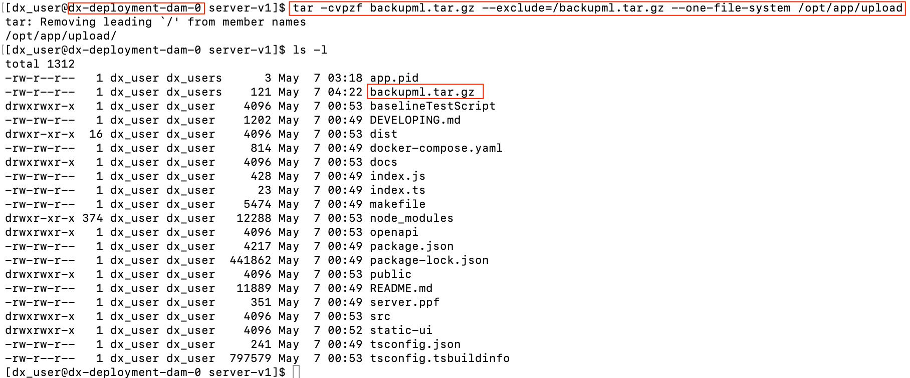
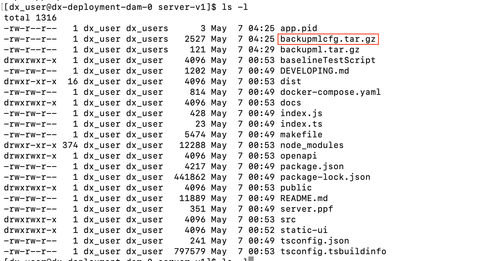

# Backup and Recovery Procedures 

This section shows the deployment architecture and provides the instructions to create and manage backup and recovery of HCL Digital Experience components in containerized DX 9.5 environments.

## Digital Experience 9.5 Container deployment architecture

Learn about the HCL DX 9.5 Container deployment architecture to get a better understanding of the backup and recovery options.

!!! note
    This topology is also available in the [Install the HCL Digital Experience 9.5 components](../../../../manage_content/digital_assets/installation/install_config_dam.md) topic.


## Instructions to back up the Digital Experience 9.5 Container components

The following sections describe how the administrators can create and manage backups and recovery of DX 9.5 Container components such as `wp_profile`, persistence layer - database, and the media in Digital Asset Management.

1.   **wp-profile backup**

    1.  Backup the file systems in the Digital Experience 9.5 container profile (**Persistent volume claim** `wp_profile`). Refer to the [Backup and restore](../../../manage/backup_restore/index.md) topic and component backup guidance for more information.

        !!! note
                    The HCL Digital Asset Management (DAM) component uploads folder and the DAM persistent mount for the primary instance dx-deployment-persistence-0 in the statefulset.

        To create a backup of the profile **Persistent volume claim** `wp_profile`, it is recommended that:

        -   The DX has only one instance.
        -   The DX 9.5 container instance is stopped using the HCL Portal and HCL Web Content Manager command as follows:

            ```
            kubectl exec --stdin --tty <DX_POD_NAME> -n <NAMESPACE> -- /bin/bash
            
            cd /opt/HCL/wp_profile/bin/
            
            /stopServer.sh WebSphere_Portal -username <USERNAME> -password <PASSWORD>
            ```

            

        -   The entire /opt/HCL/wp_profile directory is backed up.
        
            In the command line interface, run the following command to back up the Digital Experience 9.5 Persistent volume claim **wp_profile**:

        -   Before running the tar command, ensure that the backup file system that you are using has ~50% free profile.

            ```
            cd /opt/HCL/wp_profile
            
            tar -cvpzf backup.tar.gz --exclude=/backup.tar.gz --one-file-system /opt/HCL/wp_profile/*
            ```

        

        After the tar backup command is completed, it is recommended that a copy of the backup.tar.gz file is created and placed to alternate long term storage.

    -   **Recover from wp_profile pervasive volume backup**

        You can extract the backup of the wp_profile volume to recover any files you need to restore.

        If the version of the backup matches the current fixpack level, you can use the extracted files to populate the original pervasive volume.

        The procedure to do this depends on how the backup was created.

        Any changes that occurred after the backup was created will not be recovered.

        The portal database must be restored to the backup that was created when the backup of wp\_profile was created.

2.   **Persistence layer - database backup**

    Run the following command to back up the container components that are managed through the DX Persistence layer:

    ```
    pg_dump name_of_database > name_of_backup_file
    ```

    

    To back up the system components on a remote system:

    ```
       pg_dump -U user_name -h remote_host -p remote_port name_of_database > name_of_backup_file
    ```

    After the backup command is completed, it is recommended that a copy of the resulting file is created and placed to an alternate long term storage.

    See [Backup and restore a DAM image](../../../../manage_content/digital_assets/configuration/dam_backup_restore_image.md) for more information.

3.   **Digital Asset Management media backup**

    Use the following commands to back up the Digital Asset Management media uploads volume:

    1.  A command similar to the backup command outlined in Step 1 of [Backup and restore a DAM image](../../../../manage_content/digital_assets/configuration/dam_backup_restore_image.md) to create a backup of wp_profile can be used to back up the two `/opt/app/upload` and `/etc/config` Digital Asset Management mount points.

        -   Refer to the following examples:

            ```
               tar -cvpzf backupml.tar.gz --exclude=/backupml.tar.gz --one-file-system /opt/app/upload
            ```

            

        -   ```
               tar -C/ -cvpzf backupmlcfg.tar.gz --exclude=/backupmlcfg.tar.gz --one-file-system etc/config/*
            ```

            

            See [Backup and restore a DAM image](../../../../manage_content/digital_assets/configuration/dam_backup_restore_image.md) for more information.

        Alternatively, the [Kubernetes documentation](https://kubernetes.io/docs/home/) pages present additional options to backup and clone persistent volumes.

    2.  [Volume SnapShots: \(1.17 \[beta\] and later\)](https://kubernetes.io/docs/concepts/storage/volume-snapshots/){:target="_blank"}
    3.  [CSI Volume Cloning](https://kubernetes.io/docs/concepts/storage/volume-pvc-datasource/){:target="_blank"}
    !!!note
        If either of the methods described in [Step 2] as Volume Snapshots or [Step 3] as CSI Volume Cloning is used, it is important to understand fuzzy backups with the wp_profile.  A fuzzy backup is a copy of data files or directories that were operating in one state when the backup started, but in a different state by the time the backup completed. In case a volume snapshot or Container Storage Interface (CSI) volume cloning approach is used with the `wp_profile`, it is important that the snapshot is taken with the Digital Experience instance in shutdown state to ensure that recovery is performed.

        HCL Digital Experience has successfully tested the volume snapshot and CSI volume cloning methods with HCL Digital Experience 9.5 container deployments. It is recommended that customers perform the additional testing if they are using options Step 2 and Step 3 to manage the wp_profile backup.

<!-- ???info "Related information"
   - [Install the HCL Digital Experience 9.5 components](../containerization/install_config_cc_dam.md)
   - [Backup and Restore](../admin-system/i_wadm_c_bkup_restr_winlinux.md)
   - [Backup and restore DAM image](../digital_asset_mgmt/dam_backup_restore_image.html) -->
 

<!-- -   **[Restore Digital Asset Management image to previous version](../digital_asset_mgmt/dam_restore_image_operator.md)**  
This shows you how to restore the HCL Digital Experience 9.5 Digital Asset Management image to a previous version.
-   **[Back up and restore a DAM image](../digital_asset_mgmt/dam_backup_restore_image.md)**  
This topic shows you how to backup and restore for Digital Asset Management persistence and binaries in an Operator-based deployment using `dxctl`.
 -->

