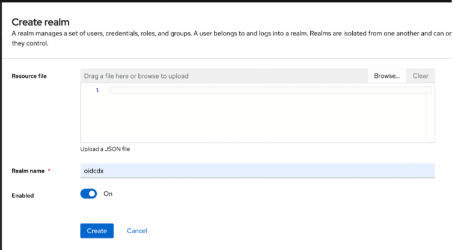
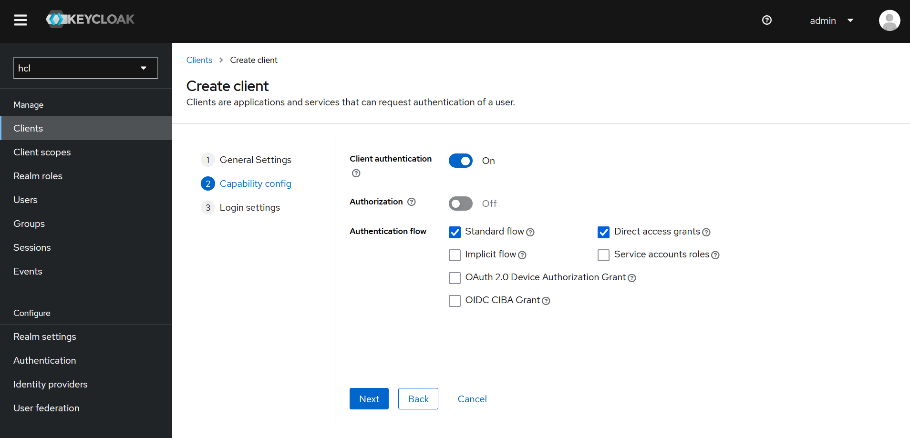
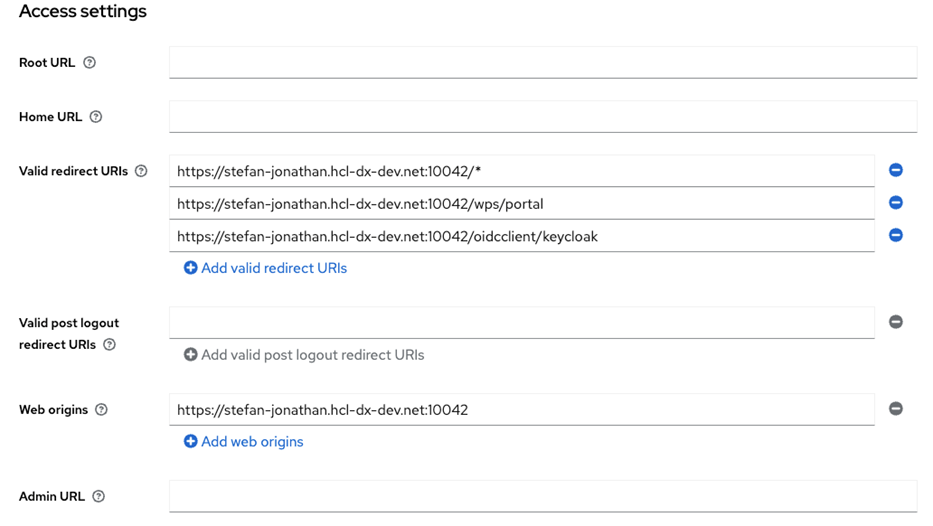
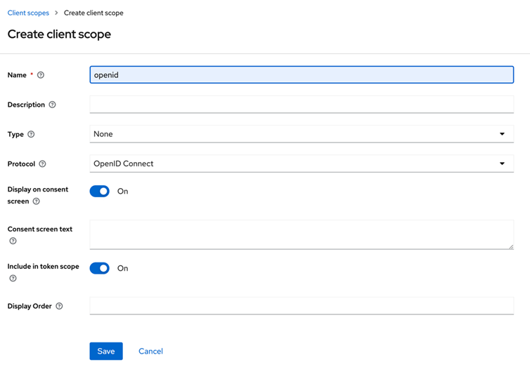
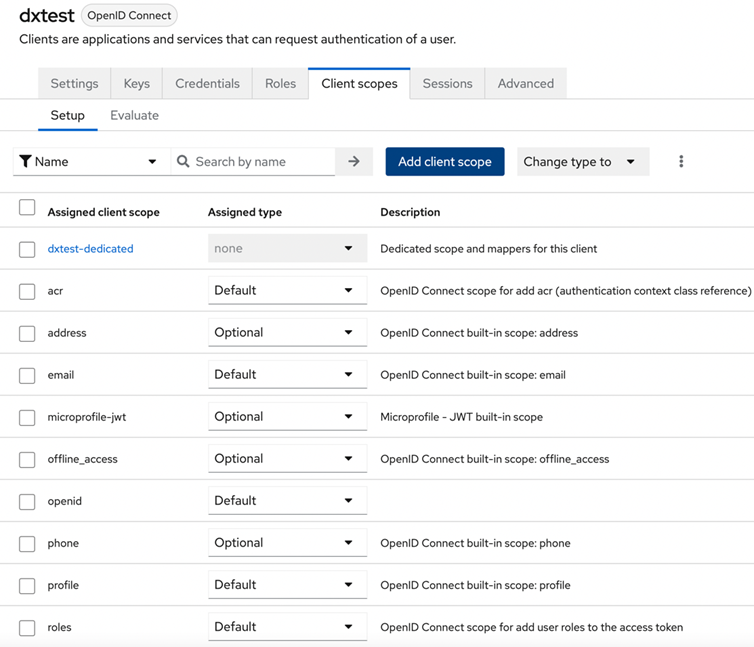

# Configuring Keycloak as an OIDC IdP for HCL Digital Experience

This document provides information on the configuration of Keycloak as an OIDC Identity Provider against HCL Digital Experience (DX) as a relying party. The configuration entails the setup of a realm, user federation, client, custom claims for client scopes and respective mappers to wire those claims.

For the HCL DS Keycloak service, the required settings/configurations are in place and are rolled out during deployment. The HCL DS Keycloak service should be validated before proceeding to ensure everything is understood and properly set up. Customers can set up their own realm and client as needed or adjust the default settings/configuration.

For default configuration, skip the remaining steps and continue to [Updating WebSphere to support OIDC Authentication for DX](./dx-update-webshpere-for-oidc.md).

1. Go to the admin console and login: `<HOSTNAME>/auth/admin>`

    - Login should be admin : admin

1. From the top left dropdown, select **Create Realm** and add a new realm name.
1. Click **Create** (for example we are using oidcdx):

    

1. Go to the **Clients Section > Create Client** and add the following values:
    1. In **General Setting** page add the following values:
        - Client ID: dxtest
        - Name: dxtest

        - Click **Next**.

        

    1. In the **Capability config** page,  check the **Client authentication** options and click “Next”.

        

    1. In the **Access setting** page, enter the following URLs in **Valid redirect URIs** section and click “Save”:

        1. (Only use this one for dev) `<HOSTNAME>/*`
        1. `<HOSTNAME>/oidcclient/keycloak`
        1. `<HOSTNAME>/wps/portal`

        

1. To create a client scope mapper for realmName, go to **{realm} > Client scope > roles > Add mappers > By Configuration > Hardcoded claim**:

    - Fill the fields with the following values:

        - Name = realmName
        - Token Claim Name = realmName
        - Claim Value = {realm} (change this as per your realm. For example: oidcdx)
        - Claim JSON Type = String
        - Check Add to ID token
        - Check Add to access token
        - Check Add to userinfo
        - Click Save.

    

1. To add `openid` client scope (if not available), select **Client scopes > Create scope**:

    - Name: openid
    - Click “Save”

    

1. To add openid client scope to the client (if not added), select **Clients > dxtest(client name) > client scopes > add client scope > select openid > Add as default**.

    

## What's next

Once you have configured Keycloak, you can now look at [Updating WebSphere to support OIDC Authentication for DX](./dx-update-webshpere-for-oidc.md) for further instructions.
