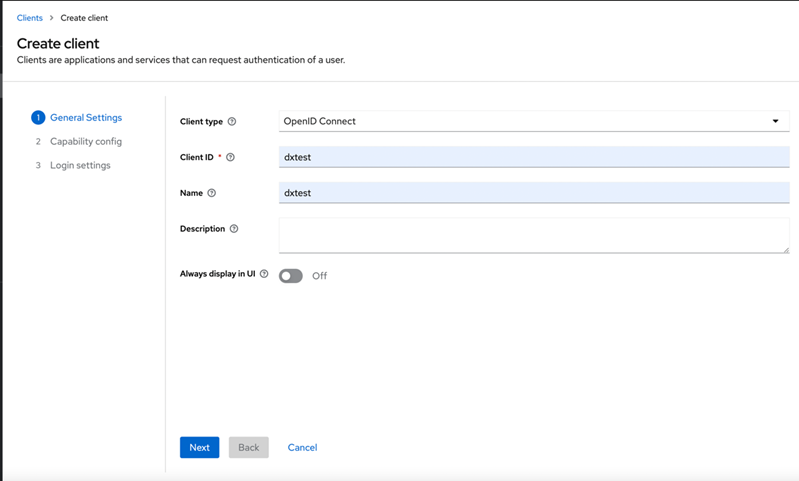
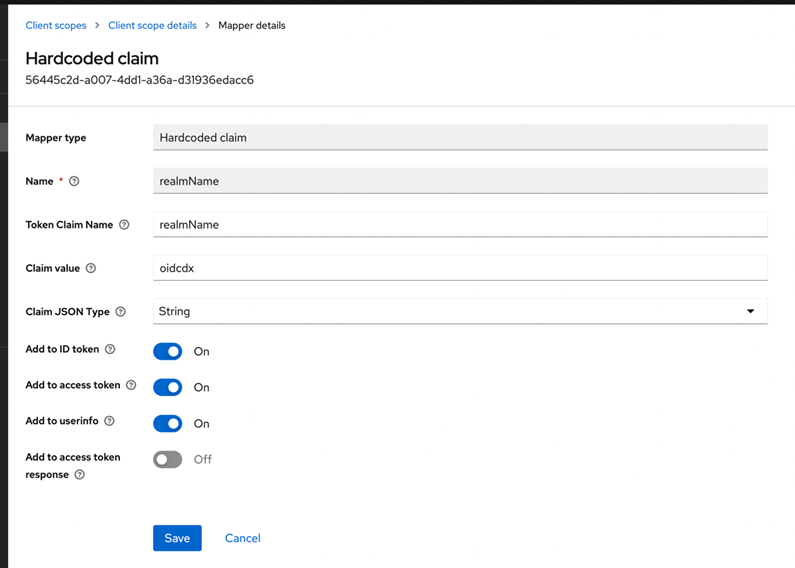

# Configuring Keycloak as an OIDC IdP for HCL Digital Experience

This document provides information around the configuration of Keycloak as an OIDC Identity Provider against HCL Digital Experience as a relying party. The full configuration here entails setup of a realm, user federation, client, custom claims for client scopes and respective mappers to wire of those claims, and is explained in detail in the document linked above.

For the HCL DS Keycloak service the required settings/configuration already are in place and get rolled out during deployment. They should still be validated once before proceeding to ensure everything is understood and properly set up. Customers certainly can set up their own realm and client as needed using below steps, or adjust the once created by default.

If you are fine with the default configuration, feel free to skip the rest and continue to [Updating WebSphere to support OIDC Authentication for DX](./dx-update-webshpere-for-oidc.md).

First, log in to Keycloak at `https://<HOSTNAME>/auth/admin` with user `admin` and password `admin`. Then, select the realm `hcl` in the top left dropdown.

1. Got to the admin console and login: `<HOSTNAME>/auth/admin>`

    - Login should be admin : admin

2. From the top left dropdown select Create Realm and add new realm name and click Create (for our example we are using oidcdx):

    

3. Go to the Clients Section and click Create Client, then add the following values and check the right boxes as shown below:

    - Client ID: dxtest
    - Name: dxtest

      Click Next

      

    - Check the Client authentication option and click “Next”.

      

    1. Enter the following Valid redirect URIs and click “Save”:

        1. (Only use this one for dev) `<HOSTNAME>/*`
        2. `<HOSTNAME>/oidcclient/keycloak`
        3. `<HOSTNAME>/wps/portal`

        

4. Create client scope Mapper for realmName: Go to {realm} -> Client scope -> roles -> Add mappers -> By Configuration -> Hardcoded Claim

    - Fill in following fields with below values:

      - Name = realmName
      - Token Claim Name = realmName
      - Claim Value = {realm} (change this as per your realm. For me it was oidcdx)
      - Check Add to ID token
      - Check Add to access token
      - Check Add to userinfo
      - Click Save.

    

5. Add openid client scope (if not available), select Client Scopes -> Create Client

    - Name: openid
    - Click “Save”

    

6. Add openid client scope to client (if not added), select Clients -> dxtest(client name) -> client scopes -> add client scope -> select openid -> Add as default.

    

## What's next

Once you have configured Keycloak, you can now look at [Updating WebSphere to support OIDC Authentication for DX](./dx-update-webshpere-for-oidc.md) for further instuctions.
