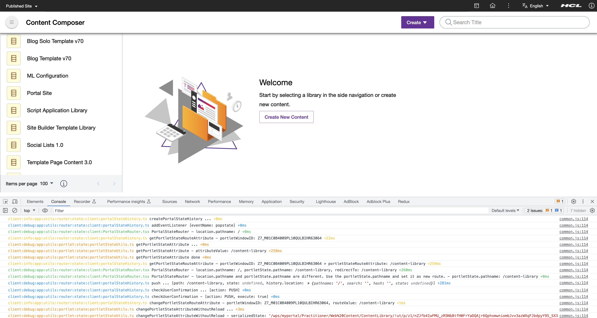

# Logging and tracing for containers and new services

Starting CF200, a new mechanism is introduced for configuring log settings at runtime (without pod restarts) in Helm-based DX deployments. Log levels and trace strings are set in your custom-values.yaml file. [Configure and Access Logs](../../../../deployment/manage/container_configuration/troubleshooting/configure_access_helm_logs.md) gives more detail on how to configure logging in Helm amd how to access Kubernetes container logs. 

Prerequisite: Install and configure Content Composer and Digital Asset Management to your HCL Digital Experience deployment.

-   **Trace string format**

    The trace strings must use the following format. Any text not in angled brackets ("<>") should not be changed:

    ```
    hcl.logging.<app-name>.client.<severity>.<client-hierarchy>.*=all
    ```

    The text strings in angled bracket placeholders must be replaced as described here.

-   **app-name**

    The application name is configured in the Digital Asset Management shared settings. The following values are currently in use:

    -   `medialibrary` - for Digital Asset Management
    -   `content-ui` - for Content Composer

-   **severity**

    This presents the logger severity level. The values used are:

    -   `info`
    -   `debug`

-   **client-hierarchy**

    This specifies the subsections of the client application where tracing can be enabled. It is specified in dot-separated trace strings and is converted by the Digital Asset Management to colon-separated trace strings. The exact hierarchy depends on the client application. Examples include:

    -   `app.*`
    -   `app.redux.*`
    -   `app.redux.actions.*`

-   **Example trace strings**

    Following are some examples of full trace strings for Content Composer and Digital Asset Management and their results:

    -   `hcl.logging.content-ui.*=all` - Enables debug message logging for all files in the DAM application user interface source folder app/redux/actions. Specifically, the debug string `client:debug:app:redux:actions:*` is set for the DAM client logger.
    This tracing is enabled either permanently or just for the current HCL Digital Experience 9.5 container.

    HCL Digital Experience 9.5 uses the IBM® WebSphere Application Server trace facilities to create trace information.

    If you need detailed trace output of Content Composer or Digital Asset Management to troubleshoot a problem, follow these steps in the succeeding sections.

## Permanently enable tracing

1.  Start WebSphere Application Server.
2.  Open the WebSphere Integrated Solutions Console.
3.  Go to **Troubleshooting > Logs and Traces > HCL Digital Experience > Diagnostic Trace**.
4.  Click **Change log detail levels**.
5.  Select the **Enable Trace** check box.
6.  Enter the trace details you would like to enable in the **TraceSpecification** field.

    For example, to trace all events, use the following value:

    ```
    hcl.logging.content-ui.*=all 
    hcl.logging.medialibrary.*=all
    ```

7.  Save the changes.
8.  Restart HCL Digital Experience 9.5 container session.

## Enable tracing just for the current HCL Digital Experience 9.5 session

1.  Click the **Administration** menu icon. Then, click **Tracing: Gather data about the site**.
2.  Enter any of the following values in the **Append these trace settings** field.

    For example, to trace all events, enter the following value:

    ```
    hcl.logging.content-ui.*=all 
    hcl.logging.medialibrary.*=all
    ```


Once a trace string is added or removed in the Tracing portlet, the Digital Experience platform page containing the **Tracing portlet** application must be refreshed in the browser.


!!!note
    The following tracing configurations only apply to client-side logging.
    The Warning **The configured trace state included the following specifications that do not match any loggers currently registered in the server: ''hcl.logging.content-ui.*=all:hcl.logging.medialibrary.*=all'' Ignore this message if the trace specifications ''hcl.logging.content-ui.*=all:hcl.logging.medialibrary.*=all'' are valid.** can be ignored.


## View Logs in Browser Console using developer tools
The client logs can be viewed using the Developer Tools in the web browser. The below image shows an example to view logs of Content Composer.




!!!important
    WebSphere Application Server consolidates the trace strings list by removing strings that are logically contained within others. For example, if you have a string `x.y.z.*=all` in the list, it disappears when you add `x.y.*=all`

???+ info "Related information"  
    -   [Troubleshooting your Helm deployment](../../../../deployment/manage/container_configuration/troubleshooting/helm_troubleshooting.md)
