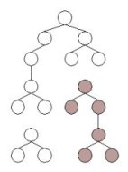

# Model SPI overview

Models provide information that is needed by HCL Portal to perform tasks such as content aggregation or building navigation to browse the aggregated content. The information that is aggregated is represented through models that can be accessed programmatically by using the Model SPI \(read-only\). The information of a model is usually persistent \(stored in a database\) but can also be transient \(computed and stored only in memory\). Models can be represented by using a tree structure \(nodes have a parent-child relationship\), a list structure, or a selection structure \(a selected element in a tree structure\).

The following models can be obtained by using the Model SPI:

-   **Content Model**

    Describes the topology in which the content is structured. The content model is a tree structure that is composed of content nodes. Types of content nodes include pages, labels, internal URLs, and external URLs.

-   **Navigation Model**

    Describes the topology of the navigation visible to a specific user, which is composed of navigation nodes. Navigation nodes are implied by the structure of the content model. A navigation node references content that is represented by content nodes.

-   **Navigation Selection Model**

    Describes the selected node in the navigation.

-   **Content Metadata Model**

    Provides access to metadata of nodes of the Content Model. The metadata are aggregated by using the hierarchy that the content model exposes.

-   **Language List**

    A list of supported languages.

-   **Layout Model**

    Describes the layout of a page, which is composed of layout nodes. Layout nodes can be containers, which affect the layout of the page \(rows and columns\), or controls, which affect the content \(portlets\) of a page.

-   **Markup List**

    A list of supported markup languages.

-   **Skin List**

    A list of skins.

-   **Theme List**

    A list of themes.

-   **PortletModel, AdminPortletModel**

    Describes portlets and their associated configuration data.

The following table shows how a model is requested for specific use from the model source, and the target model that is returned.

|Model source|The specific model is requested from the source, and the source returns the specific model|Model target that is returned and filtered for a specific use|
|------------|------------------------------------------------------------------------------------------|-------------------------------------------------------------|
|

|

|

|

## Create a specific model from source information

The interfaces of the public object model provide read only access to resources. Manipulation is possible only through the Controller SPI.

The models and their elements are all described through interfaces that are contained in the package `com.ibm.portal` and its sub packages. The more common interfaces are located higher in the package hierarchy. For example, `Identifiable`, an interface present on almost all resources, is located directly under `com.ibm.portal`.

## Model scope

The models present information based on access control. Therefore, models are scoped to a specific user, and requests to retrieve model information return only the resources to which the user has access.

The concept of virtual portals scopes some models to the virtual portal in which a user operates. At the moment, this scoping concept applies to the content model, the navigation model, and the navigation selection model. These models scope their resources to the virtual portal in which a user operates.

## The main package, com.ibm.portal

The `com.ibm.portal` package holds interfaces that are commonly used throughout the object model. This document describes important interfaces and classes that are found in the object model. It does not describe every class. For the complete information about all interfaces, read the Javadoc documentation.

Most resources carry an identifier. You can use it to address or locate them. This identifier is defined with the interface Identifiable, by which you can retrieve the ID of an element. An object ID uniquely identifies an element in an installation - and beyond \(the ID is also called GUID - globally unique ID\). An object ID can optionally have a unique name assigned \(a name that can exist only once per installation\) to make it easier to address specific elements.

Do not use `toString` on object IDs - a human readable representation is returned that cannot be parsed back into an ObjectID object. For conversion between an ObjectID object and its string representation, the Identification interface is used \(see package `com.ibm.portal.identification`\).

A common operation is to search for resources that have a specific object ID. To perform this search in a general way, the concept of a Locator is introduced: A locator is provided by a model and allows searching for elements of the model in specific ways. To obtain such a locator object, you must use the getLocator method of an object that implements the LocatorProvider interface.

You can use the generic locator interface to locate a resource by its object ID \(findByObjectID\) or by its unique name \(findByUniqueName\). Some models provide specialized locators that extend the generic locator to provide more search functions such as search by title or some other criterion.

On a generic level, models are either lists or trees. Therefore, a TreeModel and a ListModel interface exist in the main package. In a tree model, you can perform the following tasks.

-   Obtain the root node of a tree model \(getRoot\)
-   Query the children of a node of the model \(hasChildren\)
-   Obtain the children of a node of the model \(getChildren\)
-   Obtain the parent of a node of the model \(getParent\)

With these methods, it is possible to explore a tree model. You must obtain the input arguments that represent nodes of the model from the model itself.

Combined with the locator concept discussed previously, a tree model becomes a searchable tree model: SearchableTreeModel is a tree model that also extends from LocatorProvider.

Some models also take on the form of a list, for example the list of markups or the list of languages that HCL Portal supports. The generic way to directly access the elements of the list is through the iterator provided by it \(iterator method\). When a method returns a list model, it uses the interface ListModel. However, in some situations it might also return a PagedListModel, which extends from ListModel and additionally provides a paged iterator. It makes it possible to obtain the elements of the list model in chunks, which can give better performance than obtaining each element individually.

List models become searchable the same way by which tree models do: SearchableListModel is a list model that also extends from LocatorProvider.

A widespread interface on elements of models is Localized. This interface provides a title and description of an element. Title and description are properties that are locale-dependant. To obtain a title or description call getTitle\(Locale\) or getDescription\(Locale\), depending on the case.

**Note:** An element returns a title or description only if such information exists in the exact locale that is passed in to the methods mentioned. No fallback mechanism is implemented inside of these methods. A suitable fallback mechanism must be employed by invokers of the methods of Localized, or the default that is provided by LocalizedStringResolver \(see package `com.ibm.portal.model`\) can be used.

-   **[Sub packages of the Model SPI ](../dev/dgn_modelpkg.md)**  
Sub packages provide information on installed resources, hold Identification interface, and define the navigational model and the content that is represented in the Portal. The sub packages also represent portlets and their configuration data in the portal and the interconnections between the portlets.
-   **[Obtain a model from the portal](../dev/dgn_modelobt.md)**  
Portal models can be obtained by using three different ways, depending on where the code that uses them is located.
-   **[Obtaining the object ID for a page or portlet ](../dev/wpsobjid.md)**  
There are several use cases when a portlet needs to obtain the object ID used to uniquely identify a portlet or a page. For example, the object ID of a page definition is required for a portlet to start a dynamic instance of that page.
-   **[Filtering the content model ](../dev/dgn_modelfilter.md)**  
By applying filters to the content model, you can exclude parts of the page hierarchy from the content model. Filtering is performed based on request data and metadata assigned to the pages.
-   **[Model SPI samples ](../dev/dgn_modelxmp.md)**  
The Model SPI can be used in portlets, themes, and skins. The models can be used with authenticated users and also with the anonymous user.
-   **[Remote Model SPI REST service ](../dev/rest.md)**  
The Remote Model SPI gives you access to portal models through REST services. It allows you to obtain and modify portal resources that are exposed by some of the models of the model SPI remotely, that is from clients that are outside the JVM of the server. This is achieved by means of REST services.
-   **[Digital Experience Remote Model API REST explorer ](../dev/remote_model_rest_api.md)**  
The Digital Experience Remote Model REST API explorer can be used by developers creating solutions for HCL DX 9.5 on premises and container deployments to explore and test the Remote Model APIs.

**Parent topic:**[Developing ](../dev/developing_parent.md)

**Related information**  

[Controller SPI](../dev/ctrlrapic_ovu.md)

[Setting flags ](../dev/ctrlrapit_set_flag.md)

[Administration tools for configuring outbound HTTP connections ](../dev-portlet/outbhttp_cfg_tools.md)

[Obtaining the Model SPI ](../dev-portlet/outbhttp_cfg_mcspi_obtmapi.md)

[The Java API ](../admin-system/tag_rate_api_java.md)

