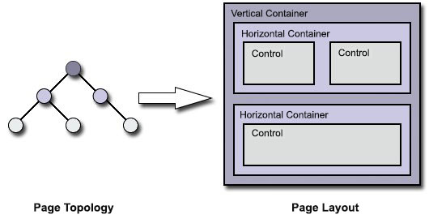
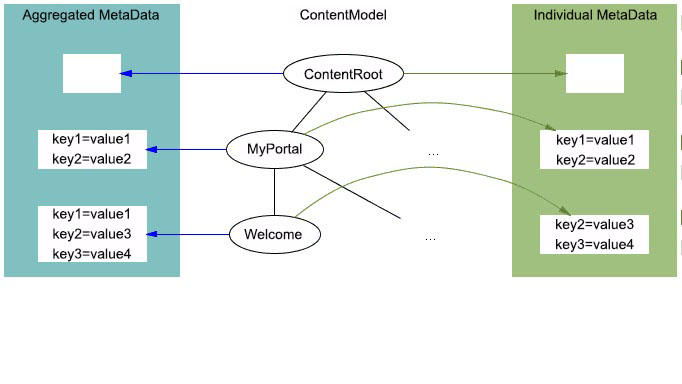
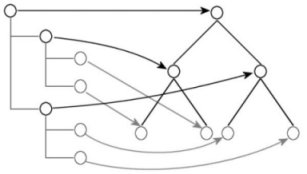

# Sub packages of the Model SPI 

Sub packages provide information on installed resources, hold Identification interface, and define the navigational model and the content that is represented in the Portal. The sub packages also represent portlets and their configuration data in the portal and the interconnections between the portlets.

The Model SPI includes the following sub packages.

-   [The sub package com.ibm.portal.admin](#admin)
-   [The sub package com.ibm.portal.content](#content)
-   [The sub package com.ibm.portal.identification](#identification)
-   [The sub package com.ibm.portal.navigation](#navigation)
-   [The sub package com.ibm.portal.portletmodel](#portletmodel)
-   [The sub package com.ibm.portal.wire](#portal_wire)

See [Model SPI overview](dgn_modelovw.md) for a description of the main package in the Model SPI: `com.ibm.portal`.

## The sub package com.ibm.portal.admin

WebSphere Portal provides several list models that contain information on installed resources, such as supported languages, supported markups, skins, and themes. For each of these resources, a specific ListModel exists that provides information on these resources. This package defines several list models:

-   Language list model
-   Markup list model
-   Skin list model
-   Theme list model
-   Device class model

Each list model contains elements that implement interfaces that coincide with their names: The language list model has Language elements. The markup list model has Markup elements. The skin list model has Skin elements. The theme list model has Theme elements, and the device class model has device class elements.

The LanguageList contains all languages that are supported by the portal. The MarkupList contains all markups that the portal generally supports. From these list models, a resource might support only a selection. The SkinList and the ThemeList hold the themes and skins that are installed for the portal. The DeviceClassModel contains the device classes that the portal generally supports.

## The sub package com.ibm.portal.content

Elements of this package define how content is represented in the portal. The two main models of this package are the ContentModel and the LayoutModel. The content model defines a tree structure for content elements \(such as pages and labels\); it is used to group these content elements logically.

**Note:**

The topology of the content model currently dictates the topology of the navigation model. For more information, see section *The sub package com.ibm.portal.navigation*. Theoretically, the topologies of content model and navigation model are allowed to diverge.

Currently, the elements of the content model can be pages, labels, or URLs. For each type, a specific ContentNode interface exists: ContentPage, ContentLabel, and ContentURL. Each content node has different information that is associated with it.

Each content node can provide the type of content node it represents; if this type is ContentNodeType.PAGE, a model exists that represents the layout of that page. It can be obtained with the getLayoutModel method of the content model. The layout model holds LayoutNode elements that describe the layout and contents of the page. Each layout node can return metrics in form of the LayoutMetrics interface. It can describe attributes of the node such as width or orientation \(horizontal/vertical\).

The elements of the layout model are either LayoutContainers that define rows and columns or LayoutControls, which represent portlets. This information is used when a page is rendered.

The following figure shows how page layout information and page content is represented. The figure depicts a page with three portlets. The surrounding vertical and horizontal containers define the layout while the controls hold the portlets that provide the actual content presented to the user.



Content nodes can provide metadata through the com.ibm.portal.MetaDataProvider interface. Metadata can be used to associate arbitrary information with a content node. The content metadata model provides a view on metadata of the nodes in the content model. It aggregates the metadata of the individual nodes into one metadata object by using the hierarchy of the nodes as described in the content model.

The following figure shows the relationship between the individual metadata that are shown by content nodes and the aggregated view that the content metadata model provides:



The metadata of individual content nodes are shown in XML Access scripts by using the `<parameter>` tag.

## The sub package com.ibm.portal.identification

This package holds the Identification interface, which allows the conversion between ObjectID objects and their string representation. This Identification interface is required where an object ID is to be passed as a parameter that can be only a String \(for inclusion into URLs, for example\). An implementation of this interface can be retrieved by using a JNDI lookup, as in the following example.

```xmp


try
{
   Context ctx = new InitialContext();
   Name ctxName = new CompositeName("portal:services/Identification");    
   Identification identification = (Identification) ctx.lookup(ctxName);    
   String serializedOID = identification.serialize(aOID);
 
      ...

   ObjectID anotherOID = identification.deserialize(serializedOID);
}
catch (SerializationException sx)
{
   // some error handling code here
}
catch (NamingException nx)
{
   // some error handling code here
}


```

## The sub package com.ibm.portal.navigation

This package defines the navigation model \(NavigationModel\) which represents a view on content model that is used for navigation. As described in section *The sub package com.ibm.portal.content*, the topology of the navigation model currently corresponds with the content model. Each node in the content model has an equivalent navigation node at the same hierarchical level.

The elements of the navigation model are NavigationNodes. Each such node can reference a ContentNode. The navigation nodes have a title that is provided through the Localized interface. The following figure shows the connection between the navigation model and the content model.

The figure shows how nodes in the navigation model can reference a node in the content model.



When a user is going through the portal, the currently selected navigation node is important to render the current page. The NavigationSelectionModel reflects the current selection and represents a list that defines a path through the navigation model.

The figure shows how the navigation selection model defines a path through the navigation model.


The last node of this path is always the currently selected navigation node. Its referenced content node represents what is aggregated for the user to see \(normally a page that is represented through a ContentPage object\).

## The sub package com.ibm.portal.portletmodel

The PortletModel represents portlets and their configuration data in the portal. It contains the following elements:

-   **WebApplication**

    Represents a deployed WAR file in the portal.

-   **Portlet**

    The programmer in the deployment descriptor of a portlet web application. Each portlet web application contains one or more portlets.

-   **PortletDefinition**

    Represents administrator configuration for a portlet. Multiple portlet definitions can be associated with the same portlet so that the same portlet code can be started with different administrative settings. With the administrative UI of the portal, you can create new portlet definitions as copies of existing ones.

-   **PortletEntity**

    Represents user configuration for a portlet. It is normally created by placing a portlet definition on a page; the same portlet definition can be added to multiple pages, resulting in multiple portlet entities. There can be two levels of user configuration \(shared and personalized configuration\) that are stored in the form of separate portlet entities.

-   **PortletWindow**

    Represents a particular view on a portlet. It normally corresponds to a LayoutControl in the layout model. The same PortletWindow can be associated with different PorltetEntities for different users, if they personalize the portlet independently.

-   **CommunicationEndpoint**

    Represents an endpoint that is available for communication that is defined for the portlet. Such endpoints can be of type CommunicationSource or CommunicationTarget and are available through the CommunicationEndpointProvider. This provider can be retrieved by the getEndpointProvider method on the PortletDefinition. For JSR 286 portlets that were developed for eventing, PublishingEventDefinition\[s\] and ProcessingEventDefinition\[s\] represent the events that a single portlet can process or publish as defined in the portlet.xml. The PublishingEventDefinition is a CommunicationSource and the ProcessingEventDefinition is a CommunicationTarget for JSR286 portlets.


## The sub package com.ibm.portal.wire

The WireModel represents the interconnections between JSR 168 cooperative portlets or JSR 286 eventing portlets. A WireModel can be obtained from a LayoutModel by using the getWireModel method of the layout model. It contains only interconnections that originate from the page that the parent layout model represents. It contains the following element:

-   **Wire**

    Represents the interconnection between a CommunicationSource of the PortletDefinition of a PortletWindow on a source page and the CommunicationTarget of the PortletDefinition of a PortletWindow on a target page. Examples of interconnections are:

    -   Between a JSR 168 cooperative portlet with an output property and a JSR 168 cooperative portlet with a target action defined.
    -   Between a JSR 286 portlet that defines a publishing event and a JSR 286 portlet that defines a processing event.

**Parent topic:**[Model SPI overview](../dev/dgn_modelovw.md)

