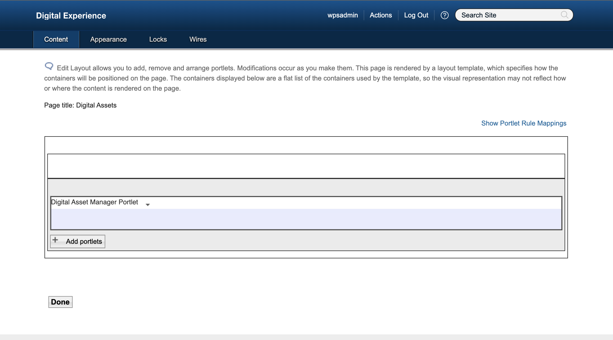
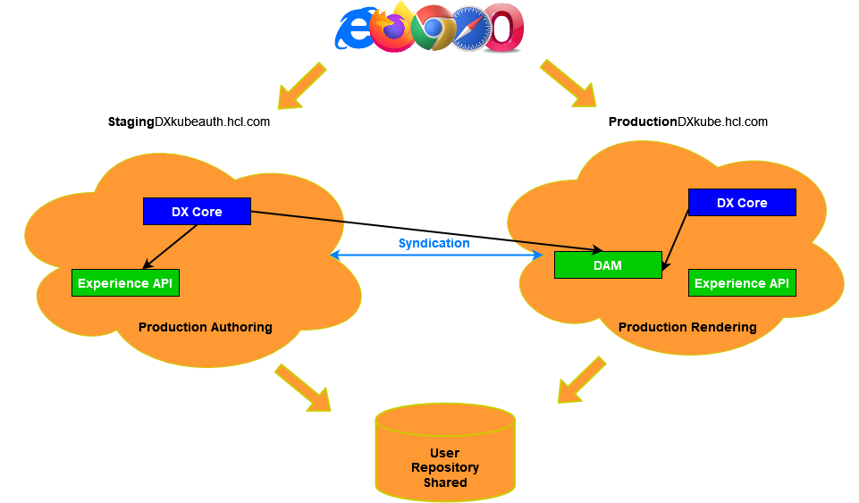

# DAM staging to production

If you create an HCL Digital Experience 9.5 container staging server in Kubernetes, do the following steps to publish your Digital Asset Management repository items to a production HCL Digital Experience 9.5 container deployment in Kubernetes.

Prerequisites:

-   Configure single sign-on \(SSO\) between the HCL Digital Experience 9.5 deployments that shares the Digital Asset Management media assets. See [Configure SSO for Digital Asset Management](../digital_asset_mgmt/configure_dam_sso.html) topic.
-   Ensure the [Cross Origin Resource Sharing \(CORS\)](https://developer.mozilla.org/en-US/docs/Web/HTTP/CORS) property is configured in the deployment config map, as follows:

    1.  The `dx.config.cors` property is added in the deployment config map, for example, `dx-deployment` with the target host:

        ```
        kubectl edit configmap dx-deployment -n <namespace>
        ```

        ```
        dx.config.cors: <loadbalancer Target url>
        ```

    2.  Add the property `dam.config.cors` in configmap `dx-deployment-dam` with the target host:

        ```
        kubectl edit configmap dx-deployment-dam -n <namespace>
        ```

        ```
        dam.config.cors: <loadbalancer Target url>
        ```

    These settings will allow Digital Asset Management to communicate with the other HCL DX 9.5 deployment servers.

    For more information about the deployment configuration map settings, refer to the [Install Experience API, Content Composer, and Digital Asset Management](../digital_asset_mgmt/install_config_dam.md) topic.


## Publish Digital Asset Management assets from staging to production

1.  A shared Digital Asset Management deployment is used to publish from the Digital Experience 9.5 source staging server to the Digital Experience 9.5 production server. See the example diagram topology Figure 1 in step 4-G.
2.  The source server is a Digital Experience 9.5 container staging server.
3.  The target server is a Digital Experience 9.5 container production server including the Digital Asset Management deployment.
4.  On the source Digital Experience 9.5 container server, configure the Digital Asset Management DAM React Integration portlet:

    1.   Go to **Administration** \> **Site Management** \> **Pages** \> **Content Root** \> **Practitioner Studio**.
    2.   Find the Digital Asset page and select the Edit \(pencil\) icon to edit the page.
    3.   Select the dropdown on the DAM ReactIntegration portlet and configure this portlet.
        
    4.   Add the Static UI URL: `https://TARGET_Hostname/dx/ui/media-library/static` to the DAM ReactIntegration portlet properties.
    5.   Save this configuration.
    6.   Follow the same configuration steps in the target Digital Experience 9.5 container server and place the URL in the target server \(see next step\). Configure the DAM ReactIntegration portlet on the target server using the same steps as outlined in A - E above.
    7.   Ensure you apply the same static UI URL \(`https://TARGET_Hostname/dx/ui/media-library/static`\) as above when defining the portlet properties.
      


## Limitations

-   Establishing single sign-on \(SSO\) across HCL Digital Experience 9.5 container deployments that shares Digital Asset Management services require that each deployment share the same user and group definitions across all participating environments.
-   Ensure appropriate access controls are assigned to Digital Asset Management collections to prevent images used during development and authoring from showing in production rendering for end users.


