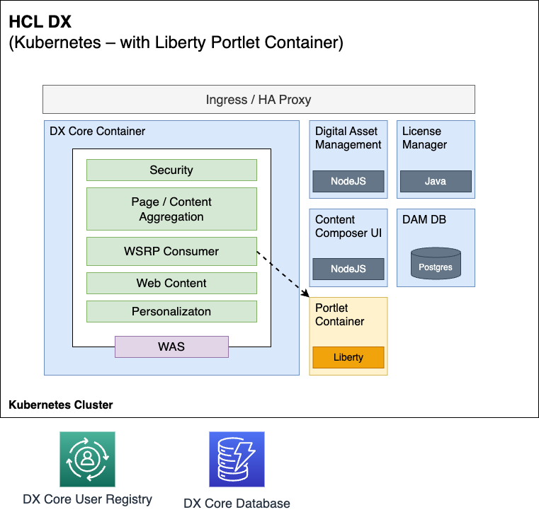

# HCL DX Early Access Program Milestones 1 and 2

This topic presents information and instructions for use and evaluation of the Open Liberty portlet container, an Early Access Program component.

## Open Liberty portlet container 

The [Open Liberty](https://openliberty.io) Portlet Container is a standalone implementation of a [JSR 168 and 286](https://jcp.org/en/jsr/detail?id=286) portlet runtime with a [Web Services for Remote Portlets](https://docs.oasis-open.org/wsrp/v2/wsrp-2.0-spec.html) (WSRP) Producer. The Open Liberty portlet container is provided with this Early Access Program for non-production use only and is available as a separate Docker image from the [HCL DX 9.5 core container images](../deployment/install/container/image_list.md). 

To download components, refer to [Downloading HCL DX Early Access Program components](download_eap_components.md) for instructions.

The Open Liberty portlet container is intended to run Java portlet workloads in Kubernetes, with those portlets being consumed on DX Core pages over WSRP. This component includes a set of Helm charts and has been architected to run in a Kubernetes environment, inside the same namespace as an existing DX Kubernetes deployment.

This approach aims to offer a modernized architecture and allow distributed portlet and web apps to be deployed and managed separately while aggregated and rendered through DX. Additional benefits include:

- Use of later JDK and J2EE levels
- Faster start and performance
- Applications that are easier to write, can leverage open software, and work well for cloud native deployments

The Open Liberty portlet container image is based on the Open Liberty server runtime rather than the IBM WebSphere Application Server which is [currently used to run HCL DX](../get_started/system_requirements/traditional/supported_config.md) components and services. 

The Open Liberty portlet container runs Java portlet workloads in Kubernetes. The portlets are consumed on DX Core pages over WSRP.

In the Early Access Program Milestones 1 and 2, the underlying technologies and version levels used in the Open Liberty portlet container are:

- Open Liberty 22.0.0.6 with JavaEE 8
- [Java 11.0.0.21](https://www.oracle.com/java/technologies/javase/11-0-21-relnotes.html)
- Red Hat Universal Base [Image Minimal 8.8-1072](https://catalog.redhat.com/software/containers/ubi8/ubi-minimal/5c359a62bed8bd75a2c3fba8?architecture=amd64&image=6541c626134440daf5b30636)

<!--It is anticipated that these version levels will be increased before general release.-->

## Differences for Portlets running in Open Liberty compared to running in DX Core

Portlets running in the Open Liberty portlet container experience a number of differences in their runtime environment compared to those running in the current DX Core:

- Portlets run on a different Open Liberty JavaEE application server, so if they use any APIs specific to [IBM WebSphere Application Server](https://www.ibm.com/products/websphere-application-server?utm_content=SRCWW&p1=Search&p4=43700074488257595&p5=e&gclid=Cj0KCQiAhc-sBhCEARIsAOVwHuT7kzKartxoc4rNstOV88KzDpVRffjM8MWo_9UMQ2iycxgKSuOYvlAaAnuiEALw_wcB&gclsrc=aw.ds), they may find those are no longer available.
- Portlets run on a [newer version of Java](https://www.oracle.com/java/technologies/javase/11-0-21-relnotes.html).
- Portlets do not run on the same JVM as DX Core. They do not have local access to any DX Java APIs such as the Model API or WCM API.
- Portlets are served over WSRP v2 so they must comply to the requirements of that standard. For example, portlets must have a `display-name` element in their `portlet.xml` file.

There are also additional differences specific to the Early Access version that are specified in the following section [Limitations and restrictions](#limitations-and-restrictions).

## Limitations and restrictions

This topic provides the limitations and restrictions when using the Early Access version. 

The Early Access version of the Open Liberty portlet container is provided for evaluation use in a non-production environment. This version is not supported through the HCL product support channels. Go to HCL Digital Experience Early Access Q&A Forum for instructions on how to provide and discuss your feedback. 

The Early Access Milestones 1 and 2 Open Liberty portlet container have the following limitations:

- **No persistence of configuration**: To install portlet applications or change the configuration in a non-temporary way, you must create your own image from the HCL-supplied one with your applications and settings. For steps on how to create your image, see [Deploying and configuring Open Liberty portlet container](deploy_config_eap.md). This limitation is a design decision and it may continue into the released product, depending on the customer feedback.
- **Only unauthenticated access to portlets** is available over WSRP.
- **JavaServer Faces (JSF) and Struts portlets cannot be used** on the Open Liberty portlet container.

The Early Access Milestones 1 and 2 Open Liberty portlet container have the following restrictions based on the Helm charts supplied and what has been tested by HCL:

- Open Liberty portlet container should be installed into an existing DX Kubernetes namespace where the deployment is set up for non-production use.
- Only a single Open Liberty portlet container pod should be created per deployment.
- Renaming the JSESSIONID cookie is not supported.
- By default, the Open Liberty portlet container is not accessible from outside the Kubernetes environment. Portlets should be accessed only through the co-located DX environment using WSRP.

