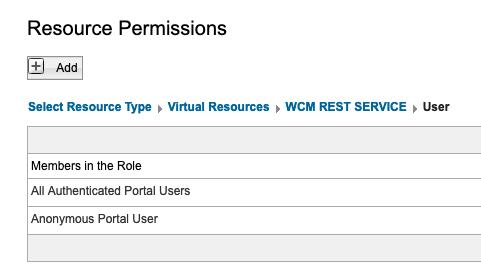

# Getting Started with HCL Experience API

Follow these steps to get started with the HCL Experience API.

## Getting Started

1.  Download the HCL Experience API installation binaries. Log in to the [HCL Software Licensing Portal](https://www.hcltech.com/software/support/release) to download the files from your HCL Digital Experience entitlements.
2.  Refer to the [Image listing and Docker install](../containerization/docker.md) Help Center topic for the latest list of container images and their file names, available for download, for example \(`hcl-dx-kubernetes-v95-CF19.zip`\).
3.  Extract the HCL Experience API installation binaries and, within a terminal, navigate to the extracted folder.
4.  Verify if the extracted folder contains the Experience API images, for example, `hcl-dx-ringapi-image-v1.4.0.**<YOUR\_BUILD\_NUMBER\>**.tar.gz`, `hcl-dx-experience-api-sample-ui-v0.2.0.**<YOUR\_BUILD\_NUMBER\>**.tar.gz`, and readme \(`README.md`\) files.

    **Note:** As HCL Digital Experience releases updated Experience API images, the image version number increases. For example, `hcl-dx-ringapi-image-v1.4.0.**<YOUR\_BUILD\_NUMBER\>**.tar.gz`.

5.  Load the HCL Experience API image using the following command:

    ```
    docker load --input hcl-dx-ringapi-image-v1.4.0.<YOUR_BUILD_NUMBER>.tar.gz
    ```

6.  Verify if the Docker image is loaded using the following command:

    ```
    docker image ls
    ```

    ```
    REPOSITORY                         TAG                    IMAGE ID       CREATED        SIZE
    
    hcl/dx/ringapi                     v1.4.0_20201109-2209   0d5efd03401f   4 weeks ago    947MB
    
    ```

7.  Execute the following Docker command to bring up the HCL Experience API Docker image:

    ```
    docker run -it -p 3000:3000 -p 3001:3001 hcl/dx/ringapi:v1.4.0.<YOUR_BUILD_NUMBER>
    ```

    -   You may modify the most common values by passing in the parameters as follows:

        ```
        docker run -it -p 3000:3000 -p 3001:3001 -e PORTAL_HOST=172.16.1.4 -e PORTAL_PORT=30015 hcl/dx/ringapi:v1.4.0.<YOUR_BUILD_NUMBER>
        ```

    -   If you wish to use `https` to connect to HCL Digital Experience 9.5 for security reasons, the command to start would be:

        ```
        docker run -it -p 3000:3000 -p 3001:3001 -e PORTAL_HOST=172.16.1.4 -e PORTAL_PORT=30015 -e PORTAL_SSL_ENABLED=true hcl/dx/ringapi:v1.4.0.<YOUR_BUILD_NUMBER>
        ```

    -   If you wish to update the `CORS_ORIGIN`, the command to start would be:

        ```
        docker run -it -p 3000:3000 -p 3001:3001 -e PORTAL_HOST=172.16.1.4 -e PORTAL_PORT=30015 -e CORS_ORIGIN="http://localhost:3002, http://localhost:3003" hcl/dx/ringapi:v1.4.0.<YOUR_BUILD_NUMBER>
        ```

8.  Verify if `http://<HOST>:<PORT>dx/api/core/v1/explorer` is accessible and shows the HCL Experience explorer \(example: http://127.0.0.1:3000/dx/api/core/v1/explorer\).
9.  Verify if the GraphQL application is accessible through URL `http://<HOST>:<GRAPHQL_PORT>dx/api/core/v1/graphql` \(example: http://127.0.0.1:3001/dx/api/core/v1/graphql\).
10. To verify if the HCL Experience API is properly connected to HCL Digital Experience 9.5, please run the following command. Login credentials must be an authenticated username and password:

    ```
    curl -X POST "http://<HOST>:<PORT>dx/api/core/v1/auth/login" -H "accept: application/json" -H "Content-Type: application/json" -d "{\"username\":\"<USER_NAME>\",\"password\":\"<PASSWORD>\"}"
    ```

11. To validate if login is successful, response should be:

    ```
    {"statusCode":200,"message":"Login Successful","data":{"UId":"(USER_NAME)"}}
    ```


## Limitations

The following limitations exist in HCL Experience API:

-   When uploading a file or an image via Experience API or Content Composer, the actual file uploaded may be larger than expected when processing through Experience API or Content Composer. This is because REST data in Experience API must be text-based, which is why when uploading files via Experience API or Content Composer, **Base64** is used to convert binary content before sending it to HCL Portal. The size bloat-up caused by the Base-64 transformation causes the encoded file or image to be approximately **30% larger** than the file size on disk.

## REST Service Access Levels

To use the REST service, for Web Content Manager a client user will be assigned the User role or higher in the *WCM REST SERVICE* virtual resource. All authenticated users are assigned the User role by default.

An administrator can edit the *WCM REST SERVICE* virtual resource. Click the **Administration menu** icon. Then, click **Access \> Resource Permissions \>Virtual Resources**. For more information, refer [Getting started with the REST service for Web Content Manager](../../../manage_content/wcm/wcm_artifacts/wcm_dev/wcm_dev_api/index.md).

If you wish to use the dxrest \(in addition to mydxrest\) for the REST APIs, you need to change the default user configuration. You need to add '**Anonymous Portal User**' to the virtual resources in **WCM REST SERVICE**.




