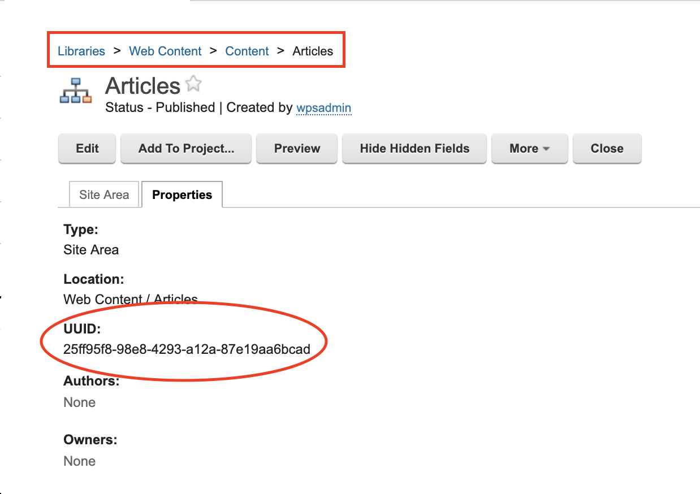
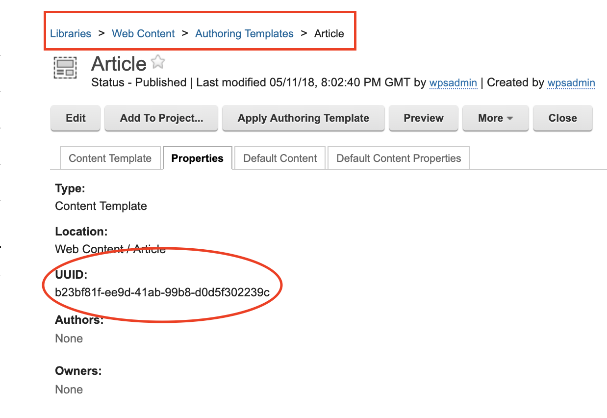

# Getting Started with Sample Content UI

Learn how to get started with the Sample Content UI application on HCL Digital Experience 9.5.

## Getting started

Follow the steps to get started with Sample Content UI application:

1.  Go to [HCL Software License Portal page](https://www.hcltech.com/software/support/release) and download the Sample Content UI application files.

    **Note:** You will find the sample file inside the CF package: HCL DX 9.5 CFXXX \(eg. HCL DX 9.5 CF199\) and called hcl-dx-experience-api-sample-ui-vX.X.X.XXXXXXXX-XXX.zip \(eg. hcl-dx-experience-api-sample-ui-v0.2.0.20211029-1354.zip\).

2.  Unzip the Sample Content UI application file \(hcl-dx-experience-api-sample-ui-vX.X.X.XXXXXXXX-XXX.zip\).
3.  Open the ui/src/app/app.config.ts file and enter the following values : `SITE_AREA_UUID`, `WORKFLOW_UUID`, `CONTENT_TEMPLATE_UUID`, and `BASE_URL`.
    -   To find your `**SITE\_AREA\_UUID**`:
        1.  Log in to HCL Portal and go to Practitioner Studio. If you have not enabled this feature yet, go here to learn [how to enable Practitioner Studio](../../../../build_sites/practitioner_studio/working_with_ps/enable_prac_studio.md).
        2.  From the Library Explorer, click **Web Content \> Content**.
        3.  Select any one site area \(e.g. "Articles"\), click on **Read** then the **Properties** tab. If UUID is not visible, click **Show Hidden Fields**.
        4.  Find the UUID as seen below and save it for later: 
    -   To find your `**WORKFLOW\_UUID**`:

1.  Log in to HCL Portal and go to Practitioner Studio.
2.  From the Library Explorer, click **Web Content \> Workflow Items \> Workflows**.
3.  Select any workflow \(e.g. "Express Workflow"\), click **Read** and then go to the **Properties** tab
4.  Find the UUID as seen below and save it for later: 
    -   To find and change `**CONTENT\_TEMPLATE\_UUID**`:

1.  Log in to HCL Portal and go to Practitioner Studio.
2.  From the Library Explorer, click **Web Content \> Authoring Templates \> Article**.
3.  Select any one workflow \(e.g. "Article"\), click **Read** then go to the **Properties** tab.
4.  Find the UUID as seen below and save it for later: 
    -   You also need to find your `**BASE\_URL**`. To find and change `**BASE\_URL**`:

1.  Copy the host and port of your HCL Experience API.
2.  Fill the host and port details into the following template: `http://<HOST>:<PORT>dx/api/core/v1`
4.  Open a terminal and change to the directory where you extracted the HCL Experience API - Sample Content UI code.
5.  Run the following command:

    ```
    npm install
    ```

6.  Run the following command next:

    ```
    PORT=3002 npm start
    ```

7.  Open a new browser, copy-paste and enter your base URL. Log in by entering your HCL Portal credentials.
8.  To know more about the design and code workflow, please refer to the documentation files inside the ui/docs/design folder.


