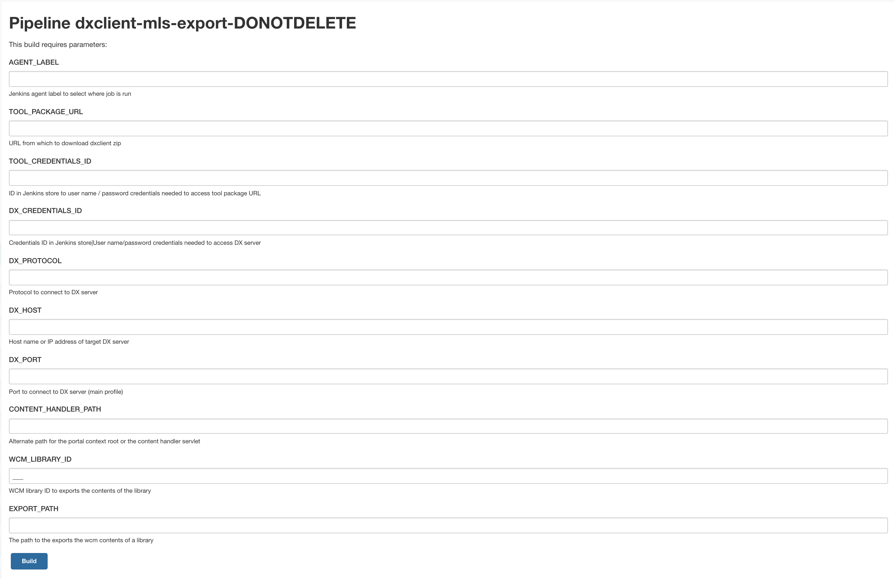
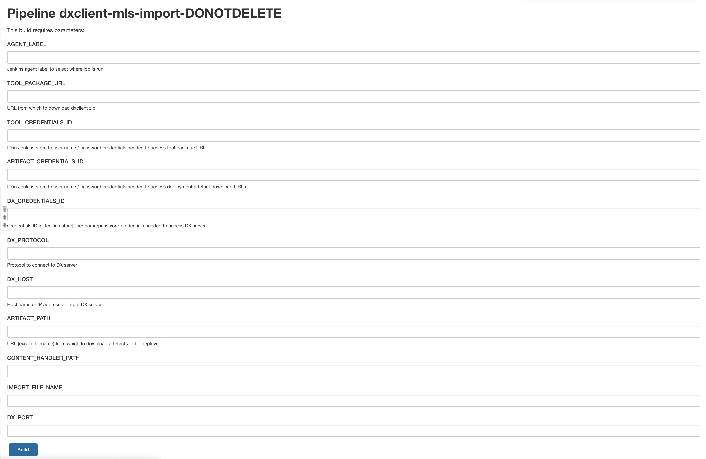

# How to translate WCM library content using export and import WCM with DXClient

The HCL Multilingual Solution \(MLS\) export and import capability allows you to support translation of the content of a library by exporting it into a format supported by a translation service and importing the translated content back into HCL Digital Experience using the DXClient tool.

## Prerequisites

-   The libraries for the other languages for translated are already existing and are filled with the content from the main language library, like with the MLS copy portlet.
-   The DXClient tool is used to manage the library export and import functions by providing an integrated solution to export and import CSV files for translation. The DXClient export and import process works on HCL Digital Experience 9.5 only. See the [DXClient Help Center](../dxclient.md) topic for more information.

## About this task

There are two separate command for handling bulk translations, `export` and `import`. These commands deal with the translation of all the WCM library contents. Note, however, that only the following WCM content elements are translated: **short text**, **rich text**, and **HTML**.

-   The `**export**` command exports the source contents from a library into a CSV file with an auto generated file name at the location specified by the user. This command creates a new CSV file every time the command is run. The following table shows how the output of the Woodburn studio CSV file looks after MLS translation. The entries which contains the heading and then the text/html elements of two content items is translated into any language \(the following example shows French and Spanish language\). For each 'text' element a row is created for each target language \(French and Spanish\). Column "Target", is the translate language and all other information is provided to help doing the import automatically. In this table only one element is shown:

    |Source|Target|Source UUID|Target UUID|Source Language|Target Language|Field|Type|WCM Type|Component Type|
    |------|------|-----------|-----------|---------------|---------------|-----|----|--------|--------------|
    |I'm in the process of redesigning my home and visited Woodburn Studio. What a resource! Helpful, talented designers throughout with absolutely stunning home furnishings and decor.|I'm in the process of redesigning my home and visited Woodburn Studio. What a resource! Helpful, talented designers throughout with absolutely stunning home furnishings and decor.|4233a655-2e24-4a1f-8f5d-fcc58386b0eb|c66a0135-e35c-454f-b679-e16affa8fa48|en|es|Review-Text|Element|Content|Text Component|
    |I'm in the process of redesigning my home and visited Woodburn Studio. What a resource! Helpful, talented designers throughout with absolutely stunning home furnishings and decor.|I'm in the process of redesigning my home and visited Woodburn Studio. What a resource! Helpful, talented designers throughout with absolutely stunning home furnishings and decor.|4233a655-2e24-4a1f-8f5d-fcc58386b0eb|0e5d4f50-c8ba-4575-bff3-8b98b6729270|en|fr|Review-Text|Element|Content|Text Component|

-   The `**import**` command overwrites any existing translations in the content of the environment. It expects the Target column to be translated to each languages as indicated in the Target Language column. The following table shows a translated example of the previous export.

    |Source|Target|Source UUID|Target UUID|Source Language|Target Language|Field|Type|WCM Type|Component Type|
    |------|------|-----------|-----------|---------------|---------------|-----|----|--------|--------------|
    |I'm in the process of redesigning my home and visited Woodburn Studio. What a resource! Helpful, talented designers throughout with absolutely stunning home furnishings and decor.|Estoy en proceso de rediseñar mi casa y visité Woodburn Studio. ¡Qué recurso! Diseñadores serviciales y talentosos en todas partes con muebles y decoración para el hogar absolutamente impresionantes.|4233a655-2e24-4a1f-8f5d-fcc58386b0eb|c66a0135-e35c-454f-b679-e16affa8fa48|en|es|Review-Text|Element|Content|Text Component|
    |I'm in the process of redesigning my home and visited Woodburn Studio. What a resource! Helpful, talented designers throughout with absolutely stunning home furnishings and decor.|Je suis en train de réaménager ma maison et j'ai visité Woodburn Studio. Quelle ressource ! Des designers serviables et talentueux avec un mobilier et une décoration absolument époustouflants.|4233a655-2e24-4a1f-8f5d-fcc58386b0eb|0e5d4f50-c8ba-4575-bff3-8b98b6729270|en|fr|Review-Text|Element|Content|Text Component|

-   All the default command options in this section are configured inside the - dist/src/configuration/config.json file of the tool. The options passed through command line overrides these default values.

!!! note
    Only the `ShortTextComponent` element type has an explicit maximum data length set at 250 characters. The `**import**` command validates the length of the data for this element type before importing. Errors due to custom configuration of limits are caught by the `**import**` and `**export**` during the cycle and are reported in an error log.

## Export command

The `**export**` command is used to export the content of a WCM library for translation into a CSV file at the location specified by the user.

**Export command**:

```
dxclient mls-export
```

**Export help command**:

```
dxclient mls-export -h
```

**Export command options**:

-   `-dxProtocol <value>` - use this attribute to specify the protocol to use to connect to the DX server.
-   `-hostname <value>` - use this attribute to specify the host name of the DX server.
-   `-dxPort <value>` - use this attribute to specify the port on which to connect to the DX server.
-   `-contenthandlerPath <value>` - use this attribute to specify the path to the contenthandler servlet on the DX server (for example, /wps/mycontenthandler).
-   `-dxUsername <value>` - use this attribute to specify the user name required for authenticating with the server.
-   `-dxPassword <value>` - use this attribute to specify the password required for authenticating with the server.
-   `-wcmLibraryId <value>` - the WCM library ID to export the contents of the library.
-   `-exportPath <value>` - the path to export the WCM contents of a library.
-   `-virtualPortalContext <value>` - the context of the virtual portal that contains the Script Application instance you want to create or update.

**Usage sample**:

```
dxclient mls-export -dxProtocol <dxProtocol> -hostname <hostname> -dxPort <dxPort> 
-contenthandlerPath <contenthandlerPath> -dxUsername <dxUsername> -dxPassword <dxPassword> -wcmLibraryId <wcmLibraryId> -exportPath <exportPath> -virtualPortalContext <virtualPortalContext>
```

## Import command

The `**import**` command is used to import the translated content into DX and overwrites any existing translations in the content of the environment.

**Import command**:

```
dxclient mls-import
```

**Import help command**:

```
dxclient mls-import -h
```

**Export command options**:

-   `-dxProtocol <value>` - use this attribute to specify the protocol to use to connect to the DX server.
-   `-hostname <value>` - use this attribute to specify the host name of the DX server.
-   `-dxPort <value>` - use this attribute to specify the port on which to connect to the DX server.
-   `-contenthandlerPath <value>` - use this attribute to specify the path to the contenthandler servlet on the DX server (for example, /wps/mycontenthandler).
-   `-dxUsername <value>` - use this attribute to specify the user name required for authenticating with the server.
-   `-dxPassword <value>` - use this attribute to specify the password required for authenticating with the server.
-   `-importPath <value>` - the path to import the translated contents into DX.
-   `-virtualPortalContext <value>` - the context of the virtual portal that contains the Script Application instance you want to create or update.

**Usage sample**:

```
dxclient mls-import -dxProtocol <dxProtocol> -hostname <hostname> -dxPort <dxPort> 
-contenthandlerPath <contenthandlerPath> -dxUsername <dxUsername> -dxPassword <dxPassword> -importPath <importPath> -virtualPortalContext <virtualPortalContext>
```

## Sample pipelines

You can use the sample pipelines in this section to run MLS export and import. The sample pipelines \(available under the samples folder in the DXClient root folder\) can be used by developers and administrators as a basis for Jenkins automation server jobs.

These samples show how to install the DXClient tool in a pipeline and then export and import the MLS. These are designed to run from a Jenkins job with the parameters indicated.

MLS Export

|Parameter|Value|Notes|
|---------|-----|-----|
|`AGENT_LABEL`|Jenkins agent label|Determines the agents the pipeline can run|
|`TOOL_PACKAGE_URL`|URL to DXClient zip|Fetched via curl|
|`TOOL_CREDENTIALS_ID`|Credentials ID in Jenkins store|The user name and password needed to access the tool package URL|
|`DX_CREDENTIALS_ID`|Credentials ID in Jenkins store|The user name and password needed to access DX server|
|`DX_PROTOCOL`|Protocol to connect to the DX server|HTTP or HTTPS|
|`DX_HOST`|Host name or IP address of the DX server|Artifacts are deployed to this server|
|`DX_PORT`|Port to connect to the DX server|Port for the DX main profile|
|`CONTENT_HANDLER_PATH`|Alternate path for the portal context root or the content handler servlet|Default path: /wps/mycontenthandler/|
|`WCM_LIBRARY_ID`|WCM library ID to export the contents of the library|Exports the available content from this library ID|
|`EXPORT_PATH`|The path to export the WCM contents of a library|The path where the content is exported|



MLS Import

|Parameter|Value|Notes|
|---------|-----|-----|
|`AGENT_LABEL`|Jenkins agent label|Determines the agents the pipeline can run|
|`TOOL_PACKAGE_URL`|URL to DXClient zip|Fetched via curl|
|`TOOL_CREDENTIALS_ID`|Credentials ID in Jenkins store|The user name and password needed to access the tool package URL|
|`DX_CREDENTIALS_ID`|Credentials ID in Jenkins store|The user name and password needed to access DX server|
|`ARTIFACT_CREDENTIALS_ID`|Credentials ID in Jenkins store|The user name and password needed to access artifact URLs|
|`ARTIFACT_PATH`|URL (except file names) for artifacts to be deployed|Artifacts fetched via curl|
|`DX_PROTOCOL`|Protocol to connect to the DX server|HTTP or HTTPS|
|`DX_HOST`|Host name or IP address of the DX server|Artifacts are deployed to this server|
|`DX_PORT`|Port to connect to the DX server|Port for the DX main profile|
|`CONTENT_HANDLER_PATH`|Alternate path for the portal context root or the content handler servlet|Default path: /wps/mycontenthandler/|
|IMPORT_FILE_NAME|File name to import the translated content into DX|Imports the content from this file|




<!-- ???Info "Related information"


[Deploy DX components using HCL DXClient and DXConnect](../containerization/deploy_dx_components_using_hcl_dx_client_and_dx_connect.md)

[DXClient](../containerization/dxclient.md)

[DXClient Artifact Types](../containerization/dxclientartifacts.md)

[Sample Pipelines for use with HCL DXClient and Automation servers](../containerization/sample_pipelines_for_use_with_dx_client_and_automation_servers.md)

[HCL Web Content Manager Multilingual Solution](../wcm/wcm_mls.md)

[Sample Pipelines for the DXClient Docker image file](../containerization/sample_pipelines_docker_dxclient.md)

[Sample Pipelines for the DXClient node package file](../containerization/sample_pipelines_node_dxclient.md) -->

