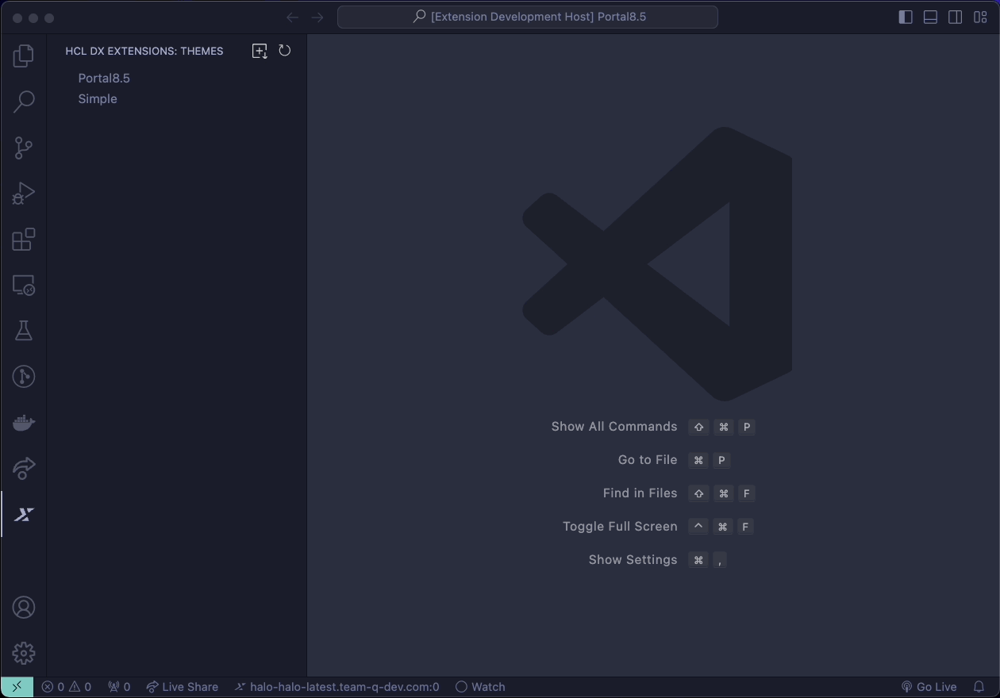
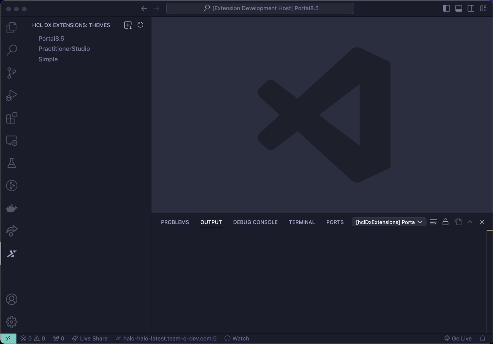

# HCL DX Extensions for Visual Studio Code

The HCL DX Extensions feature for Visual Studio Code Editor provides a user interface experience for DX developers during the development life cycle. Through this extension, DX developers can do shorter coding cycles between local editing events to server rendering and validation.

For v1.0.0, real time sync of WebDAV-based DX themes between local and server environments is supported.

## Prerequisites

Before installing the extension, make sure the following prerequisites are met:

- VS Code 1.80.0 or higher
- [DXClient 1.23.0 or higher](../dxclient/index.md)
    
    !!! note
        
        It is recommended to use the node version of DXClient tool for better performance of the extension.

## Installation

Install the HCL DX extension by clicking the Install link on this page, or install from the Extensions tab in Visual Studio Code.

Alternatively, you can perform an offline installation by following below steps:

1. Download the extension by going to the VSCode marketplace and click the "Download Extension" link under "Resources".
2. Install and open Visual Studio Code.
3. Press **Ctrl+Shift+X** (for Windows) or **Cmd+Shift+X** (for MacOS) to open the Extensions pane.
4. On the top right of the Extensions pane, click **More Actions… > Install from VSIX…**.
5. Find the hcl-dx-extensions-<x.x.x>.vsix on your local file system and click **Install**.
6. Restart VS Code to activate the extension.

After installing the HCL DX extension, a DX icon is visible on the VS Code sidebar.

## Settings

Go to **Settings > User > Extensions > HCL DX Extensions Configuration**. Set the below configuration arguments:

* `hclDxExtensions.dxProtocol`: Protocol of the DX Core server
* `hclDxExtensions.hostname`: Host name of the DX Core server
* `hclDxExtensions.dxPort`: Port number of the DX Core server, for any Kubernetes Environment default is 443
* `hclDxExtensions.dxUsername`: Username of the DX Core server
* `hclDxExtensions.dxPassword`: Password of the DX Core server
* `hclDxExtensions.contenthandlerPath`: Alternate path for the portal context root or the content handler servlet
* `hclDxExtensions.themesPath`: The parent folder of your Themes (for example, /path/to/Themes)
* `hclDxExtensions.executablePath`: (Optional) The directory of dxclient executable (for example, /path/to/dxclient/bin)
* `hclDxExtensions.dxclientType`: The type of DxClient executable (required when the "Executable Path" setting is provided)

## Using the Themes View

To go to the Themes view, click the DX Icon on the Activity Bar on the right. If there are no listed or available themes , the **Set Themes Path** button is displayed. Clicking this button opens a Select Folder dialog box where you can set the path where all themes will be loaded.

!!! note

    All first-level folders under the given `themesPath` are considered a theme.

### General features

- **Pull New Theme**
    
    This provides users with a list of all themes in the connected DX server and you can choose which one to pull. The Pull New Theme action downloads all files under the theme to a folder named with the chosen theme name under `themesPath`. If the theme name does not exist in the local computer, a new folder is created.

    

- **Refresh**
    
    This refreshes the listed themes under the `themesPath`.

### Features available for each listed theme

- **Pull Theme**
    
    This initiates the DXClient Livesync Pull Theme action, utilizing the selected theme to download theme files to the corresponding folder under `themesPath`. 

    

- **Push Theme**
    
    This triggers the DXClient Livesync Push Theme for the selected theme. It starts a watching process for the files under that folder and pushes the subsequent changes into the server.

    

    

- **Stop Pushing Theme**
    
    This terminates the watching process for the theme if Push Theme has been initiated.

## Limitation

- The HCL DX Extensions feature is supported in non-English versions of VS Code, but it is only available in English and is not translated.
