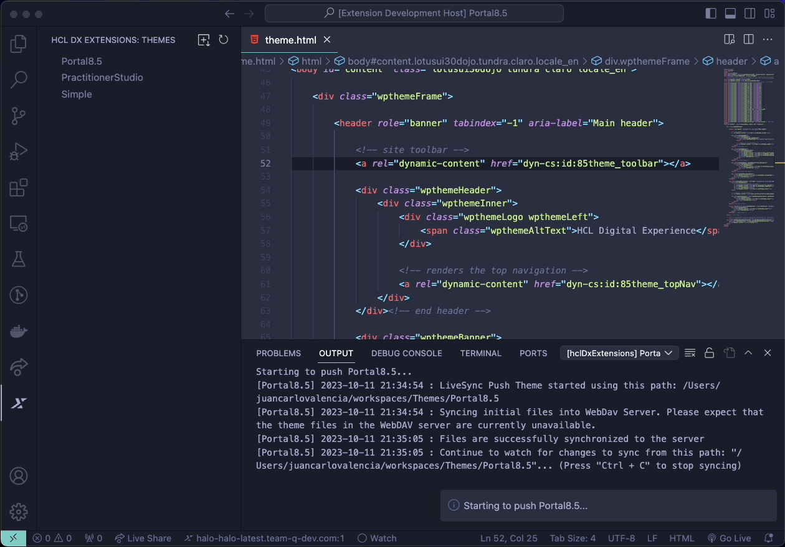

# HCL DX Extensions

The HCL DX extension for Visual Studio Code Editor provides User Interface experience for DX developers during the development life cycle. This will help boost DX developers efficiency by enabling them to do shorter coding cycles between local editing events to server rendering and validation.

For v1.0.0 of this tool, we will cover real time sync of WebDAV based DX themes between local and server environments.

## Pre-requisites

Before installing the extension, ensure the following pre-requisites are met:

- VS Code 1.80.0 or higher
- [DXClient 1.23.0 or higher](https://opensource.hcltechsw.com/digital-experience/CF214/extend_dx/development_tools/dxclient/)

## Installation

Install the HCL DX extension by clicking the Install link on this page, or install from the Extensions tab in Visual Studio Code.

Alternatively, you can perform an offline installation by following below steps:

* Download the extension via Download Extension link under Resources section.
* Install and open Visual Studio Code.
* Press Ctrl+Shift+X or Cmd+Shift+X to open the Extensions pane.
* Click More Actions… (on the top right in Extensions pane) > Install from VSIX…
* Find hcl-dx-extensions-<x.x.x>.vsix on your local file system and click Install.
* Restart VS Code to activate the extension.

Once you install the HCL DX extension, a DX icon is visible on the VS Code side bar.

## Settings

Go to Settings > User > Extensions > HCL DX Extensions Configuration. Set the below configuration arguments.

* `hclDxExtensions.dxProtocol`: Protocol of the DX Core server
* `hclDxExtensions.hostname`: Host name of the DX Core server
* `hclDxExtensions.dxPort`: Port number of the DX Core server, for any Kubernetes Environment default is 443
* `hclDxExtensions.dxUsername`: Username of the DX Core server
* `hclDxExtensions.dxPassword`: Password of the DX Core server
* `hclDxExtensions.contenthandlerPath`: Alternate path for the portal context root or the content handler servlet
* `hclDxExtensions.themesPath`: The parent folder of your Themes. (Example: /path/to/Themes)
* `hclDxExtensions.executablePath`: Optional. The directory of dxclient executable. (Example: /path/to/dxclient/bin)
* `hclDxExtensions.dxclientType`: The type of dxclient executable. (Required when the "Executable Path" setting is provided.)

## Features

1. A separate panel/badge in the Activity Bar that contains the Themes View.

### Themes View

1. Click on the DX badge > If there are no listed or available themes , there will be the **"Set Themes Path"** button which will open a select folder dialog box to set the path where all the themes will be loaded.

    !!! note

        All first-level folders under the given `themesPath` are considered a theme.

2. General Features

    1. **Pull New Theme**
        
        This will provide the user selection from list of all themes in the connected DX server. The user may choose one to pull. It will trigger download of all files under the theme to a folder named with the chosen theme name under `themesPath`. If the theme name does not exist in local, a new folder will be created.

        

    2. **Refresh**
        
        This will refresh the listed themes under the `themesPath`.

3. For the features available for each listed theme:

    1. **Pull Theme**
        
        This will trigger DXClient Livesync Pull Theme using the chosen theme to download theme files to the folder named after it under `themesPath`.

        
    
    2. **Push Theme**
        
        This will trigger DXClient Livesync Push Theme for this particular theme. It starts a watching process for the files under that folder and push the subsequent changes into the server.

        

        

    3. **Stop Pushing Theme**
        
        This will terminate the watching process if there is one for this particular theme.

## Limitations

1. The HCL DX Extensions is supported with non-English versions of VS Code, but is only available in English and is not translated.

## Guidelines & Best Practices

1. Recommend to use node version of DXClient tool for better performance of the extension.
