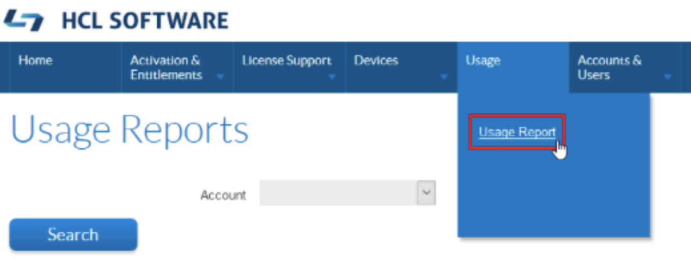
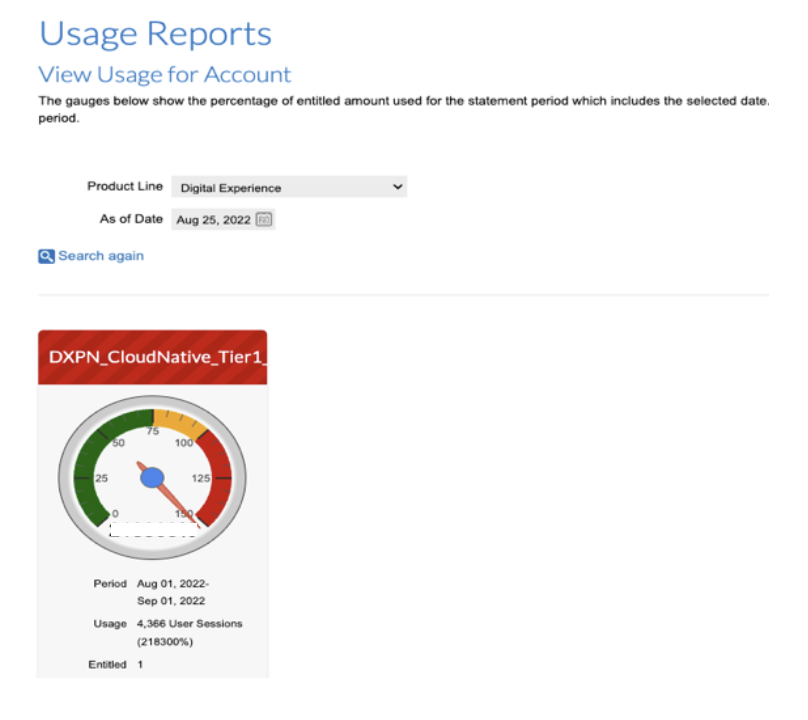

# HCL Digital Experience Cloud Native 9.5 entitlement check scenarios

Review the following [HCL Digital Experience Cloud Native 9.5](../../../../get_started/product_overview/index.md#hcl-digital-experience-cloud-native) entitlement validation check scenarios to be used to formulate responses when entitlement validations encounter failures.

The approach that HCL takes is to perform automated license validation for all products. This kind of license validation is called an entitlement check. The following information highlights all scenarios which involve HCL Software License Portal entitlement checks within [HCL Digital Experience Cloud Native 9.5 Tier 1 – 7](../../../../get_started/product_overview/index.md#hcl-digital-experience-cloud-native) offering deployments. An entitlement check verifies the customer's purchased product (DX Cloud Native 9.5 Tier 1- 7 part number that is mapped in their Flexnet Server instance(s)) subscription period is valid, or is past due, and requires renewal with HCL. For example, if a customer purchases **Digital Experience Cloud Native 9.5 Tier 2** part in May 30, 2022, their entitlement period is valid through May 30, 2023.

## Entitlement check scenarios
Depending upon your entitlement check result, the **HCL DX Cloud Native 9.5** server starts or issues warning messages when an error is encountered, or an entitlement requires renewal.
  
**The following table describes all possible entitlement check scenarios, and the corresponding behavior of the Digital Experience Cloud Native 9.5 Tier 1 – 7 (CN) server.**

!!!note
    -   The grace period is 28 days. This is determined and defined by the Flexnet entitlement server. This is the time in which the DX Cloud Native 9.5 server will start, despite failing an entitlement check.
    -   To verify that your entitlement has been verified, and that your HCL DX CN 9.5 server is not within the grace period, you can access the HCL Digital Experience v9.5 Container Update Log Manager pod logs once your DX Cloud Native 9.5 deployment Helm chart is configured for entitlement checking to verify that there are no HCL DX CN 9.5 entitlement messages.

| Entitlement check scenario | Digital Experience Cloud Native 9.5 Server Behavior |
| ----------- | ----------- |
| 1. The connection to the entitlement server is successful. You have a valid HCL Digital Experience Cloud Native 9.5 entitlement.|HCL DX Cloud Native 9.5 server starts.|
| 2. The connection to the entitlement server is successful. The HCL DX CN 9.5 entitlement has expired. You are operating within the HCL DX CN 9.5 entitlement grace period.|HCL DX Cloud Native 9.5 server starts. The following message appears in the server-side log file and on (other DX location):    `HCL DX CN 9.5 entitlement has ended on expiry date. The grace period will expire in (number of days remaining). To avoid interruption in service, please contact your HCL salesperson to resolve the entitlement issue.`|
| 3. The connection to the entitlement server is successful. You do not have a valid HCL Digital Experience Cloud Native 9.5 entitlement. |HCL DX Cloud Native 9.5 server starts. The following message appears in the server-side log file:    `HCL DX CN 9.5 entitlement grace period has ended on grace period end date. Resolve this issue to avoid interruption in the service.`|
| 4. The connection to the entitlement server fails. The HCL DX CN 9.5 entitlement grace period has started.|HCL DX Cloud Native 9.5 server starts. The following message appears in the server-side log file in the HCL DX 9.5 Container Update License Manager pod logs:    `The connection to the entitlement server failed. HCL DX CN 9.5 entitlement grace period of four weeks has started and will expire on grace period end date. Please contact HCL Support to resolve the connection issue and try again.`|
| 5. The connection to the entitlement server fails. You are operating within the HCL DX CN 9.5 entitlement grace period.|HCL DX Cloud Native 9.5 server starts. The following message appears in the HCL DX 9.5 Container Update License Manager pod logs:    `The connection to the entitlement server failed. You are currently operating within HCL DX CN 9.5 entitlement grace period of four weeks, which expire on grace period end date. Please contact HCL Support to resolve the connection issue and try again.`|
| 6. The connection to the entitlement server fails. The HCL DX CN 9.5 entitlement grace period has expired.|The following message appears in the HCL DX 9.5 Container Update License Manager pod logs:    `HCL DX CN 9.5 entitlement grace period has ended on grace period end date. If you feel this is an error, please log in to the HCL Customer Support portal ([https://support.hcltechsw.com/csm](https://support.hcltechsw.com/csm)) and open a Licensing case (New cases > Licensing case). Otherwise, contact your HCL salesperson to update your licensing.`  If you require extensions to the grace period, you can contact Support for one-time extensions for up to 14 additional days. |

## How to monitor User Session consumption for HCL DX Cloud Native v9.5 production deployments
In addition to performing entitlement verification of the contract period for purchased subscription software, the HCL Software License and Delivery Portal can present usage information for HCL Software offerings that have been developed to report use metrics. This includes HCL Digital Experience Cloud Native v9.5 Tier 1 – 7 offerings, for production deployments. 

HCL Digital Experience Cloud Native 9.5 Tier 1 – 7 offerings are purchased according to the number of user sessions that will be consumed annually.  A **user session** is defined as the number of web sessions or other online interactions by anonymous or authenticated users to the Program when deployed for production use. User sessions also include API calls which deliver production use web site content or application data to external resources, excluding to a content delivery network. Reference the HCL article [Introducing New HCL Digital Experience Cloud-Native 9.5 Bundle with User Session Pricing](https://blog.hcltechsw.com/digital-experience/introducing-new-hcl-digital-experience-cloud-native-9-5-bundle-with-user-session-pricing/) and the [HCL Digital Experience Cloud Native 9.5 License document](https://www.hcltechsw.com/wps/wcm/connect/61f40a7e-d2ca-42d4-b24c-d5adfd4fe54d/HCL+Digital+Experience+Cloud+Native+v9.5.pdf?MOD=AJPERES&CONVERT_TO=url&CACHEID=ROOTWORKSPACE-61f40a7e-d2ca-42d4-b24c-d5adfd4fe54d-n-MmIad) for more information. 

User session consumption for the Digital Experience Cloud Native 9.5 entitlements you have mapped to your HCL Software License portal instances for entitlement checking, and that have been configured for Production use in your deployment Helm charts can be viewed using Usage reports in the HCL Software Licensing Portal. Refer to the guidance outlined in the HCL Support knowledge article [What is the HCL Software License and Download Portal?](https://support.hcltechsw.com/csm?id=kb_article&sysparm_article=KB0073344#a8). Run **Reports for Metered products** section to understand how to access your specific Flexnet entitlement dashboard. Users with authorized access to this service can run Usage reports. The Digital Experience Cloud Native 9.5 entitlements are configured to report user session consumption for deployments configured for production use.

!!!note
    HCL Digital Experience Cloud Native 9.5 applies the following approach when reporting totals for user session consumption in deployments configured for Production to individual customer Flexnet dashboards:    When a user interacts with an HCL DX Cloud Native 9.5 Tier 1 - 7 Production deployment site, for every request a key is computed based on the requesting IP of the user combined with the user agent, as well as a forwarding header (X-Forwarded-For) for proxy (if a customer uses a proxy in their deployment setup) usage. Subsequent interactions within the same user session period leverage that key to identify the same user. If the customer uses a proxy in their setup, it is the responsibility of the customer to ensure this data arrives properly at the DX deployment layer for accurate tracking.

1. Access the Reports section of the HCL Software License and Download Portal (Flexnet) server.

    

    Select your account and then click on Search. Select Digital Experience Cloud Native 9.5 from the list of your account entitlements. Results will appear similar to the following example. 

    !!!note
        The results may show an overage percentage amount in parentheses which is N/A for this informational dashboard report.

        

The Usage report will show:

-   **Period**: The time period for the report results.
-   **Usage**: The number of User sessions executed to your Digital Experience 9.5 Container Update deployment mapped to this entitlement and has the ProductionEnvironment variable enabled and set to True. See the User Session details in the [HCL Digital Experience Cloud Native 9.5 license](https://www.hcltechsw.com/wps/wcm/connect/61f40a7e-d2ca-42d4-b24c-d5adfd4fe54d/HCL+Digital+Experience+Cloud+Native+v9.5.pdf?MOD=AJPERES&CONVERT_TO=url&CACHEID=ROOTWORKSPACE-61f40a7e-d2ca-42d4-b24c-d5adfd4fe54d-n-MmIad) on the [HCL Software License Agreements](https://www.hcltechsw.com/resources/license-agreements) site.

    !!!note
        Only user session data totals per month for the calendar year of purchase are transmitted to the customer's Flexnet dashboards for their view and monitoring purposes. No personal or PII data is transmitted.
        
-   **Entitlement**: Amount will equal to one (1), which is equivalent to your HCL Digital Experience Cloud Native 9.5 Tier 1 – 7 purchased part. 

!!!note
    The Flexnet dashboard **Usage** data may show a data percentage amount in parenthesis. This overage percentage amount is not applicable for HCL Digital Experience Cloud Native 9.5 Tier 1 - 7 entitlement checking and informational user session consumption reporting, and may be disregarded. 
