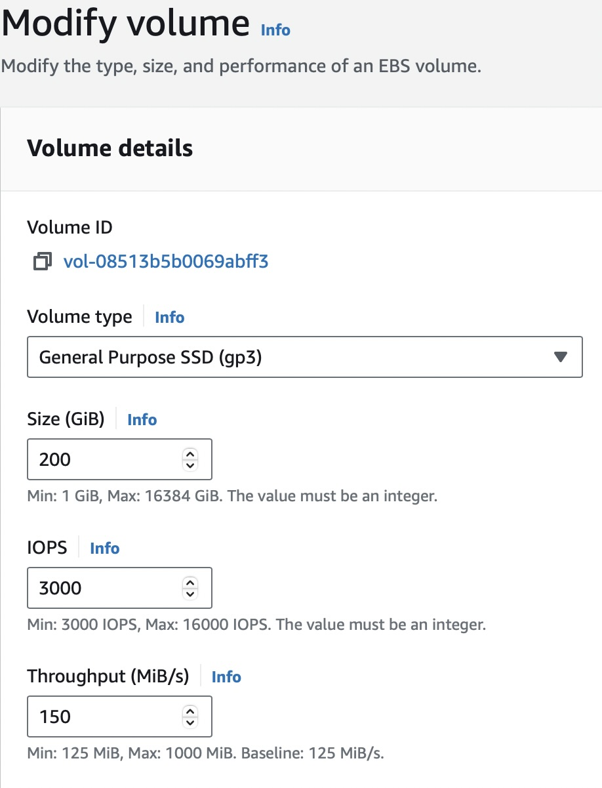
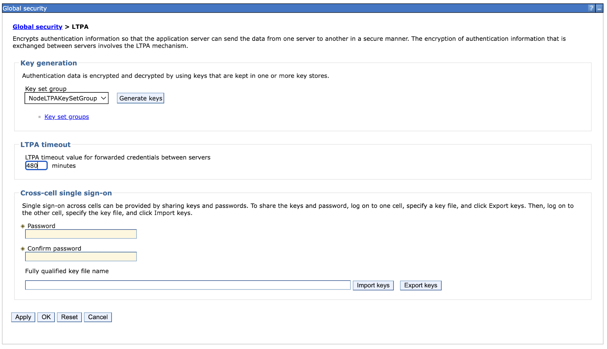
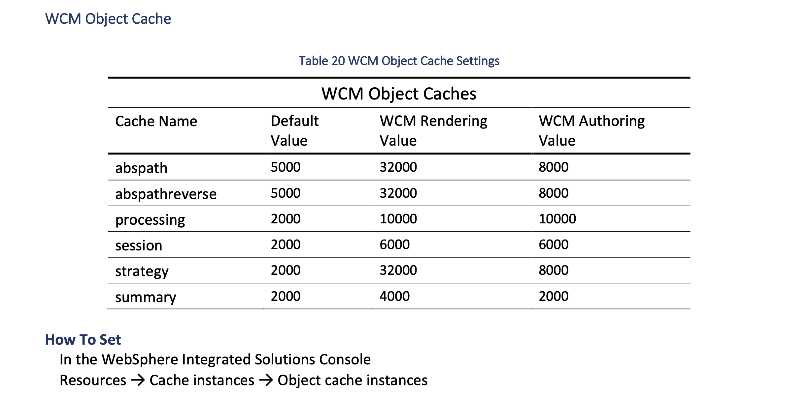
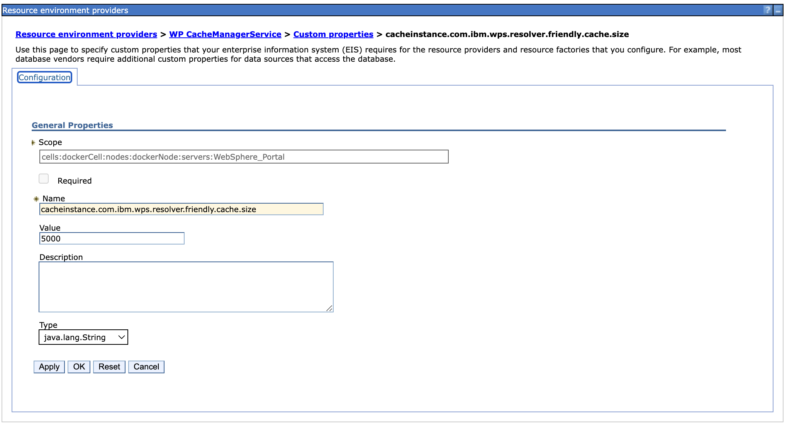
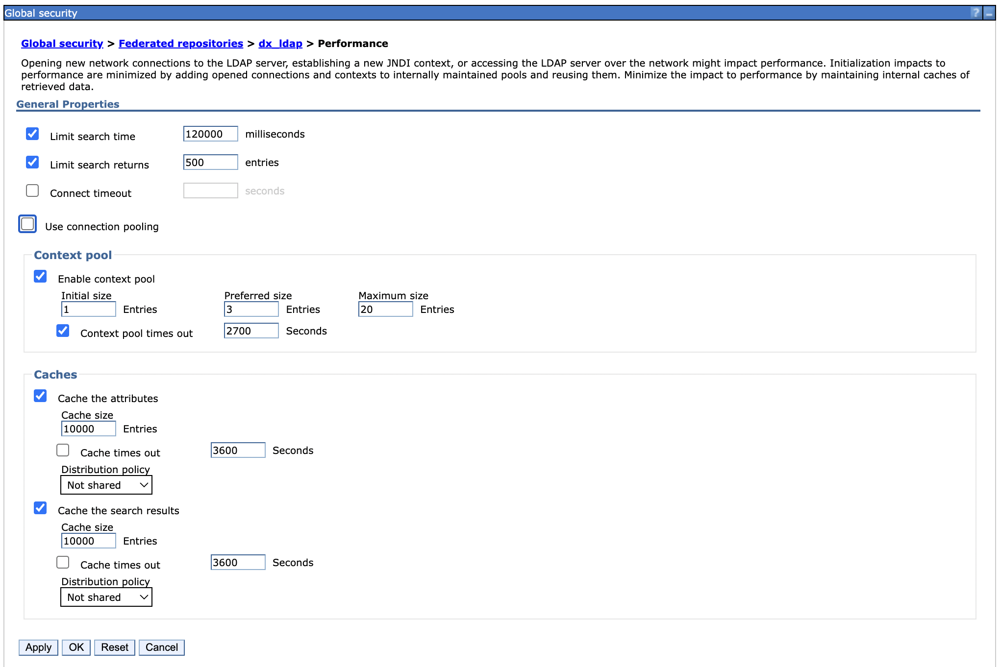
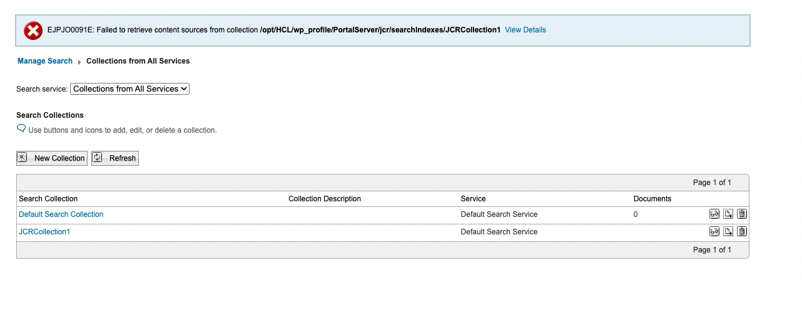
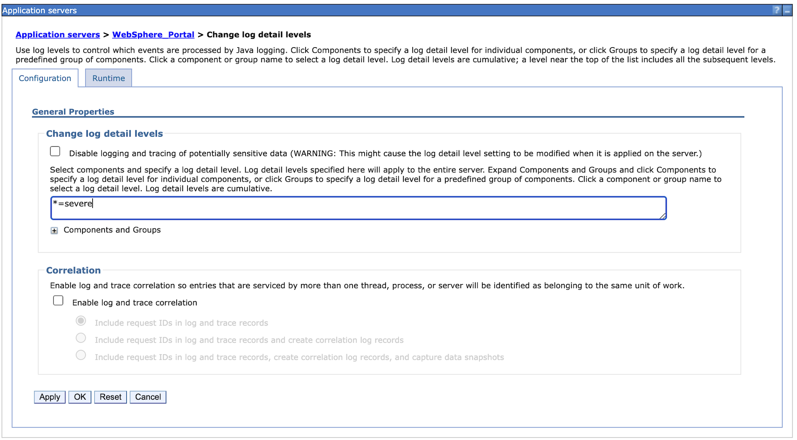
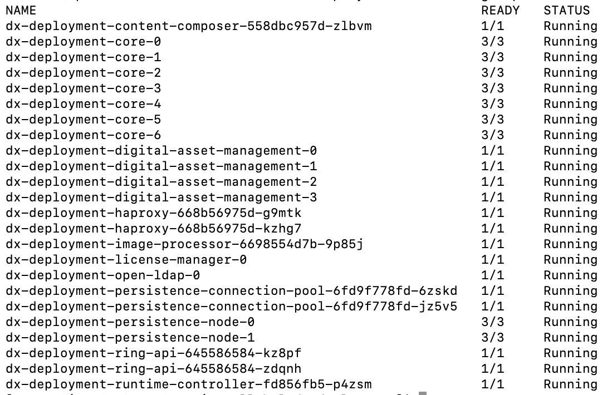

## Performance-sizing guidance for rendering in medium configuration

### Overview of DX rendering sizing-performance tests

DX sizing is one of the goals of DX performance tests. DX sizing aims to identify the reliable Kubernetes environment for small, medium, and large DX configurations. This topic presents the important KPIs (for example, number of concurrent users, average response time, and throughput) for the upper limit in a single-node configuration. This topic also discusses how adjustments to the core tuning, scaling of pods, and pod configuration can make significant improvements in system responsiveness.

This sizing work started with rendering scenarios of Web Content Management (WCM), portlets, and Digital Asset Management (DAM) with a rendering setup enabled in AWS/Native-Kubernetes. The Apache JMeter tool was used for performance tests.

For guidance when rendering with a small configuration, see [Performance-sizing guidance for rendering with a small configuration](../rm_container/dx_performance_small_cfg.md).

### Conclusion

This performance guidance shows the medium configuration on K8s cluster with AWS instances having one master (c5.xlarge) and four worker nodes (c5.4xlarge).

- Core tuning details are available in [DX core tuning](#dx-core-tuning-and-enhancements-after-10000-concurrent-user-run).

- The following table contains the number and limits for each pod. Using these values significantly improves the responsiveness of the setup and enables the system to handle 10000 concurrent users with average and 95th percentile (pct) response times in the range of ~5 seconds.

| Pod name                    | number of pods | Container                   | Container CPU request and limit(m) | Container memory request and limit(Mi) |
| --------------------------- | -------------- | --------------------------- | ---------------------------------- | -------------------------------------- |
| core                        | 7              | core                        | 5200                               | 8192                                   |
| ringApi                     | 2              | ringApi                     | 2000                               | 512                                    |
| haproxy                     | 2              | haproxy                     | 2000                               | 1024                                   |
| digitalAssetManagement      | 4              | digitalAssetManagement      | 1000                               | 2048                                   |
| persistence-connection-pool | 2              | persistence-connection-pool | 700                                | 1024                                   |
| persistence-node            | 2              | persistence-node            | 1000                               | 2048                                   |
| openLDAP                    | 1              | openLDAP                    | 500                                | 2048                                   |
|                             |                |                             | 52300                              | 76800                                  |

### Customer rendering scenario details

| Concurrent users      | Existing WCM pages | Existing DAM content | Pages with portlets |
| --------------------  | ------------------ | -------------------- | ------------------- |
| Small  – 1000 users   | 20                 | 2k                   | 80                  |
| Medium – 10000 users  | 200                | 10k                  | 800                 |
| Large  – 100000 users | 2000               | 50 - 100k            | 8000                | 

### Environment

#### AWS/Native Kubernetes

- An AWS Elastic Compute Cloud (EC2) instance is running on a native Kubernetes platform with the DX images installed and configured.

- In AWS/Native Kubernetes, the tests are executed in EC2 instances with one master (c5.xlarge) and 4 worker nodes (c5.4xlarge).

- The tests used a remote DB2 instance.(c5.2xlarge)

- The tests started with c5.2xlarge, then c5.4xlarge, and then a c5.9xlarge instance after analyzing test results and observations.

      

      

- Processor details

      

- Volume details

      

#### DB2 instance

- Remote DB2 - [c5.2xlarge]

      

      

- Processor details

      

- Volume details

      

#### JMeter agents

- JMeter instance - [c5.2xlarge]

- To run the tests, a distributed AWS/JMeter agents setup consisting of one primary and eight subordinates was used.

      

      

- Processor details

      

- Volume details

      

- Processor details

      

- Volume details

      

### Authoring details

Set up the systems before performing the rendering tests. This section provides details for WCM, DAM, and portlets authoring.

### WCM Default Test Data - 200 pages

#### WCM test data characteristics

- The default test data has a WCM design library called "PerformanceTestDesign" and five content libraries named "PerformanceTestContent01" to "PerformanceTestContent05".
      
- Each content library contains four levels of site areas, with four site areas per level. Only the 256 "leaf" site areas contain content.

- Each leaf site area contains ten content items, for a total of 12,800 content items across the libraries.

- Half of the content items are visible to "Anonymous" and "All Authenticated" users. This portion of the content items is evenly distributed between these two types of users and is profiled with the keyword "MENU".

- The other half is visible only to members of ten groups per content item. These ten groups are spread out among the 500 groups assumed to exist in the test LDAP, and assumed to be called "Group0000" through "Group0499".

- There are 20 test-portal pages created under the "PerformanceTest" label. Each page has a URL in the form "<context-root>/perf/page-xx". 20 pages are duplicated to 200 pages.

- Each page contains 6 WCM viewer portlets that show content below one of the 20 top-level site areas. For example, Pages 01 to 04 show content from site areas "SA01" through "SA04" in the "PerformanceTestContent01" library, and pages 05 to 08 show content from site areas "SA01" through "SA04" in the "PerformanceTestContent02"  library, and so on.

- Four of the portlets on each page show single-content items. For page 01, these are the first content items in site areas: "SA01.01.01.01", "SA01.02.01.01", "SA01.03.01.01", and "SA01.04.01.01" respectively. Other pages follow the same pattern.

- Another portlet on each page shows a navigator of site areas and content items below the same top-level area.

- The final portlet on each page shows a menu of items and is scoped to the top-level site area. It also selects only those items profiled with the "MENU" keyword.

- A total of 99,999 users were added to openLDAP as authenticated users.

### DAM default test data: 25,000 assets

- Testers uploaded 2,500 assets. These assets include images (136kb, .jpg), documents (199kb, .docx), and videos (1.1mb, .mp4) to preheat. After preloading 2,500 assets, 15 assets were uploaded and rendered for 1 hour.

- Details of 15 assets were uploaded for rendering.
      
- There are 19 URLs in total, three of which are custom URLs, eight are uuid URLs, and eight are short URLs, which are combinations of original, tablet, smartphone, and desktop renditions.

      | Asset    | Type          | Size                                      |
      | -------- | ------------- |-----------------------------------------  |
      | Image    | .jpg/png/tif  | 155kb, 2mb,5mb, 500kb, 100 kb, 2 mb,300 kb|
      | Video    | mp4/webm      | 5 mb, 199kb,200kb , 2 mb,199kb            |
      | Document | docx/xlsx/pptx| mp4- 1mb, 15mb, 100mb, webm- 2 mb         |

!!!note
      For DAM, only anonymous rendering is available.

### Pages and portlets default test data: 80 pages

Customers typically use a total of eight pages with portlets. To complete authoring and rendering, both anonymous and authenticated users received access. The same users were added in openLDAP for WCM rendering. All authenticated users are assigned the User role. The pages in the following list are duplicated 10 times with different page numbers, resulting to 80 pages.
 
As part of authoring, pages and portlets were added manually. The list shows the details of portlets for authoring on every page.

- Page 1 - 2 Articles
- Page 2 - 2 Rich text
- Page 3 - Login portlet
- Page 4 - Information Portlet(JSR) - JSP file -  jsp/oob/welcome.jsp 
- Page 5 - Search Centre portlet
- Page 6 - Custom JSF portlet with simple form (disabled in JMeter script because there are some errors)
- Page 7 - Script Application portlet (Added JavaScript Functions, Date and Time object examples)
- Page 8 - Added all mentioned portlets except JSF portlet

After completing the authoring steps, the anonymous portal user and authenticated users (added to openLDAP) must render the pages. Every page request uses a `/GET API` call (for example, `/wps/portal/portletsperf/page1`) and there is a response assertion in a sampler to validate the content html in the response body. 

### Combined DX rendering of WCM, DAM, and pages and portlets

For rendering sizing, all rendering JMeter scripts of WCM, DAM, and pages and portlets are combined. See the following section for details of load distribution.

**Load distribution**

- WCM - 40%
- DAM - 30%
- Pages and Portlets - 30%

### DX core tuning and enhancements after 10000 concurrent user run
      
The following list contains details of tuning and enhancements done to DX core during testing:

- LTPA token timeout increased from 120 minutes to 480 minutes for rendering tests execution.

 

- WCM object cache for rendering updated as per DX performance tuning guide.

 

 

- Updated abspath, abspathreverse, processing, session, strategy, summary values WCM rendering values as per tuning guide.

- Added new custom property under **Resource environment providers > WP CacheManagerService > Custom properties > cacheinstance.com.ibm.wps.resolver.friendly.cache.size**.

 

- Adjusted JVM Heap size from 3584 to 4096 under **Application servers > WebSphere_Portal > Process_definition > Java Virtual Machine**.

 

- Set LDAP user cache attributes and search to 10000.

 

- Disabled jcr.text.search under **Resource environment providers > JCR ConfigService Portal Content > Custom properties** because there is no search functionality.

 

- Deleted search collections in **Portal > Administration > Search > Search collections** (both JCRCollection1 and Default Search Collection).

 

- Logged level changes from info to severe in WAS for in both configuration and run time.

 

 !!!note
       Restart all core pods after performing all the tunings steps mentioned.

 - DB2 tuning performed by executing DB2 Reorg and Runstats.

#### Helm values

                                        Requests                Limits 
| Component                     | No. of pods | cpu(m)    | memory(Mi) | cpu(m)    | memory(Mi) |
|-------------------------------|-------------|-----------|------------|-----------|------------|
| contentComposer               | 1           | 100       | 128        | 100       | 128        |
| **core**                      | **7**       | **5200**  | **8192**   | **5200**  | **8192**   |
| **digitalAssetManagement**    | **4**       | **1000**  | **2048**   | **1000**  | **2048**   |
| imageProcessor                | 1           | 200       | 2048       | 200       | 2048       |
| **openLdap**                  | **1**       | **500**   | **2048**   | **500**   | **2048**   |
| **persistenceNode**           | **2**       | **1000**  | **2048**   | **1000**  | **2048**   |
| **persistenceConnectionPool** | **2**       | **700**   | **1024**   | **700**   | **1024**   |
| **ringApi**                   | **2**       | **2000**  | **512**    | **2000**  | **512**    |
| runtimeController             | 1           | 100       | 256        | 100       | 256        |
| **haproxy**                   | **2**       | **2000**  | **1024**   | **2000**  | **1024**   |
| licenseManager                | 1           | 100       | 300        | 100       | 300        |
| **Total**                     |             | **52300** | **76800**  | **52300** | **76800**  |

#### Details of Pods in native-kube deployment

#### Results overview

##### Observations 

- 76 bad requests out of 6647702 samples (contributing to 0% error rate) from JMeter results observed only in DAM APIs, which is negligible.

- The CPU usage of a node reached an average of 80% in tests with 10000 concurrent users. The saturation was checked by reducing the number of users to 5000, 3000, and 2500 users. Node CPU average usage is then close to 70% and maximum is 80% in all 5000, 3000, and 2500 users load test results.

- For 5000 and 3000 concurrent users, results of average and 90th pct response time of APIs exceed 5 seconds.

-  It is suggested that for a single node (c5.9xlarge) rendering scenarios for DAM, WCM, and pages with portlets, the recommended load is 2500 concurrent users with good average and 90th percentile (pct) response times. The top five response times of rendering APIs are all in the range of 4 to 5 seconds.

