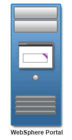

# HCL Digital Experience demonstration environment: Roadmap

A demonstration environment is ideal for running products, features, and application demonstrations. After installation, you have an Apache Derby database and a default file-based repository.

# Who should use this roadmap

Use this roadmap if you are an organization with the following requirements:

-   An organization that wants to explore new features or functions.
-   An organization that must demonstrate HCL Portal to customers, clients, or colleagues.
-   An organization that requires an environment to demonstrate applications and designs.
-   An organization that wants to demonstrate a specific database or user registry, using the Stand-alone server roadmap.

# Topology diagram

A demonstration environment is a portal server with a local database. Because Apache Derby is installed, configured, and ready for use, a database is not included in the topology diagram.

# Preparing for the installation process

Gather information and software before you install HCL Digital Experience.

1.  Check product system requirements.

2.  Log in to [HCL Software Support](https://www.hcltechsw.com/wps/portal/about/welcome.html) and get the software.

# Installing HCL Digital Experience

Installing HCL Digital Experience involves preparing your operating system, installing or upgrading the installation manager, and running the installation program. See *Installing the HCL Digital Experience software* for more information.

# Applying the latest cumulative fix

Portal maintenance is delivered through individual Fixes and Combined Cumulative Fixes \(CFs\), which are recommended to your environment.

# Tuning the servers in your environment

Tuning the servers is important for the performance of your portal environment. After installation and deployment, HCL Portal is not tuned for a production environment. Your database requires tuning for improved performance. You can organize your database now or soon after you finish configuration. You must tune and maintain your database regularly.

Run the performance tuning tool to complete the initial tuning of your servers.

