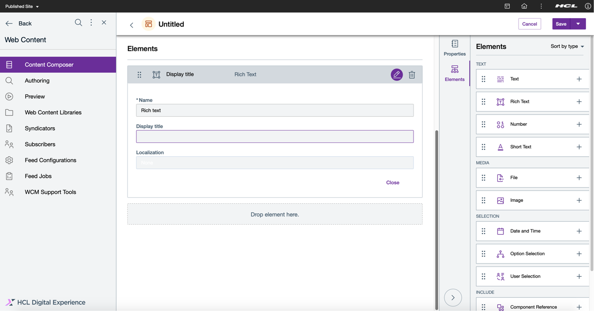

---
tags:
    - Content Management
    - Web Content
hide: tags
---

# Content management

HCL DX provides a fully-featured, multi-platform web content-management solution. DX facilitates the management of your growing volume of digital content that is required to run your business and support critical decisions.

## Separated template and design

HCL DX separates the content from the presentation layer. Content authors enter information in authoring templates. The authoring template is then associated with a presentation template. The presentation template defines how the content is rendered and presented to site visitors. As a result, you can rapidly change the look and feel of your content without editing the same elements repeatedly.

The following example of a content template shows how you can drag and configure all elements as part of content.

## Headless content access

The team can access content headlessly by using the [WCM REST APIs](api_access.md). With this API, users can integreate content stored in HCL DX with applications created outside the platform, for example, a mobile application built with HCL MX, a commerce site built with HCL Commerce, or a standalone React application.

## Standalone and inline content editors

Users can edit content in a standalone application or inline with a website hosted by HCL DX.

If you are primarily thinking about your content outside of a specific presentation, then you can use the DX content authoring tools to create and manage individual content items. The following figure shows the content editor:

However, many people create content in the context of a specific website. In that case, HCL DX provides inline editing capabilities that are integrated with the websites built on the platform. With this approach, content authors can browse to the relevant page in the [site manager](site_building.md) and edit the content in the context of the page where it is displayed.

These two modes of content editing are not mutually exclusive. Because a content item might be presented in multiple ways, changes to the source are reflected wherever it is presented.

## External data and content

You can use Web Content Integrator, [WCM REST services](api_access.md), [Digital Data Connector](application_integration.md), specialized portlets and other tools to retrieve and render content from sources outside HCL DX. Every time a form is created with [HCL Leap](https://www.hcltechsw.com/leap), an API is generated that you can use to access its logic and data.