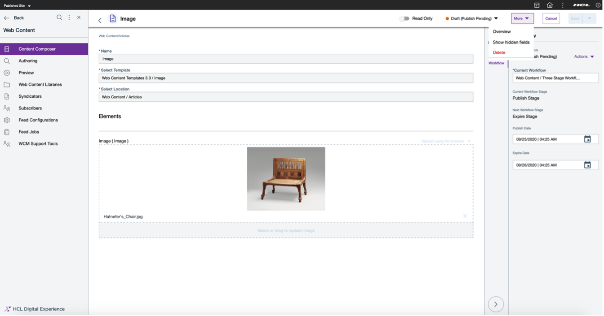

---
tags:
    - Content Management
    - Web Content
hide: tags
---

# Content Management

HCL DX provides a fully featured, multi-platform web content management solution. Easily manage your growing volume of digital content that is required to run your business and support critical decisions.

## Separated Template and Design

HCL DX separates the content from the presentation layer. Content authors enter information in authoring templates. The authoring template is then associated with a presentation template. The presentation template defines how the content is rendered and presented to the site visitor. As a result, you can rapidly change the look and feel of your content without editing the same elements repeatedly.

Here is an example of a content template where you can drag & drop and configure any element as part of content.

## Headless Content Access

Content can be accessed headlessly, using the [WCM REST APIs](api_access). This enables content stored in HCL DX to be integrated to applications created outside the platform, for example a mobile application built using HCL MX, a commerce site built using HCL Commerce or a standalone React application.

## Standalone and Inline Content Editors

Content can be edited either standalone or inline with a website hosted by HCL DX.

If you are primarily thinking about your content outside of a specific presentation, then you can use our content authoring tools to create and manage individual content items. That content editor is shown below:

On the other hand, many people create content in the context of a specific website. In that case, HCL DX provides inline editing capabilities that are integrated to the websites built on the platform. This enables content authors to browse to the relevant page in [site manager](site_building) and edit the content in context of the page where it is displayed.

These two modes of content editing are not mutually exclusive. Since a single item of content may be presented in multiple different ways, changes made to the source are reflected wherever it is presented.

## External Data and Content

You can use Web Content Integrator, [WCM REST services](api_access), [Digital Data Connector](application_integration), specialized portlets and other mechanisms to retrieve and render content from sources outside HCL DX. Every time a form is created with [HCL LEAP](forms_building), an API is generated that enables you to access its logic and data.