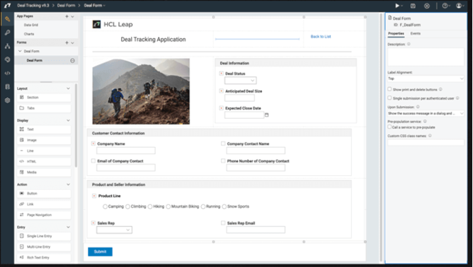

---
tags:
    - LEAP
    - Forms
    - Forms Builder
hide: tags
---

# Form Application Builder

HCL DX provides the HCL LEAP product to allows business users to create and deploy customer engagement applications and forms. Customers have used HCL LEAP to build applications like Issue and resolution tracking, Customer change requests, Supply chain certification, Healthcare tracking, Business requests, Customer acquisition and Employee onboarding.

## Forms Builder

HCL Leap lets non-technical users easily create sophisticated web applications for data collection and process automation. Applications are designed without writing code through a simple drag and drop interface. More technical users can extend the application further by including custom JavaScript actions, for example. Styles can be modified through CSS, functions added as HTML fragments and JavaScript can be used with the software’s comprehensive API and events.

Integrate data from existing systems to pre-populate fields and feed back-end systems with information you collect. HCL LEAP's service architecture lets you define connections with most back-end services, including services created using HCL MX Foundry.

When you deploy your application HCL Leap automatically creates its runtime which includes forms, database, reports, charts, API, rules, notifications, security, and workflow.

Easily build the application using drag & drop:

## Integrated Workflow

HCL LEAP also includes flexible, role-based workflow and access control. You can automatically generate email notifications, invoke services at workflow steps and provide a dynamic experience based on rules. Forms' lifecycle can also be controlled, with different access at each stage. This enables simple processes to be automated via HCL LEAP.

