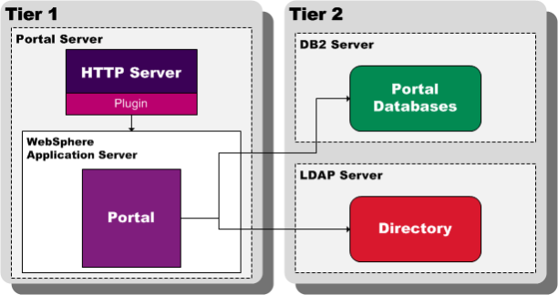
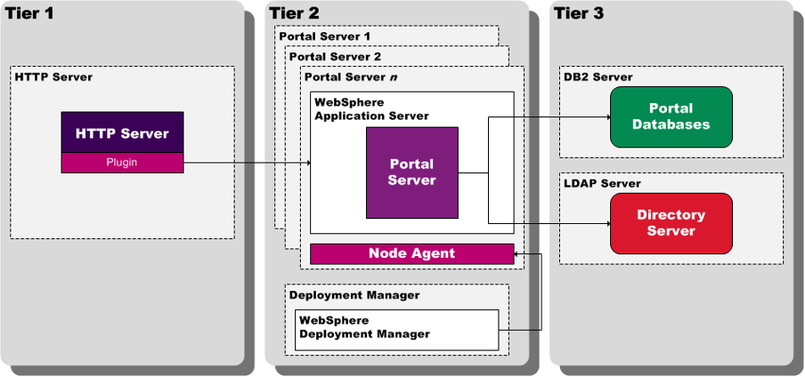

# Performance Tuning Overview

Tuning an HCL Digital Experience (DX) environment involves tuning and configuring the various systems and components of the environment. This chapter discusses some general concepts and details the specifics of the configuration used in our measurement environments. These specifics entail:

    - Configuring the application server and the resources defined for that application server
    - Tuning the database(s) and database server
    - Tuning the directory server and its database
    - Tuning the web server and/or proxy server
    - Tuning the operating system and network stack
    - Tuning the HCL DX services to ensure sufficient bandwidth to support the required user load
    - Performance is acceptable even on slower, long distance networks

When tuning specific systems, it is important to begin with a baseline and monitor performance metrics to determine if any parameters should be changed. When a change is made, another measurement should be made determine the effectiveness of the change.

In addition to the tuning changes we made in our measurement environments, there are some additional tuning options available which can improve performance in certain circumstances; these will be discussed in the Other Tuning Considerations section.

## Using This Document

A ConfigEngine tuning task was added in Portal 8.0.0.1 CF 6 and ships out of the box with HCL Portal 8.5. This task automatically applies some, but not all of the tuning changes discussed in this document. This includes basic tuning of the JVM Max heap & nursery sizes, JDBC & WebContainer ThreadPools and CacheManagerService properties.

The tuning task also configures Portal as a rendering server by setting deployment.subscriberOnly=true and turning off the toolbar. This can be changed for Authoring environments by editing the task’s properties files.

This task should be run as the first step for tuning a Portal server. See [Portal server performance tuning tool](../../deployment/manage/tune_servers/wp_tune_tool.md) for information on how to configure and run this task.

If additional tuning is necessary, start by applying the Base Portal Tuning then apply the tunings that are specific to the use case. For example, if you are using Web Content Management (WCM) also apply the WCM tunings.

The tunings in this document are applicable to HCL Digital Experience version 8.5 and higher releases.

## Environment Recommendations

Before beginning your install of HCL Portal and Web Content Manager, you should consider how the environment will be used to achieve ideal performance.

### 64 Bit versus 32 Bit

For Portal 8.5, 32 bit JVMs are no longer supported. All measurements were run with 64 bit operating systems running 64 bit versions of IBM WebSphere and HCL Portal and WCM.

### Hardware Multithreading

Many modern processor architectures support hardware multithreading. For example, this is known as Hyper-Threading (HT) on Intel processors and Simultaneous Multithreading (SMT) on Power processors. Our experience is that using hardware multithreading provides an improvement in capacity in all of the scenarios and platforms we have measured, so we would recommend its use on platforms where this is an
option.

### Virtualization

When running Portal in a virtualized environment, it is important to ensure that the virtual machines are
allocated enough resources to perform optimally. To reach capacity on a virtual machine (VM) it may be
necessary to ensure that the virtual resources map one-to-one with physical resources, especially CPU and
memory. Running Portal on a VM whose host is over committed will not achieve optimal performance.
Consider dedicating CPUs and memory to the Portal VMs.

In addition, ensure that the network bandwidth to the host is sufficient for all VMs. Depending on
requirements, the Portal VM may require a dedicated network interface on the host.

### Portal Topologies

HCL Portal supports a variety of deployment topologies. Typical deployments will use a three-tier
configuration:
    - HTTP server(s)
    - Application server(s)
    - Database and directory server(s)

The primary benefit of having a multi-tiered configuration is to avoid resource contention brought on from
multiple databases and applications residing on a single server. For example, if the database server shares a
node with the application server, the combined resource contention would negatively impact the amount
of throughput that can be achieved. On the other hand, a small deployment may have sufficiently small
resource requirements that some of these servers could be deployed on a single node.

A multi-tiered configuration also allows a single component to be scaled up by adding extra servers. Portal
servers, for instance can be added to increase capacity without also requiring a new database installation
and configuration.

### Single-Server Topology

For smaller deployments, some of these tiers may be run on a single system. For example, a common
configuration is to use a single node to run the HTTP server and the application server, while the database
and directory servers are run on separate servers. This is the configuration we have used for most
performance benchmarks. The only exception to this was on newer, more powerful Windows systems. In
that case, Portal was able to support so many simultaneous users, that an outboard-64 bit HTTP server was
required.

### Cluster Topology

A cluster deployment has one or more nodes in the application server tier. The cluster configuration we
used in our lab, shown in the diagram below, is as follows:

The first tier is a web server. We used the WebSphere plugin for load balancing. The incoming client HTTP requests are routed by the plugin to a cluster of Portal servers using the random load balancing algorithm.

Many clustered deployments will use multiple HTTP servers with a load balancer directing traffic to those servers. This will provide additional capacity at the HTTP servers as well as server failover support at the HTTP layer.

The second tier includes the Portal servers and the Deployment Manager. The Portal servers execute portlets and other application logic to handle the client requests. The Deployment Manager coordinates all Portal server processes through a node agent process running on each node. This diagram depicts a horizontal cluster where each Portal server runs in a separate operating system. Portal also supports a vertical clustering topology where multiple Portal servers run on a single operating system. Vertical clustering was not measured in performance benchmarks because 64-bit JVMs are capable of utilizing all the CPU resources of systems with at many as 12 cores.

Incoming HTTP requests from the web server (tier 1) were routed to one of Portal server nodes using the WebSphere plugin. With session affinity, the plugin will attempt to route all requests associated with a particular session (end user) to the same node.

The third tier includes the LDAP server and Portal databases. These servers store the user directory information about Portal resources such as pages & portlets and WCM content.

