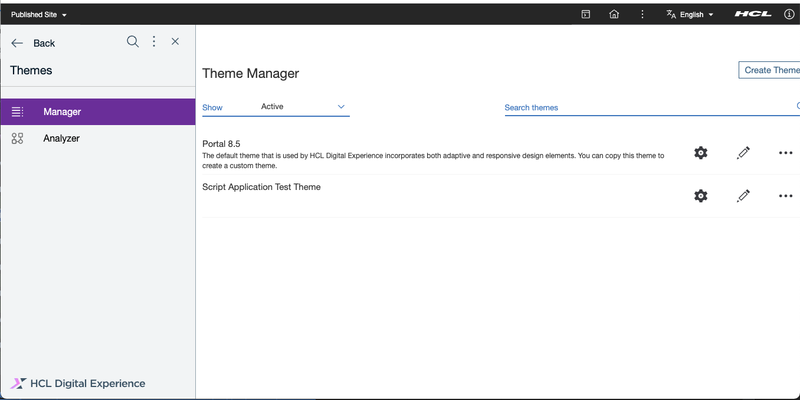
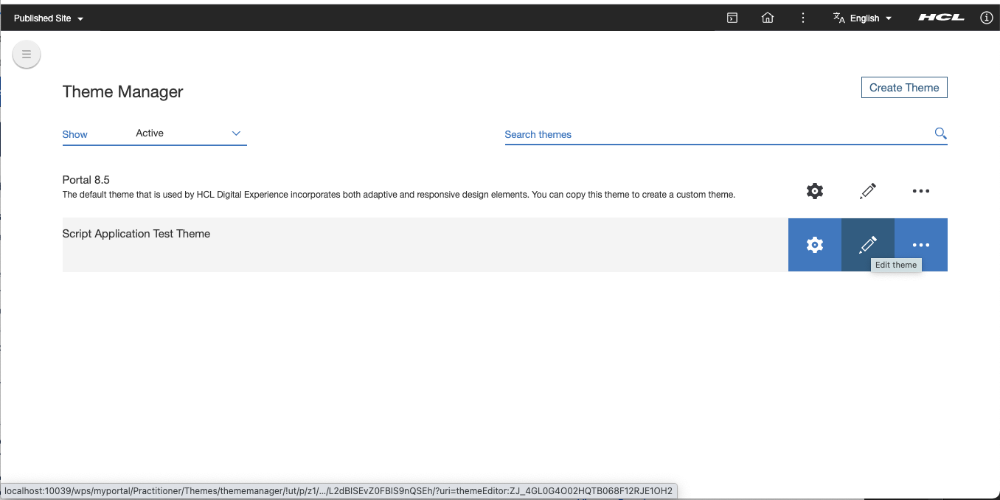
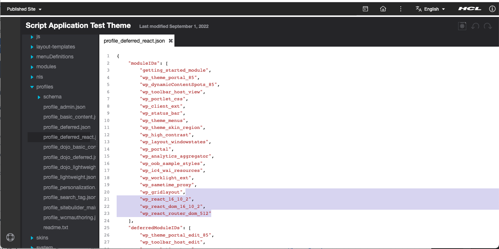
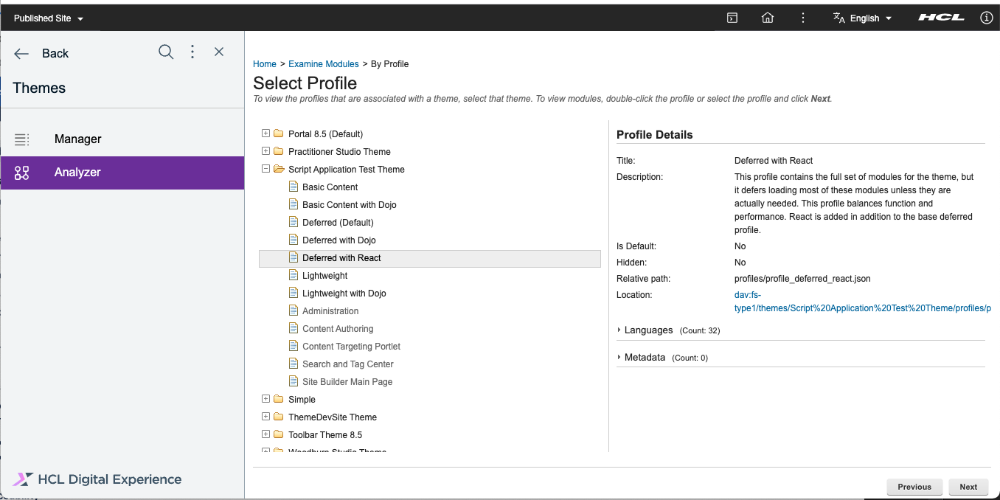
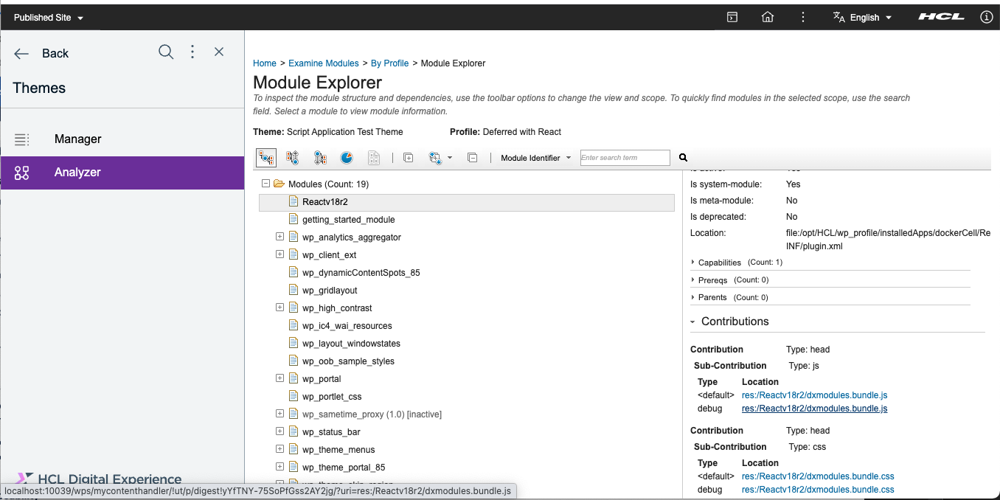

# Verify A Successful Deployment and Link a DX Module to a DX Theme

## Verify in WebSphere Application Server

To verify, log in to the WebSphere console. Under the *Applications* tab, then the *Application Types*, and then lastly in the *Business-level applications*, you can search for your application name in the table in the right-hand side.
   

## Verify In HCL DX and Link to Theme

To verify inside HCL Digital Experience:

   Click Theme button in Practitioner Studio Home Page
   
   Click the Menu button at the upper left most part of the screen
   
   Click the Manager Menu icon in the top-left corner.
   
   Click Pencil Button on the right side of the theme to be used (i.e. Script Applications Test Theme)
   
   Go to profiles->profile_deferred_react.json then remove the 3 highlighted moduleIDs (for release builds prior to CF205, the following modules will not exist).
   
   Add the new module (i.e. Reactv18r2). Click on the Save button (disc icon) in the upper right area.
   
   Click the Analyzer Menu then click the Examine modules by profile
   
   Navigate to Examine modules by profile and click the module used then click Next button
   
   Expand Modules and the module uploaded must be there (i.e. Reactv18r2). Note: there must be no warning icon in the uploaded module.
   
