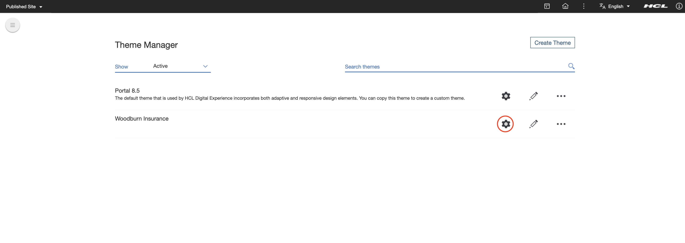
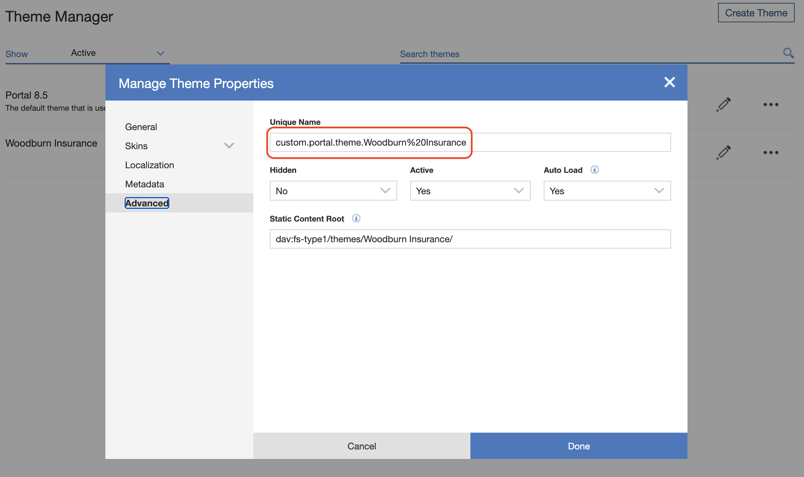
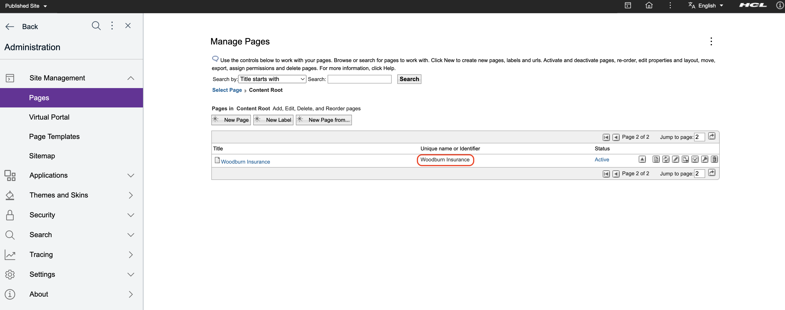

---
tags:
    - Script Application
    - Gradle
    - Theme
    - DX Site
    - WCM Library
hide: tags
---

# Importing and Exporting DX Site

## Overview
### What You Will Learn In This Tutorial
   - How to export parts of a DX Site
   - How to import parts of a DX Site from exported files
   - What to look out for when exporting and deploying DX sites

## Reference Site
   - WoodBurn Insurance Demo Site could be used as reference to try and test the steps detailed in this guide. You can find it [here](https://github.com/HCL-TECH-SOFTWARE/DX-Modules-and-ScriptApps/showcase-sites/WoodBurnInsurance).

## Common Set-up
### Config File

   - Create a config file that you can use to set up your frequently used environment variables. Save the config file in your working directory.

    
    === "MacOS or Linux"

        !!!example "sample.config"

            ```bash
            # the protocol with which to connect to the server
            export DXPROTOCOL=https
            # the hostname of the target server
            export HOSTNAME=localhost
            # the port on which to connect to the server (for Kubernetes Environment, dxPort is 443)
            export DXPORT=10041
            # the port number of the cw_profile (for Kubernetes Environment, dxConnectPort is 443)
            export DXCONNECTPORT=10202
            # the profile name of the DX core server
            export DXPROFILENAME=wp_profile
            ```
 
    === "Windows "

        !!!example "sample.bat" 

            ```bat
            :: The protocol with which to connect to the server
            set "DXPROTOCOL=https"
            :: the hostname of the target server
            set "HOSTNAME=localhost"
            :: the port on which to connect to the server (for Kubernetes Environment, dxPort is 443)
            set "DXPORT=10041"
            :: the port number of the cw_profile (for Kubernetes Environment, dxConnectPort is 443)
            set "DXCONNECTPORT=10202"
            :: the profile name of the DX core server
            set "DXPROFILENAME=wp_profile"
            ```
        !!!tip 
            For Windows batch files, enabling [delayed expansion](https://ss64.com/nt/delayedexpansion.html) and using ! (i.e: !DXPROTOCOL!) instead of % (i.e: %DXPROTOCOL%) is encouraged to avoid unwanted reuse of old values from previous runs.  

## How to export parts of a DX Site
1.  [Manual export of a DX Theme via Practitioner Studio](manual_export_theme.md)
2.  [Manual export of a DX site's_page_hierarchy](manual_export_site_page_hierarchy.md)
3.  [Export a DX Theme via commandline](export_theme.md)
4.  [Export a DX site's page hierarchy via commandline](export_site_page_hierarchy.md)
5.  [Export the DX site's WCM libraries via commandline](export_wcm_library.md)

## How to import parts of a DX Site from exported files
Here are the steps in order to deploy your exported DX Site:
1. [Deploy all DX Modules required by your DX Theme.](../../common-setup/build-and-deploy/build_and_deploy_dx_modules.md)
2. [Deploy the DX Theme you have created for your site. (Skip if you are using one of the out the box themes).](import_theme.md)
3. [Import all of WCM library that have your components.](import_wcm_libraries.md)
4. [Import your site page hierarchy.](import_site_page_hierarchy.md)
5. [Update all of WCM library that have references to site pages.](import_wcm_libraries.md)
6. [(Optional) Update the script applications](../../common-setup/build-and-deploy/build_and_deploy_scriptapps.md)

## XML files
   Sample XML files are available in the [WoodBurn Insurance reference site](https://github.com/HCL-TECH-SOFTWARE/DX-Modules-and-ScriptApps/showcase-sites/WoodBurnInsurance). DXClient samples are also available in the DX server located in the following directory: `<portal_server_home>/doc/xml-samples`.

!!!note "When using Woodburn Insurance Demo"
   The following xml files are already included in the demo named theme-export.xml and site-export.xml respectively.

###  Theme Metadata XML
This xml will be used to export the metadata xml of theme.
!!!example "theme-export.xml"
        
    ```XML
    <?xml version="1.0" encoding="UTF-8"?>
    <!--
    =================================================================
    * Licensed Materials - Property of IBM
    * (c) Copyright IBM Corp. 2012.  All rights reserved.
    *
    * US Government Users Restricted Rights - Use, duplication or
    * disclosure restricted by GSA ADP Schedule Contract with IBM
    * Corp.
    *
    * DISCLAIMER OF WARRANTIES.  The following [enclosed] code is
    * sample code created by IBM Corporation.  This sample code is
    * not part of any standard or IBM product and is provided to you
    * solely for the purpose of assisting you in the development of
    * your applications.  The code is provided "AS IS", without
    * warranty of any kind.  IBM shall not be liable for any damages
    * arising out of your use of the sample code, even if they have
    * been advised of the possibility of such damages.
    *
    =================================================================
    -->

    <request
       xmlns:xsi="http://www.w3.org/2001/XMLSchema-instance"
       xsi:noNamespaceSchemaLocation="PortalConfig_8.0.0.xsd"
       type="export">

       <portal action="locate">
          <skin action="export" objectid="custom.portal.skin.Woodburn%20Insurance.Standard" />
          <theme action="export" objectid="custom.portal.theme.Woodburn%20Insurance" />
       </portal>
    </request>
    ```

   - modify the objectid to match yours.
   ```xml
      <portal action="locate">
         <skin action="export" objectid="custom.portal.skin.Woodburn%20Insurance.Standard" />
         <theme action="export" objectid="custom.portal.theme.Woodburn%20Insurance" />
      </portal>
   ```
   - You can find the objectid by going to Theme Manager and then clicking the cog.
      
   - Skin objectid.
      
   - Theme objectid.
      

###  Page Hierarchy XML
This xml will be used to export the Page metadata and hierarchy xml of your site.
!!!example "site-export.xml"
      ``` XML
      <?xml version="1.0" encoding="UTF-8"?>
      <!--
      =================================================================
      * Licensed Materials - Property of IBM
      * (c) Copyright IBM Corp. 2003, 2010.  All rights reserved.
      *
      * US Government Users Restricted Rights - Use, duplication or
      * disclosure restricted by GSA ADP Schedule Contract with IBM
      * Corp.
      *
      * DISCLAIMER OF WARRANTIES.  The following [enclosed] code is
      * sample code created by IBM Corporation.  This sample code is
      * not part of any standard or IBM product and is provided to you
      * solely for the purpose of assisting you in the development of
      * your applications.  The code is provided "AS IS", without
      * warranty of any kind.  IBM shall not be liable for any damages
      * arising out of your use of the sample code, even if they have
      * been advised of the possibility of such damages.
      *
      =================================================================
      -->

      <request
         xmlns:xsi="http://www.w3.org/2001/XMLSchema-instance"
         xsi:noNamespaceSchemaLocation="PortalConfig_8.0.0.xsd"
         type="export">

         <!-- sample for exporting a page -->
         <portal action="locate">

            <content-node action="export" uniquename="Woodburn Insurance"  export-descendants="true"/>

         </portal>
      </request>
      ```

   - modify the uniquename to match yours.


   ``` XML
         <content-node action="export" uniquename="Woodburn Insurance"  export-descendants="true"/>
   ```

   - You can find it in `Administration > Site Management` under the `Unique name or Identifier` Column.
   
