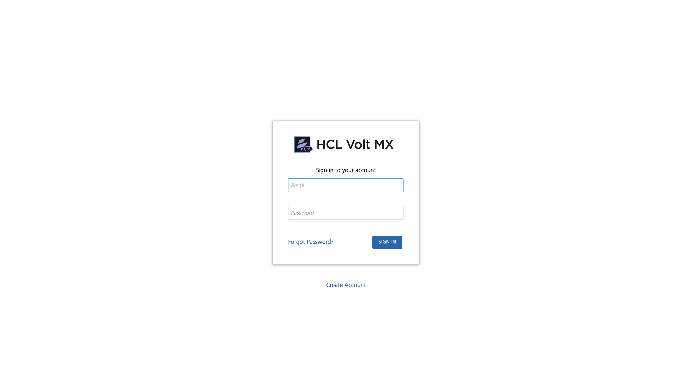
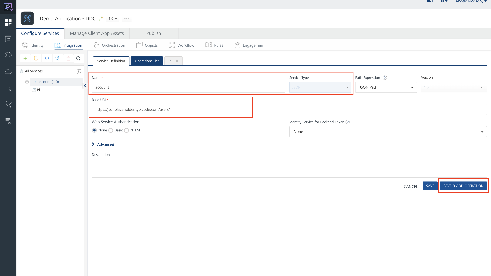

# Configuring Volt MX Foundry to connect to Digital Experience DDC

This section provides the steps on how to configure Volt MX Foundry to be able to connect via DX DDC.

## Prerequisite

You must have access to the Volt MX Foundry Console via Volt MX Cloud or On-Premise instance. You may consult this link for the [cloud service](https://opensource.hcltechsw.com/volt-mx-docs/docs/documentation/Foundry/voltmx_foundry_user_guide/Content/Accessing_VoltMX_MBaaS_Portal.html) and [on-premise service](https://opensource.hcltechsw.com/volt-mx-docs/docs/documentation/Foundry/voltmx_foundry_user_guide/Content/How_to_access_VoltMX_Foundry_Portal_on-Prem.html). In this sample, we will use the cloud service that Volt MX offers.

## Create new integration service with Volt MX Foundry

Follow the steps below to use the new integration service with Volt MX Foundry cloud service:

1.  Go to [https://manage.hclvoltmx.com](https://manage.hclvoltmx.com) to access paid cloud resources, or  [https://manage.demo-hclvoltmx.com](https://manage.demo-hclvoltmx.com) to access your trial environment.

    

2.  Select **Apps** sidenav. Then, click **Add New**.

    

3.  Create a new API endpoint via the **Integration Service**. Then, click **Integration**, then **Configure New**.

    

4.  Configure the service definition. Add a **Name**, then select **Service Type** and Add **Base URL**. Then click **Save & Add Operation**

    

4.  Add an **Operation** for the service that we created. Add **Name**, then under **Operation Security Level**, select **Anonymous App Users** or **Public** since it's the only option right now that is supported in DDC and last, you can modiy the **target URL** if the URL needs modification (see sample below).  Then in the **Advance** section, click **Front End API**. Under **Resource Method** select the **GET** since it's the only method supported in DDC. 

    

5. Adding **Response Output**. Click the **Response Output** tab, then click **Add Parameter**. After clicking, a row will appear on the table. Add the **Name**, then the **Path** or the JSON Path. The path is based on the response of the target URL you define in Service Definition. Let's try the service by clicking **Save And Fetch Response** and if everything is okay, then click **Save Operation**.

    

## Publish and Test integration service with Volt MX Foundry

1. Under the **Publish** tab, click the **Publish** button.

    

2. Once the App is published, we can now test the API endpoint by using **Developer Portals**. Click **Developer Portals** the sidenav then click the on link where your environment is located. This will open a new tab in your browser.

    

3. View the endpoint we created. On the Developer Portals, click **API**, then under the App you created, there is a dropdown button. Click the **View** link on the integration service you have created. This will redirect you to the Swagger Page where you can try your Endpoint.

    

4. Test the endpoint we created. Before we test the endpoint we created, we must Authorize the call since we chose **Anonymous App Users** during the creation of the operation. Click the **Authorize** button and put in the username field the **App Key** and in the password field the **App Secret**. Both values can be swagger page. On the swagger page, we will see the service that we created and click the dropdown beside it, then click the **Try Out** button. Once all the fields are filled up, you can now excute the API. There should be a response when everything is set up properly.

    

Note: If you created your Operation **Public** in Operation Security Level you dont need any authorization.