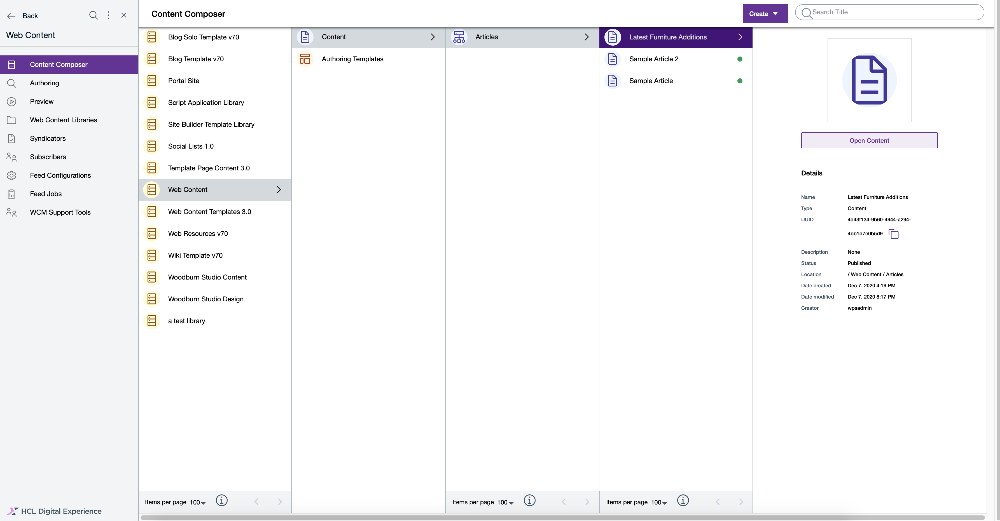
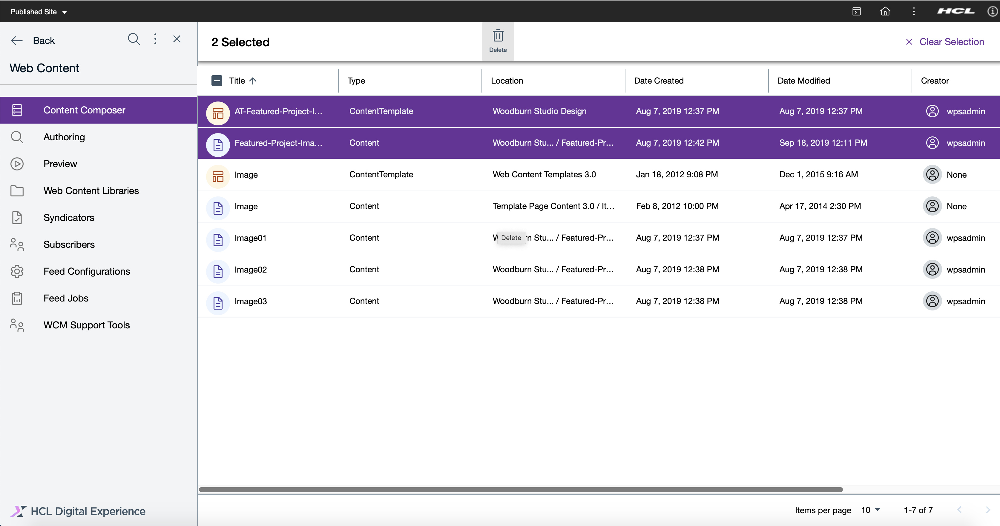

# Delete Content Templates

This section provides the steps on how to delete a content template using HCL Content Composer.

## Prerequisite

Content Composer should be installed and configured to HCL Digital Experience 9.5 container release update CF181 or higher. See instructions to install to supported container environments in the [Install HCL Digital Experience 9.5 Components](../../installation/install_config_cc_dam.md) topic.

Content Composer is accessible from the Practitioner Studio interface (after image configuration to your HCL Digital Experience 9.5 CF181 and higher deployment).

## Delete a content template

1.  Log in to your HCL Digital Experience 9.5 platform, and select **Web Content** from the Practitioner Studio navigator.

    

2.  Select **Web Content** menu option to access the HCL Digital Experience 9.5 Content Composer user interface.
3.  Access the content item you wish to delete. In this example, the content item example is obtained from **Content Composer > Web Content > Web Content Templates** site area location.

    

4.  The content item editor interface is set in **Read Only** mode. Click the **Read Only** selector to switch the interface to **Edit** mode to edit the content.
5.  Select the **Delete** option from the **More** drop down selector as shown below:

    

6.  A pop-up will ask to confirm the **Delete** action. Click **Delete** to confirm or **Cancel** cancel action.

## Delete content template from Search Results view

Users can also delete content from the Search Results view.

1.  From the HCL Digital Experience 9.5 Content Composer user interface, enter a search term in the search box located in the upper right corner as shown in the example below:

    

2.  Click to select the content to delete. User can choose more than one content to delete, as shown below. Then click **Delete**.

    

3.  A pop-up will ask to confirm the **Delete** action. Click **Delete** to confirm or **Cancel** cancel action.

## Delete from Dashboard view

Users can also delete content from the Search Results view.

1.  From the HCL Digital Experience 9.5 Content Composer user interface, enter a search term in the search box located in the upper right corner as shown in the example below:

    

2.  Click the avatar icon of the content you wish to delete. Users can choose more than one content to delete, as shown below.

    

3.  Click the **Delete** from the main header.
4.  A pop-up will ask to confirm the **Delete** action. Click **Delete** to confirm or **Cancel** cancel action.

<!--
## HCL Digital Experience Solution Feedback

HCL Digital Experience is interested in your experience and feedback working with HCL Digital Experience 9.5 release software. To offer comments or issues on your findings, please access the [HCL Digital Experience 9.5 Feedback Reporting application](https://www.hclleap.com/apps/secure/org/app/158bbc7c-f357-4ef0-8023-654dd90780d4/launch/index.html?form=F_Form1){:target="_blank"}. -->

