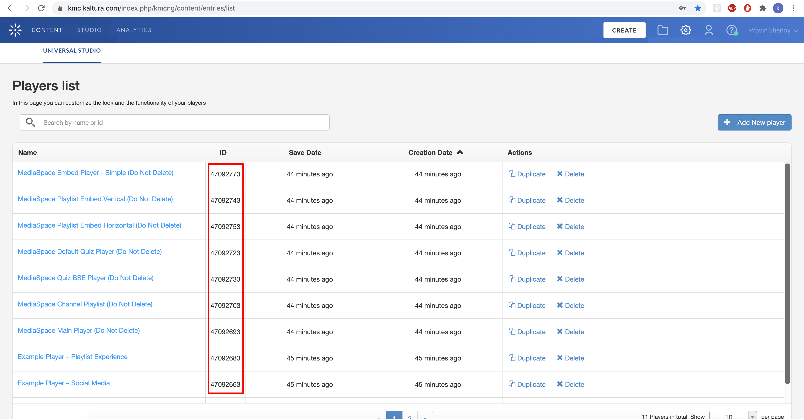
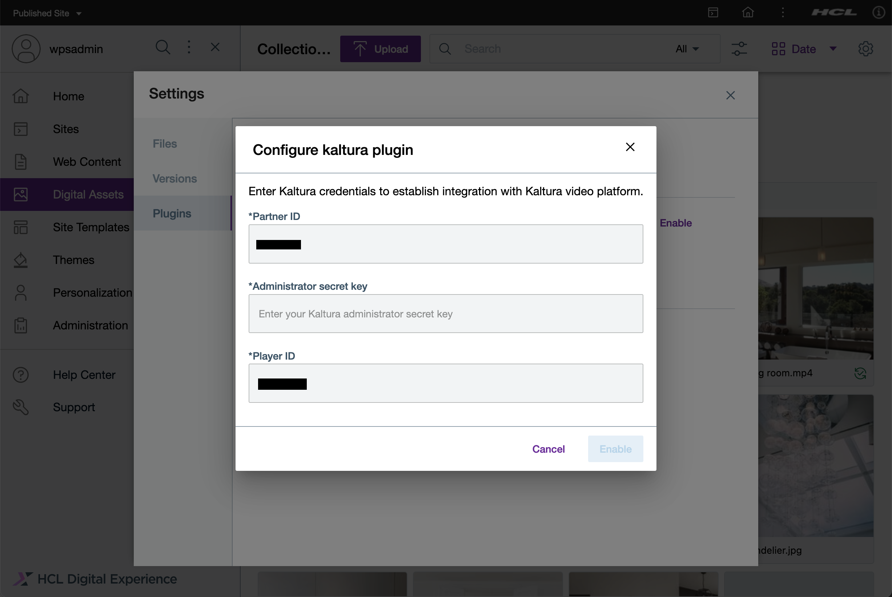
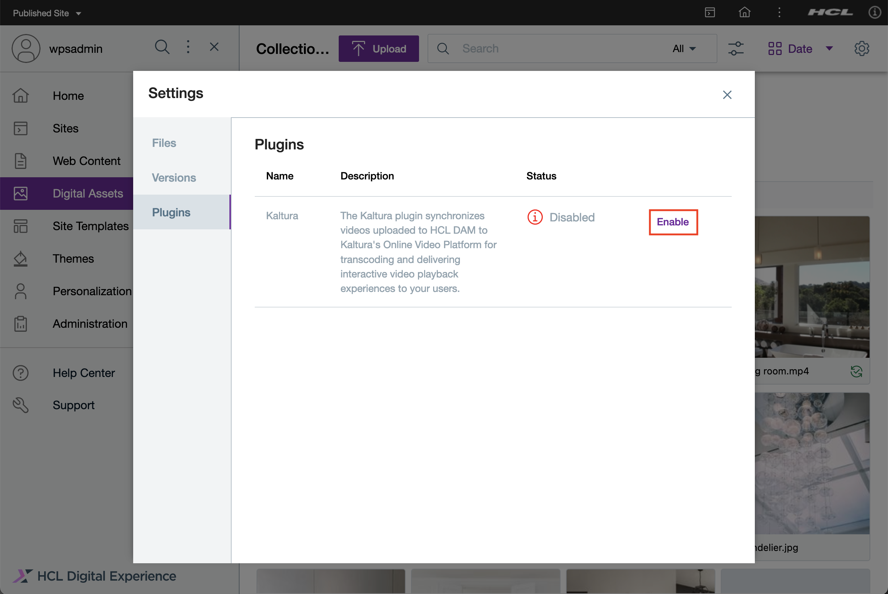
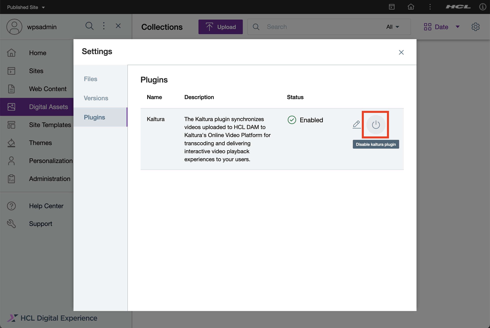
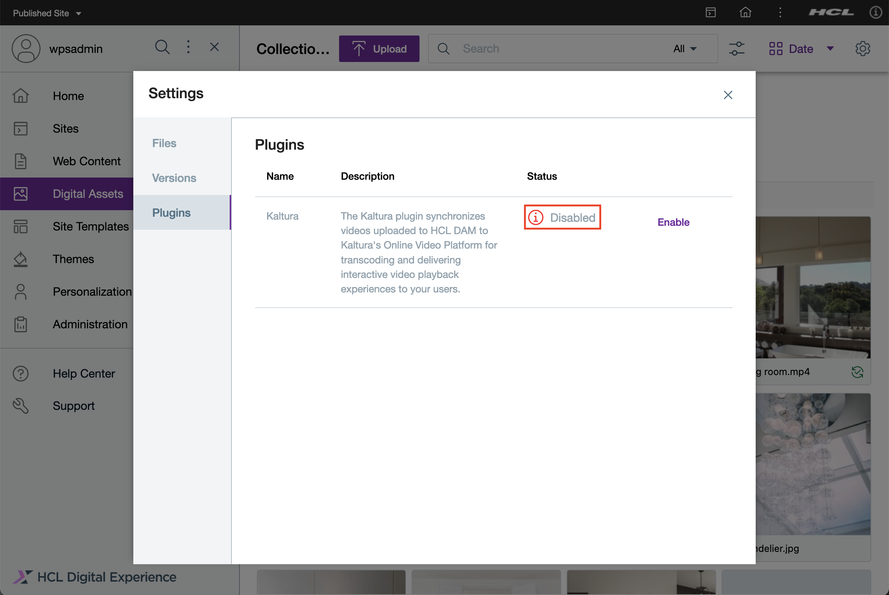

# Configure DAM - Kaltura integration

This section provides the steps on how to get the Kaltura Partner ID and Admin secret ID and configure the Kaltura Video Content Management System integration, provided with HCL DX 9.5 CF19 and higher releases, to accelerate Digital Asset Management rich media integration to HCL Digital Experience site pages and content.

## About this task

Kaltura is a video platform provider that helps with video creation, management, and collaboration. It provides an on-demand and live video software as a service \(SaaS\) solution. It also provides a platform for hosting videos and streaming videos. Integrating with Kaltura helps to link your web content with your video assets.

Kaltura video plugins enable content authors to easily share and deliver high-quality video content that displays on any device, anywhere, all within the Digital Asset Management environment.

## Prerequisite

HCL Digital Experience 9.5 customers need to separately acquire access to the [Kaltura Video Content Management System](https://corp.kaltura.com/video-content-management-system/) service and the Kaltura Management Console \(KMC\).

!!! note

    -   All videos uploaded to HCL Digital Asset Management are synchronized after the Kaltura Video Content Management System and plugin are configured and enabled. Configuring Kaltura integration, including enabling/disabling of the Kaltura plugin, is done by the Digital Asset Management Administrator.
    -   The Kaltura sync icon shows the sync status \(**Sync in progress**, **Sync done**, and **Sync failed**\) and can be checked in **Tile View**. The Kaltura sync icon showing status does not appear in List View nor in Search View.

## Get Kaltura Partner ID and Administrator Secret Key

Follow these steps to get your Kaltura Partner ID and Administrator Secret key:

1.  Log in to [https://kmc.kaltura.com/index.php/kmcng/login](https://kmc.kaltura.com/index.php/kmcng/login).
2.  Enter your Kaltura login credentials.

    

3.  Click **Settings**.

    

4.  Click **Integration**.

    

5.  Copy your **Partner ID** and **Administrator Secret** key. These are needed to configure your Kaltura plugin.
6.  Click **Studio**.

    

7.  Copy the **Player ID**.

    

## Configure Kaltura plugin

Follow these steps to configure your Kaltura plugin:

1.  From your HCL Digital Experience 9.5 Practitioner Studio interface, select **Digital Assets** from the navigator as shown below.

    

    The HCL Digital Experience 9.5 Digital Asset Management can also be accessed from the Practitioner Studio **Digital Assets** tile.

2.  From the HCL Digital Experience 9.5 Digital Asset Management user interface, select the gear icon \(for **Settings**\) located at the far top-right of the Digital Asset Management menu bar.
3.  Click **Plugins**.
4.  Click **Edit Kaltura plugin settings**.

    

5.  Enter your Kaltura Management Console \(KMC\) credentials.

    

    -   **Partner ID** - your Kaltura **Partner ID**
    -   **Administrator secret key** - your **Administrator Secret** key
    -   **Player ID** - your Kaltura **Player ID**
6.  After entering your credentials, click **Enable**.

## Update the Kaltura plugin configuration

1.  From the HCL Digital Experience 9.5 Digital Asset Management user interface, select the gear icon \(for **Settings**\) located at the far top-right of the Digital Asset Management menu bar.
2.  Click **Plugins**.
3.  Click **Edit Kaltura plugin settings**.

    

4.  Update your Kaltura Management Console \(KMC\) credentials.

    

    -   **Partner ID** - your Kaltura **Partner ID**
    -   **Administrator secret key** - your **Administrator Secret** key
    -   **Player ID** - your Kaltura **Player ID**

5.  After updating your credentials, click **Update**.

## Enable the Kaltura plugin

1.  From the HCL Digital Experience 9.5 Digital Asset Management user interface, select the gear icon \(for **Settings**\) located at the far top-right of the Digital Asset Management menu bar.
2.  Click **Plugins**.
3.  Click **Enable**.

    

4.  Enter your Kaltura Management Console \(KMC\) credentials.

    

    -   **Partner ID** - your Kaltura **Partner ID**
    -   **Administrator secret key** - your **Administrator Secret** key
    -   **Player ID** - your Kaltura **Player ID**
    
5.  Click **Enable**.

## Disable the Kaltura plugin

1.  From the HCL Digital Experience 9.5 Digital Asset Management user interface, select the gear icon \(for **Settings**\) located at the far top-right of the Digital Asset Management menu bar.
2.  Click **Plugins**.
3.  Click **Disable Kaltura plugin**.

    

    The status is updated to **Disabled**.

    

<!--
## HCL Digital Experience Solution Feedback

HCL Digital Experience is interested in your experience and feedback working with HCL Digital Experience 9.5 release software. To offer comments or issues on your findings, please access the [HCL Digital Experience 9.5 Feedback Reporting application](https://www.hclleap.com/apps/secure/org/app/158bbc7c-f357-4ef0-8023-654dd90780d4/launch/index.html?form=F_Form1).-->

