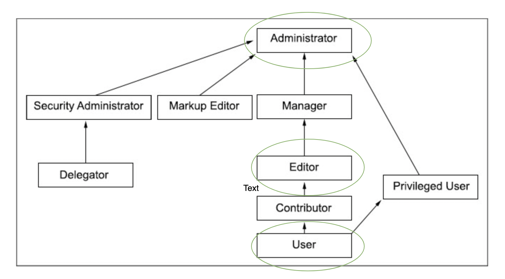
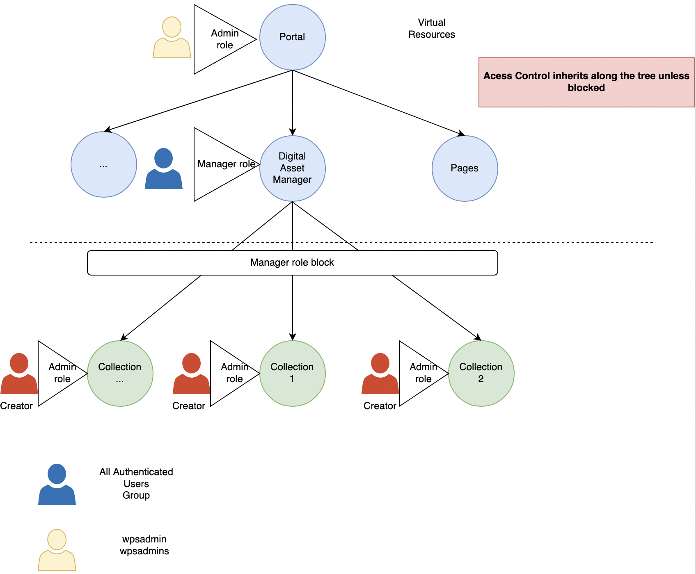

# DAM Access Control Management

This topic describes collection access feature and details about API added for DAM collection resources and its access.

## Overview on Portal Access Control and DAM Collection Access

DX Portal Access Control follows an inheritance based tree structure. At the top of the tree is the virtual Resource Portal, below it is the virtual Resource Media Library and below that the resource instances you are registering with its children. By assigning a role on a resource to a user, the user gets permissions on the resource and its children. There is a way to block the inheritance with role blocks but it is not exposed in this initial configuration. 

Currently, only Administrator, Editor and User roles are exposed in DAM UI.
### Portal Access Control Management API

To enable the usage of Portal Access Control for Media Library Management, new APIs were exposed in DX portal for below scenarios. DAM calls the below Portal API's by invoking corresponding REST API's exposed by Experience API.

- Registering a resource with Access Control
- De-registering a resource with Access Control
- Moving a resource from one parent to another

The returned IDs from the above API's can be used to interact with the existing Portal Access Control APIs (https://pages.git.cwp.pnp-hcl.com/CWPDoc/dx-mkdocs/in-progress/extend_dx/apis/portal_access_control_interfaces/) through existing Ring/Experience API that allow: - Check what access a user has on a resource - Assign permissions (role assignments) to an user or group on a resource - Remove permissions (role assignments) on a resource for a user or group - Set or remove role blocks to influence the inheritance hierarchy.

New API's were exposed for below scenarios too.

- Querying a single resource
- Querying all root resources
- Filtering Access

### DAM Access Control

From the DAM perspective, each individual collection is a resource instance. 

DAM collection resource is accessible by the current user based on his role and this access permission is managed by DX Portal Access Control (e.g. Possible Role Types are User, Editor (edit, create), Manager (edit, create, delete), Administrator (edit, create, delete, set/remove access) in DX perspective). So, current user can view the collection if he has User role, if current user has Editor role, he can view, create and edit the collection and he can even delete the collection if he has Manager role. If user has Administrator role, then he can even assign/remove the permission for other users as well.

# Authorisation API Endpoints

## API's to fetch user’s allowed permission list for a given collection resource

A user’s allowed permission list for a given resource are available via a call to following Experience API method calls:

For authenticated endpoints: “/dxmyrest/access/current-user?resourceId={accessReferenceId}”.
For anonymous endpoints: “/dxrest/access/current-user?resourceId={accessReferenceId}”.

## API's to get the filtered resource list for granting the permission based on multiple resources.

For authenticated user: /dxmyrest/resources?role={role}&parentid={virtualResourceId} where role can be Editor/Manager/Administrator and virtualResourceId will be wps.MEDIA_LIBRARY for media library.

For anonymous user: /dxrest/resources?role='User'&parentid={virtualResourceId} where virtualResourceId will be wps.MEDIA_LIBRARY for media library.

Ex: Currently GET Endpoint like /items/{item_id} can call one of the above mentioned API's based on the access type. This API endpoint can be accessible by both authenticated and anonymous user, based on the granted permission.