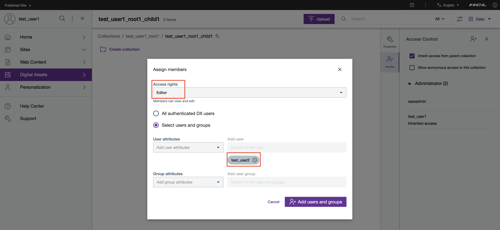
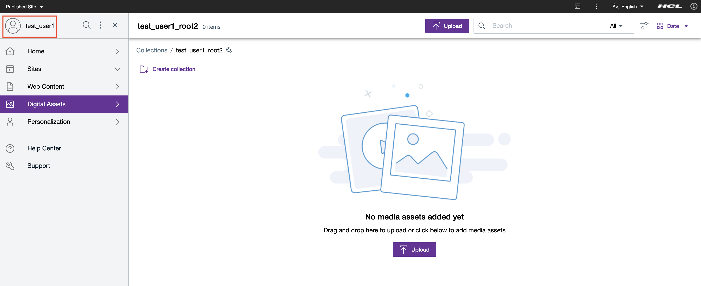
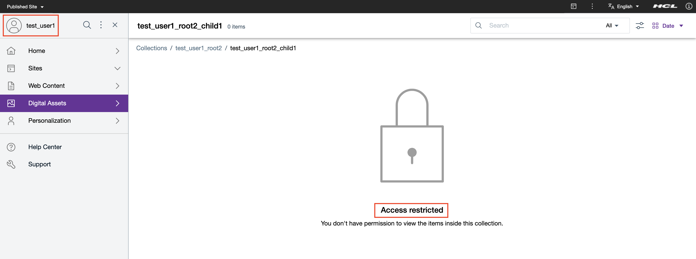
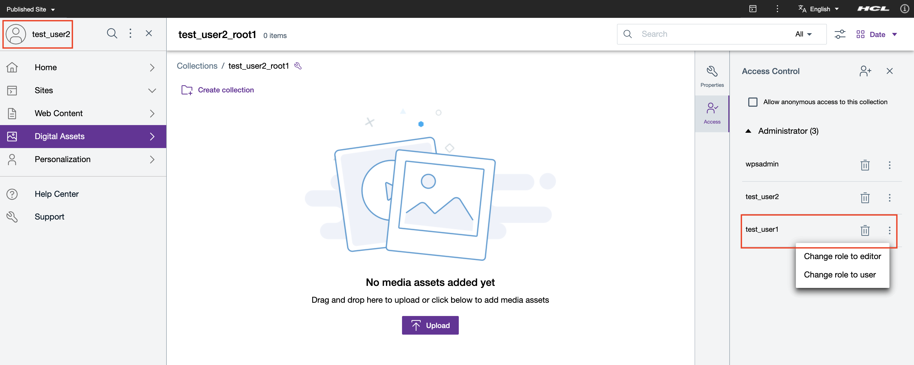

# DAM Access Control Management

This topic describes the details of DAM access control, its features and limitations and also on how to assign permission to Users through the DAM user interface.

## Overview on DX Portal Access Control for DAM

DX Portal Access Control follows an inheritance based tree structure. DAM is part of that tree just like WCM or Portal Pages. 
At the top of the tree is the virtual Resource Portal, below it is the virtual Resource DIGITAL ASSET MANAGEMENT and below that, are the resource instances (the collections) you are registering with its children. By assigning a role on a resource to a user, the user gets permission for the resource and its children.

For DAM, only a subset of the roles is exposed. Possible role types are User (view only), Editor (view, edit, create), and Administrator (view, edit, create, delete, set/remove access). Other roles existing in Portal Access Control like Manager or Privileged User are not exposed.

!!! note
    Currently, only highlighted roles (Administrator, Editor, User) are applicable in DAM.


## Overview on DAM Collection Access Control

DAM collection is accessible by the currently logged in user based on his role and the access is managed by DX Portal Access Control as mentioned. 

!!! note
    Currently, only Administrator, Editor, and User roles are exposed in DAM UI. The user creating the collection gets explicitly assigned the Administrator role on the collection. All nested collections by default will inherit the permission from root collection but permission can be modified.

### DAM Access Control in detail

From the DAM perspective, each individual root level collection and child collection is a resource instance that can be administered.

- User role: The user can view items in the collection and the collection itself as well as child collections.
- Editor role: All permissions of the User role plus the user can edit collection details as well as upload items.
- Administrator role: All permissions of the User and Editor role plus the user can view, create, edit, and delete a collection, delete items in a collection and he can assign/remove permission for other users as well on the collections.

A user that creates a root collection gets the Administrator role on the collection and so can do anything with that collection as indicated above.

See the [Out of the box access](#Out-of-the-box-access) section, to understand how the default access works for a collection.

!!! note
    The Manager Role is not exposed in DAM UI currently.

To be able to create new root collections the Editor role or higher of the virtual resource DIGITAL ASSET MANAGEMENT is required.

Also, note that if the user has given a User/Editor role to any collection which is not created by him, that user can not modify the access permissions of that collection.


## Out of the box access

After installation, all Authenticated User Group is assigned to the Manager role of the virtual resource DIGITAL ASSET MANAGEMENT and propagation is blocked. With that, every authenticated user can create a root collection (and when doing that gets the Administrator role for that collection) but does not have access to other collections he did not create. You can change this as desired on the virtual resource.

## Assigning Permission to User

In DAM, the user can assign permission to a collection tree at the root level if he has administrator permission for the root collection as below.


# Nested Collection Permissions

Nested collection will inherit the permission from it's root collection by default. Below editor permission is inherited from root collection.


In DAM, the user can assign permission to a nested collection if user has administrator permission for the root collection.



Permissions are inherited from root to nested collection since inheritance checkbox is selected by default.


If inheritance checkbox is unchecked from administrator, then inherited permission for the nested collection will get removed and user will not be able to view the nested collection.



# Access Control Traversal for Nested Collections (ACL Traversal)

In nested access control If user has access to the child collection but not parent then the parent collection will not be visible to the user. Hence user cannot navigate to the child collection to perform any operations. In order to overcome this a new configuration (i.e aclTraversal) has been introduced which will allow all users to view all the collections across DAM, but user will not be able to modify, view access panel or any media items unless user has access to that collection. In this case user will be able to only navigate by clicking the collection to reach to the sub collection for which the user has access to. This configuration is an application level configuration which can be enabled or disabled through helm.

```
# Application Configuration
configuration:
  digitalAssetManagement:
    aclTraversal: false
```
With ACL traversal enabled, user can traverse across all the root collections and nested collection for which user does not have permission but user will not be able to view the media items under the collection/ nested collection. By default, ACL traversal will be disabled.



When user uncheck inheritance checkbox, User and editor role block will be applied on the resource. If the checkbox is selected then there are no user/ editor role blocks on the resource.

Inherit uncheck implies Editor and User roles block for inheritance. Below API endpoint is used to achieve the role block.

!!! note       
    The below endpoint is used to set or remove role blocks. The default mode for the endpoint is set to update. [Update Resource Config API](https://opensource.hcltechsw.com/experience-api-documentation/ring-api/#operation/accessUpdateResourceConfig)

## Changing Permissions on the collection tree for the users

You can change collection permissions for any user from Administrator to Editor or User or vice versa.



## Downgrading Self Permission

Downgrading self permission from Administrator to Editor or User will remove authority to upgrade back to Administrator as you can see below. In this case, the Administrator or Super Admin should add you back as Administrator if needed.


