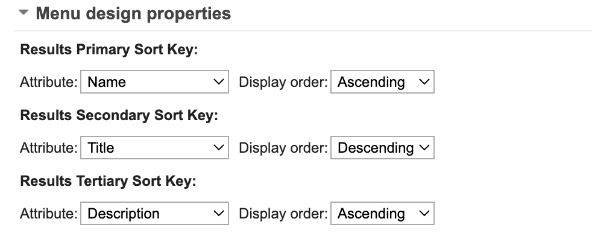

# Defining menu element formatting options

Define how search results are displayed for the menu element. These options include defining the sort order for results, paging options for menu elements with multiple pages of results, and formatting options that control how the menu is rendered.

1.  Specify how the search results displayed in the menu element are sorted.

    a. **Prior to CF210**, there is only one sort order option for all sort fields:

    
 
      a.1.  Select the sort order for the results.

      -   Select **Ascending** to sort results in ascending order.
      -   Select **Descending** to sort results in descending order.

      a.2.  Select the content item fields on which you want to base the sort order.

    You can select a primary field and two extra fields to provide more fine-grained sorting of the results. The sort fields are applied in order, so that results are sorted first by the primary field, then by the secondary field, and finally by the tertiary field.

    b. **Starting CF210**, there will be an option to set sort order for each sort field selected:

    

      b.1.  Select 3 sorting fields with corresponding sort order. The options are arranged by which field the results will be sorted first. Results are sorted first by the primary field and by its sort order, then by the secondary field and its sort order, and finally by the tertiary field.

    Limitation:

      Same key can be selected for all 3 fields.

    !!!note
        On creation, default sort key is title and order is ascending

2.  Specify paging options for the menu element.

    1.  Enter the number of items that are displayed in each menu page.

    2.  Enter the number of the start page for displaying search results in the menu.

    3.  Enter the maximum number of results pages to be included in the menu.

    4.  Enter the number of results pages to read ahead when you use a page navigation element. For example, if you enter 3, the page navigation element calculates results up to three pages ahead of the current page. Increasing this number improves the accuracy of the page navigation element. Lowering this number improves the performance of the page navigation element when rendered.

    !!!note
        To display multiple menu pages, you need to use a page navigation element. This element is referenced within the header or footer of the menu design.

    !!!note
        Changes to paging options are not visible to users until the session cache is expired, or a user starts a new session.

3.  Specify the formatting options that are used to display the menu element.

    Enter text, tags, and code into the menu design fields.

    -   The text that is entered in the **Header** and **Footer** designs will appear before and after the displayed menu results. When you enter design tagging for menu elements with multiple pages of search results, you can reference a page navigation element in the header or footer to provide the user with a way of browsing through the menu pages.
    -   The text that is entered into the **Component Design for each matching content** field defines the format of each menu result.
    -   The text that is entered into the **Separator** field appears between each displayed menu result.
    -   The text that is entered into the **No result design** field is displayed if no matches are found for the menu search criteria.

???+ info "Related information"  
    -   [Inserting an image in an element](../element_designs/wcm_dev_elements_insert_image.md)
    -   [Inserting a link in an element](../element_designs/wcm_dev_elements_insert_link.md)
    -   [Inserting element tags](../element_designs/wcm_dev_elements_insert_tags.md)
    -   [Creating web content tags](../../tags/creating_web_content_tags/index.md)

