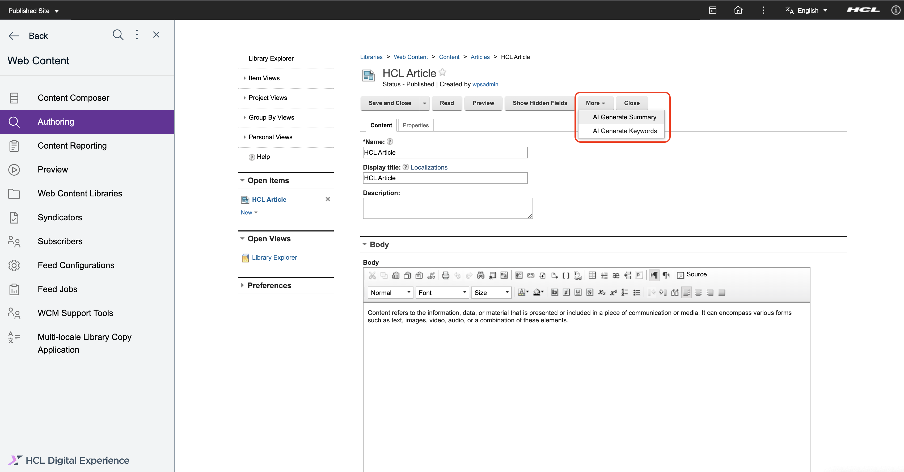
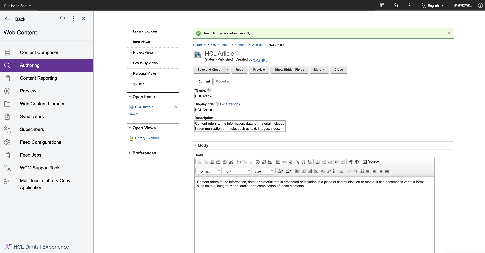
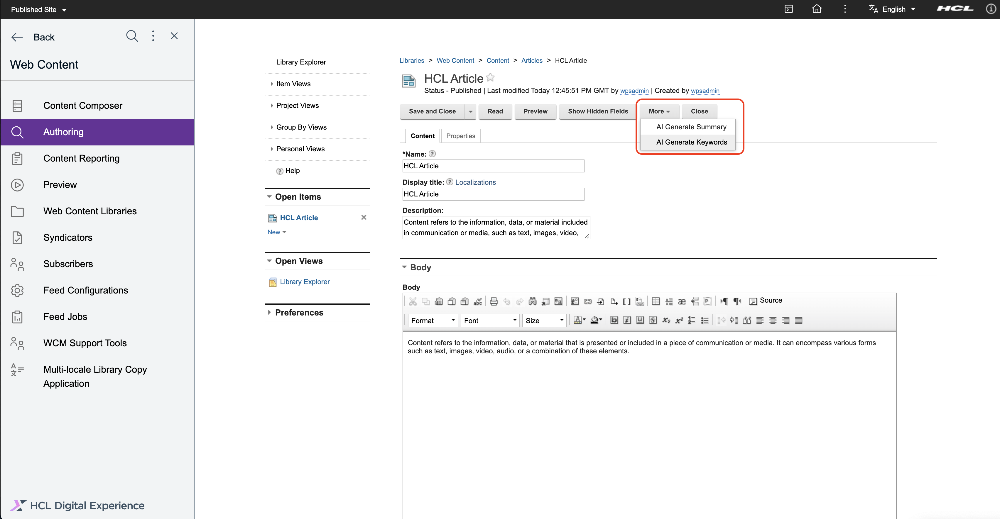
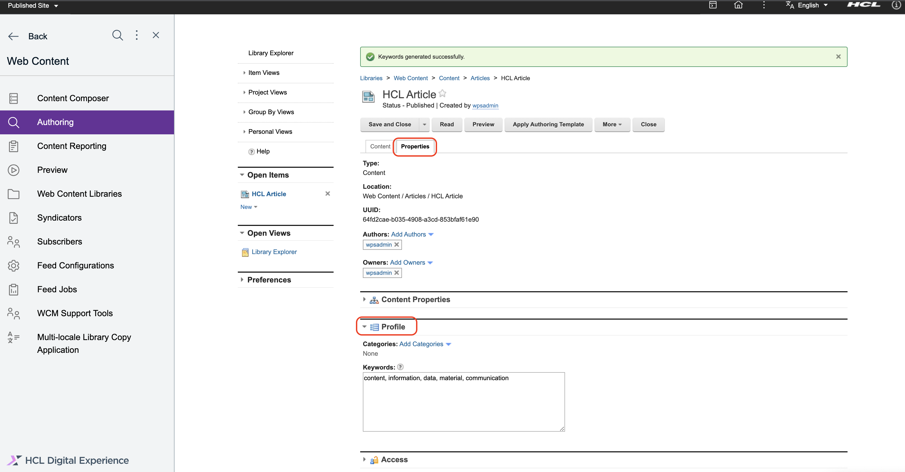
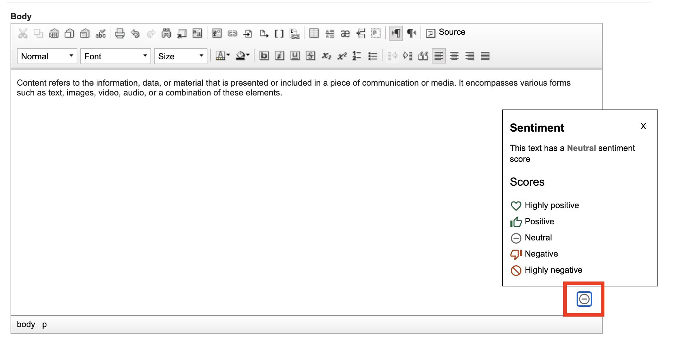
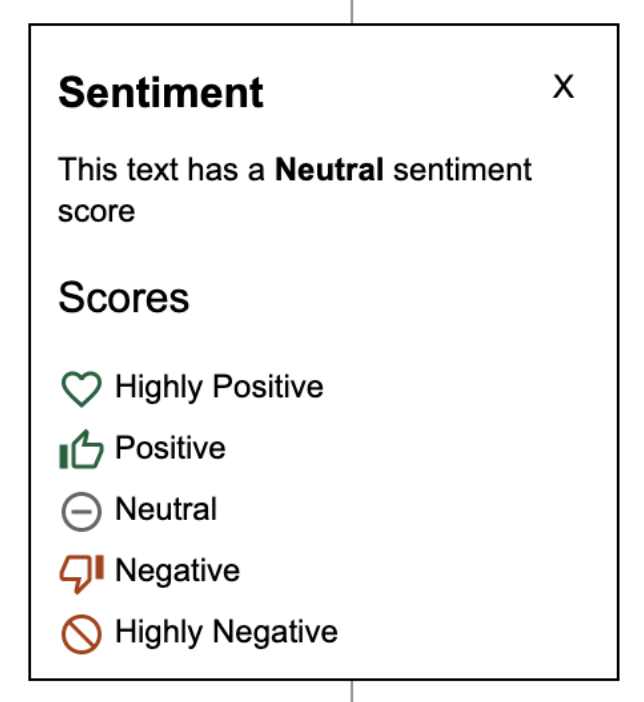

# AI assistance for descriptions, keyword generation, and sentiment analysis in a content item

This section provides the steps on how to use AI assistance for generating descriptions, keywords, and getting sentiment analysis on content elements.

## Prerequisite

Before you can use AI-assisted features for sentiment analysis of content, keyword extraction from content, and auto summarization of content element, refer to the following steps to enable AI Analysis:

- [Web content AI analysis for Kubernetes Deployment](../../../../../get_started/plan_deployment/container_deployment/wcm_content_ai_analysis.md)
- [Web content AI analysis for traditional deployment](../../../../../get_started/plan_deployment/traditional_deployment/wcm_env/wcm_ai_analysis.md)

## Using AI-assisted summarization of content element

1. Fill in at least one text element (for example, rich text, text, or short text) in the **Content** tab of the content item.

2. Click the **More** button in the toolbar, then click **AI Generate Summary**. The generated description is based on the content provided in the content element. The generated description replaces any existing description, if present.

    
    

3. Select **Save** or other **Save** options to save your updates.

## Using AI-assisted keyword extraction on content elements

1. Fill in at least one text element (for example, rich text, text, or short text) in the **Content** tab of the content item.

2. Click the **Show Hidden Fields** button in the toolbar.

    

3. Click the **More** button in the toolbar, then click **AI Generate Keywords**. The extracted keywords are based on the content provided in the content item. The AI-generated keywords will not overwrite the existing keywords but they will append to it.

    

4. Click the **Properties** tab then expand the **Profile** section to view the extracted keywords.

    

5. Select **Save** or other **Save** options to save your updates.

## Using AI-assisted sentiment analysis of content element

1. Fill in any of text elements (for example, rich text, text, or short text) of the content item.

2. Click the **Analyze Sentiment** icon located in the lower right corner of the text element. 

    
    
    A sentiment analysis result is returned based on the analysis of the content of the text element. The sentiment analysis result is represented by an icon on the **Body** field.
    

3. Click the sentiment result icon to see more details about the result.

    
