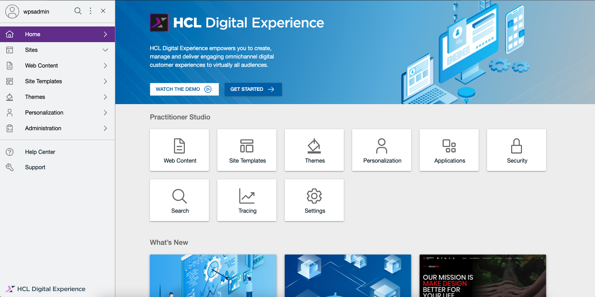
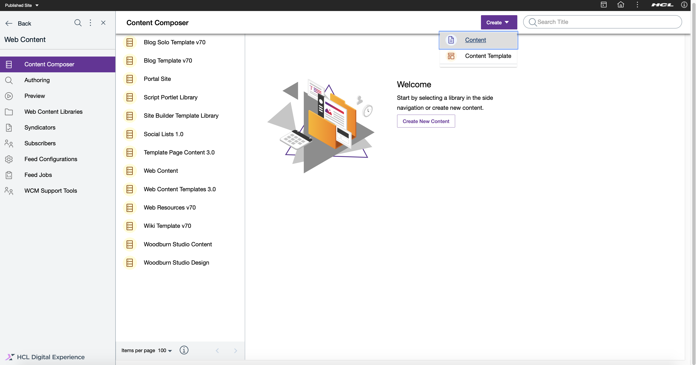
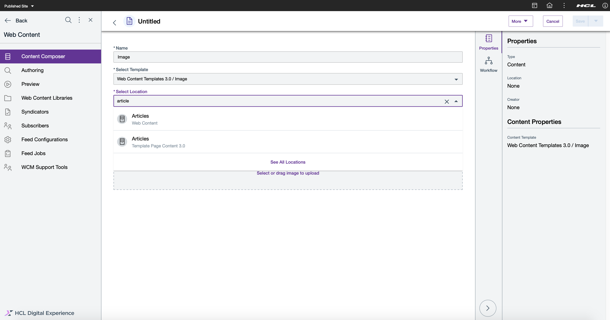
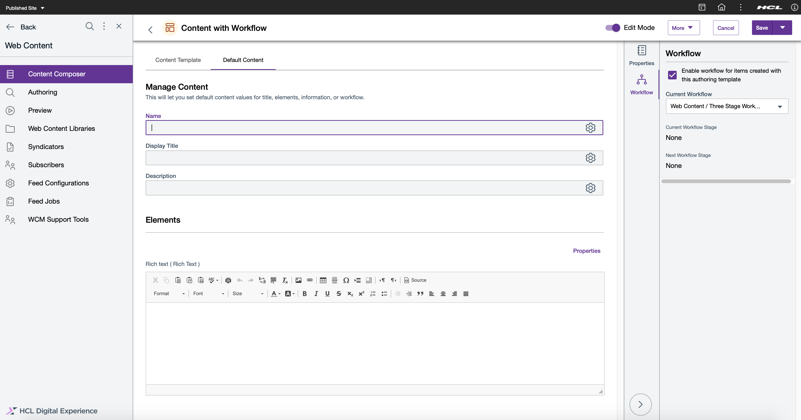
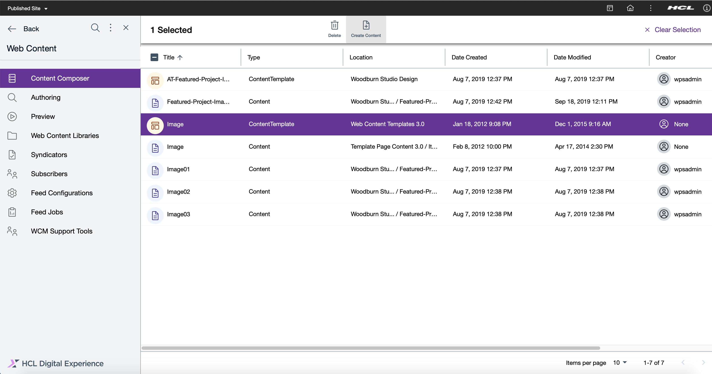
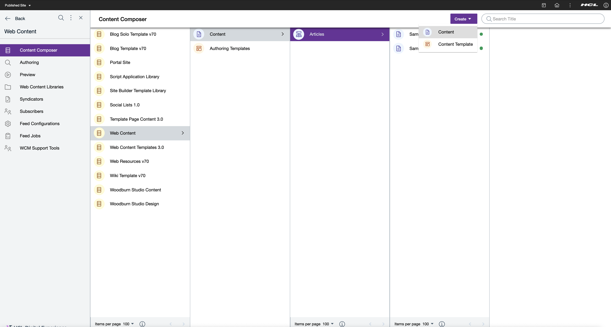
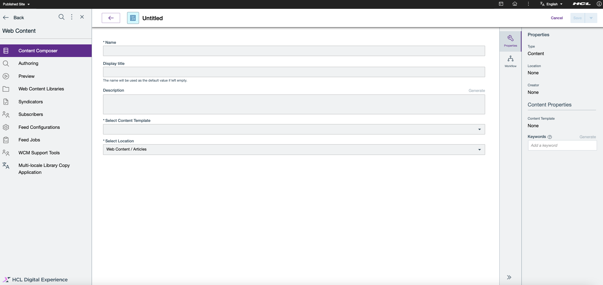

# Author Content Items

This section provides the steps on how to author a web content item using HCL Content Composer.

## Prerequisite

Content Composer should be installed and configured to HCL Digital Experience 9.5 container release update CF181 or higher. See instructions to install to supported container environments in the [Install HCL Digital Experience 9.5 Components](../../installation/install_config_cc_dam.md) topic.

Content Composer is accessible from the Practitioner Studio interface (after image configuration to your HCL Digital Experience 9.5 CF181 and higher deployment).

## Create new content with Content Composer

Follow the steps below to create new content with the HCL Digital Experience 9.5 Content Composer from the Practitioner Studio:

1.  Log in to your HCL Digital Experience 9.5 platform, and select **Web Content** from the Practitioner Studio navigator.

    

2.  Select **Web Content** menu option to access the HCL Digital Experience 9.5 Content Composer features. Then, click **Create New Content**.

    

3.  Complete the fields in the content template. Add a **Name**, **Display Title**, and (optional) **Description** for your content.
4.  In **Select Template**, select the template to use to model the content by either typing in a specific keyword or by clicking the drop-down arrow to access all templates in the Web Content library. The type-ahead feature in the **Select Template** field assists content authors to find, identify and select the template of choice for the new content.

    In this example, the **Web Content Templates 3.0 / Image** template is selected.

    

5.  In **Select Location**, select the site location to present the content when completed and ready for publication. Using the same new content example, the **Web Content / Articles** location is selected.

    

6.  If adding an image file, select **Upload using file browser** or **HCL DAM** in the **Elements** section. Then, you can also drag and drop preferred image file from your local repository.

    

7.  In the **Workflow** located on the right side of the interface, select the workflow to use by either typing in a specific keyword or by clicking the drop-down arrow and selecting **See All Workflows**. The type-ahead feature in the **Current Workflow** field assists content authors to find, identify and select the workflow of choice for the new content. In this example, the **Web Content Templates / Three Stage Workflow** is selected.

    

    You can keep it as is or enter a date for the **Publish Date** and **Expire Date** fields, as shown below.

    

8.  If done, select **Save** to save your settings and create your new content template, or **Save and Close**, which will create your new content template with the saved settings and will redirect you to the new content template's location in the Content Composer Dashboard.

## Create new content from a content template in Search Results view

Users can also create new content via the Search Results view.

1.  From the HCL Digital Experience 9.5 Content Composer user interface, enter a search term in the search box located in the upper right corner as shown in the example below:

    

2.  Click to select the content template to create new content from. Click **Create Content** to proceed.

    

3.  See *Create new content with Content Composer* above for next steps.

## Create new content with auto-populate location

Follow the steps to create a new content template with auto-populated location from the Dashboard view:

1.  From the HCL Digital Experience 9.5 Content Composer Dashboard, select a Site Area.
2.  Click **Create** then select **Content**.

    

3.  The location will auto-populate to the selected Site Area as shown below.

    

4.  Complete the fields on the **Content** tab, of which the content author will be directed to by default.
5.  When done, select **Save** to save your settings and create your new content template, or **Save and Close** which will create your new content template with the saved settings and will redirect you to the new content template's location in the Content Composer dashboard.

## Content authoring actions in Search Results view

The **Search Results** view allows users to perform content authoring actions.

1.  Selecting the search result row will enable display of **Edit** and **Delete** options from the Content Composer search results view.

    Ticking the checkbox (beside **Title**) for the content item presented in the **Search Results** will also enable context-specific **Edit** and **Delete** options for the content item to optionally proceed to the content item's details in **Edit mode**.

    

2.  Column item results can also be sorted by clicking **Title**, **Date Created** or **Date Modified**. The **Status** column shows whether the content item is *Published* or *Draft*. Search Result columns can also be resized for convenience. 

## Content authoring actions in Dashboard view

The **Dashboard** view allows users to perform content authoring actions.

1.  Selecting the avatar icons of the content items will enable display of **Edit**, **Delete**,  **Move**, and **Duplicate** options from the Content Composer Dashboard view.

    Ticking the checkbox \(beside the **Content Title**\) presented in the **Content Collections** column will also enable context-specific **Edit**, **Delete**, **Move**, and **Duplicate** options for the content item to optionally proceed to the content item's details in **Edit mode**.

    

<!--

## HCL Digital Experience Solution Feedback

HCL Digital Experience is interested in your experience and feedback working with HCL Digital Experience 9.5 release software. To offer comments or issues on your findings, please access the [HCL Digital Experience 9.5 Feedback Reporting application](https://www.hclleap.com/apps/secure/org/app/158bbc7c-f357-4ef0-8023-654dd90780d4/launch/index.html?form=F_Form1){:target="_blank"}. -->

