# Manage Content Items

This section provides the steps on how to manage content items using the HCL Content Composer.

## Prerequisite {#prerequisite}

Content Composer should be installed and configured to HCL Digital Experience 9.5 container release update CF181 or higher. See instructions to install to supported container environments in the [Install HCL Digital Experience 9.5 Components](../../installation/install_config_cc_dam.md) topic.

Content Composer is accessible from the Practitioner Studio interface (after image configuration to your HCL Digital Experience 9.5 CF181 and higher deployment).

Instructions on how to use the AI-assistance features are available at [Web Content Manager REST V2 APIs for AI content analysis](../../../../../manage_content/wcm_development/wcm_rest_v2_ai_analysis/index.md). 

To utilize AI-assistance features for sentimental analysis of content, keyword extraction from content, and auto summarization of content element in Content Composer, follow the steps for enabling AI Analysis for Kubernetes deployment at [Web content AI analysis in Kubernetes Deployment](../../../../../get_started/plan_deployment/container_deployment/wcm_content_ai_analysis.md). Instructions for enabling AI Analysis for DX on-premise deployment is available at [Web content AI analysis in on-premise deployment](../../../../../get_started/plan_deployment/traditional_deployment/wcm_env/wcm_ai_analysis.md)

## View Content overview

Content users can view a light preview of uploaded content and more using HCL Content Composer.

1.  Access the content item you wish to edit. In this example, the content item example above (**Image**) is obtained from **Web Content > Content > Articles** site area location. Select **Open Content**.

2.  On the content item editor interface, select the **More** drop down as shown below and select **Overview**.

    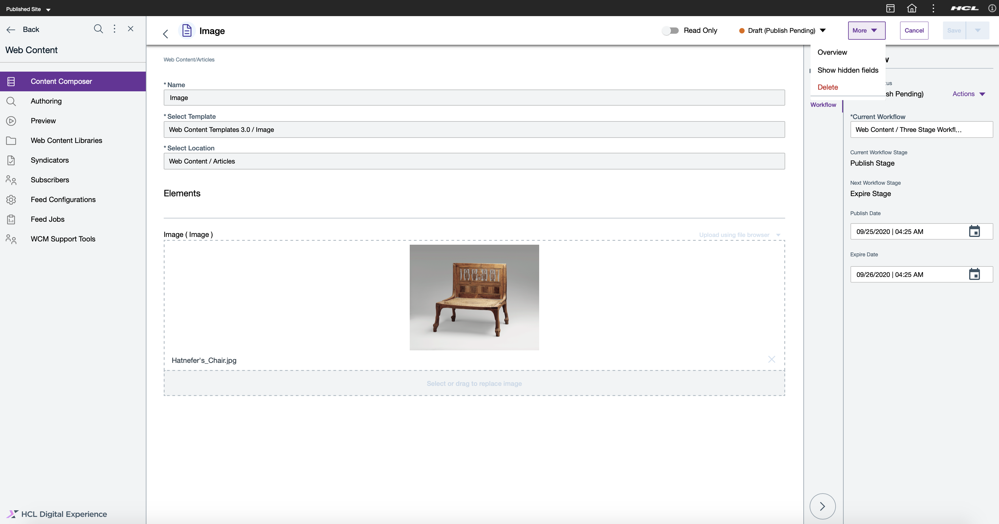

3.  The light preview of the selected content will be shown in a new window. It will display:

    -   Content title
    -   Content type
    -   For images, a preview of the content in its original size; and
    -   Published link of the content

4.  User can also add a preview image of the content file. In **Edit Mode**, user can select **Show hidden content** and **Upload using file browser** or **HCL DAM** the preview image file.

5.  If done, select **Save** to save your settings and create your new content template, or **Save and Close**, which will create your new content template with the saved settings and will redirect you to the new content template's location in the Content Composer Dashboard.

## Edit Content item

1.  Log in to your HCL Digital Experience 9.5 platform, and select **Web Content** from the Practitioner Studio navigator.

    

2.  Select **Web Content** menu option to access the HCL Digital Experience 9.5 Content Composer interface.

3.  From the Content Composer interface, navigate through the preset folders Access the content item you wish to edit. In this example, the content item example (**HCL Article**) is obtained from **Web Content > Content > Articles** site area location. Select **Edit**.

    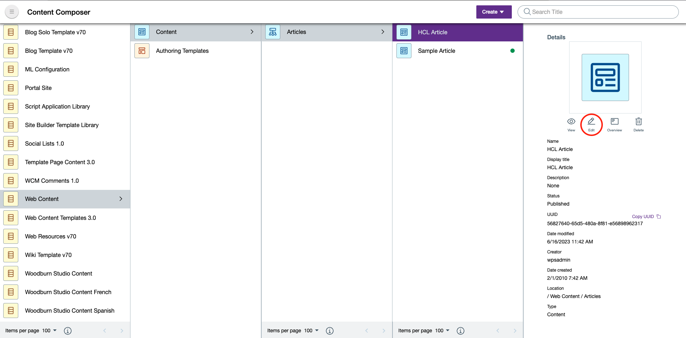

4.  Click the **Save** button or the drop-down to **Save and Close** in the upper right of the interface to save your completed content edits.

## Edit Content item with AI-assistance

!!! note "Using AI-assisted content generation in Content Composer"
    Refer to the [Prerequisite](#prerequisite) section on how to setup and enable AI-assistance features

1.  From the Content Composer interface, navigate through the preset folders Access the content item you wish to edit. In this example, the content item example (**HCL Article with AI-assistance**) is obtained from **Web Content > Content > Articles** site area location. Select **Edit**.

    

2. You can use the AI-assisted content generation features when editing content items:

    ### Auto-summarization of content element

    Click the 'Generate' button in the Description field. The generated description will be based on the content provided in the content element. The generated description will replace any existing description, if present.

    

    ### Keyword extraction from content

    Click the 'Generate' button in the Keywords field. The extracted keywords will be based on the content provided in the content item. The AI-generated keywords will not overwrite the existing keywords but will append to it.

    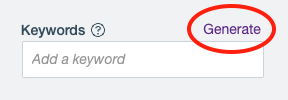

    ### Sentiment analysis of content

    Click the 'Analyze Sentiment' icon in the text element/s. A sentiment analysis result will be returned based on the analysis of the content of the text element. This sentiment analysis result is represented by an icon on the text field. Click the icon to see more details about the sentiment analysis result.

    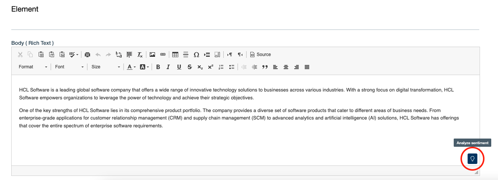

    When in **Read Only** mode, sentiment analysis is still enabled.

    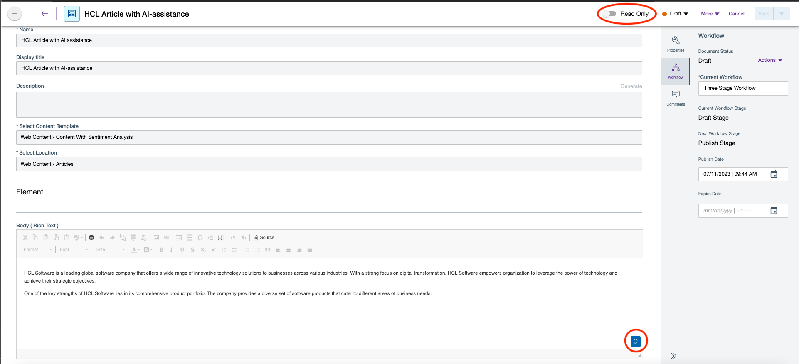

3.  Click the **Save** button or the drop-down to **Save and Close** in the upper right of the interface to save your completed content edits.

## Move Content item

Content users can move a content item to another site area location.

1. Access the content item you wish to move. In this example, the content item example below \(**Image**\) is obtained from **Web Content \> Content \> Articles** site area location. Click the icon to select the content item. After doing so, click the **Move** icon on the header. 

    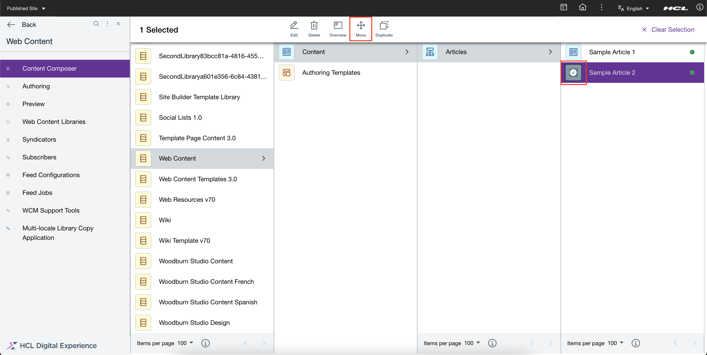

2. A location selector should appear on the screen. Pick the site area to move the content to. After selecting, click the **Move** button to finalize moving of the content item.

    

## Copy Content item

Content users can copy a content item to another site area location.

1. Go to the content item you want to copy. In the example below, the content item is obtained from **Web Content > Content > Articles** site area location. Click the icon to select the content item and then click the **Copy** icon on the header. 

    

2. A location selector appears. Select the site area you want to copy the content to. After selecting, click the **Copy** button to finalize copying of the content item.

    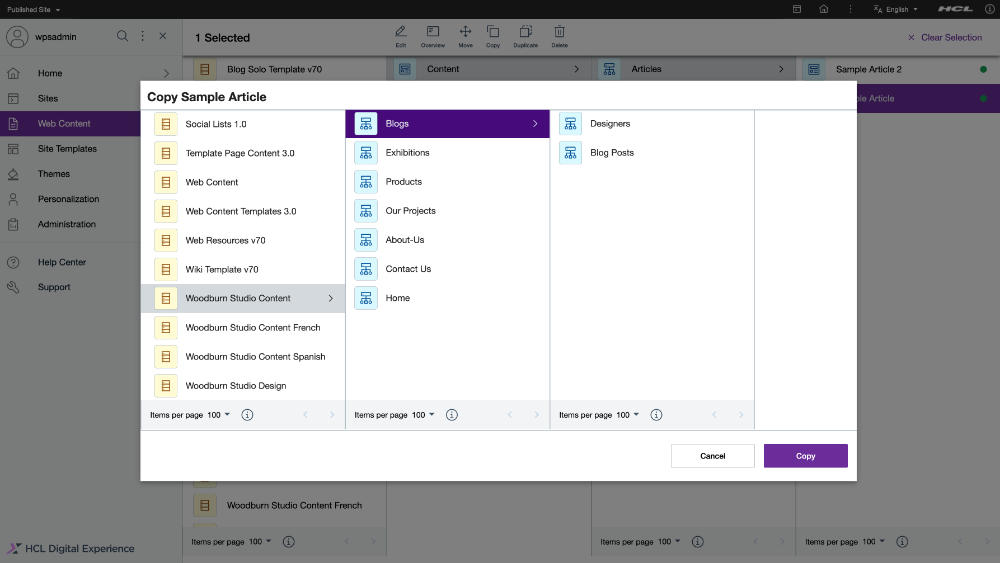

## Rename Content item when there is conflict during move or copy

Content users can rename a content item during moving or copying when there is another content with the same name in the selected site area location.

1.  A **Save As** modal appears when a user tries to move or copy a content item in a site area location that has a content item with the same name. An auto-generated name and a display title are suggested.

    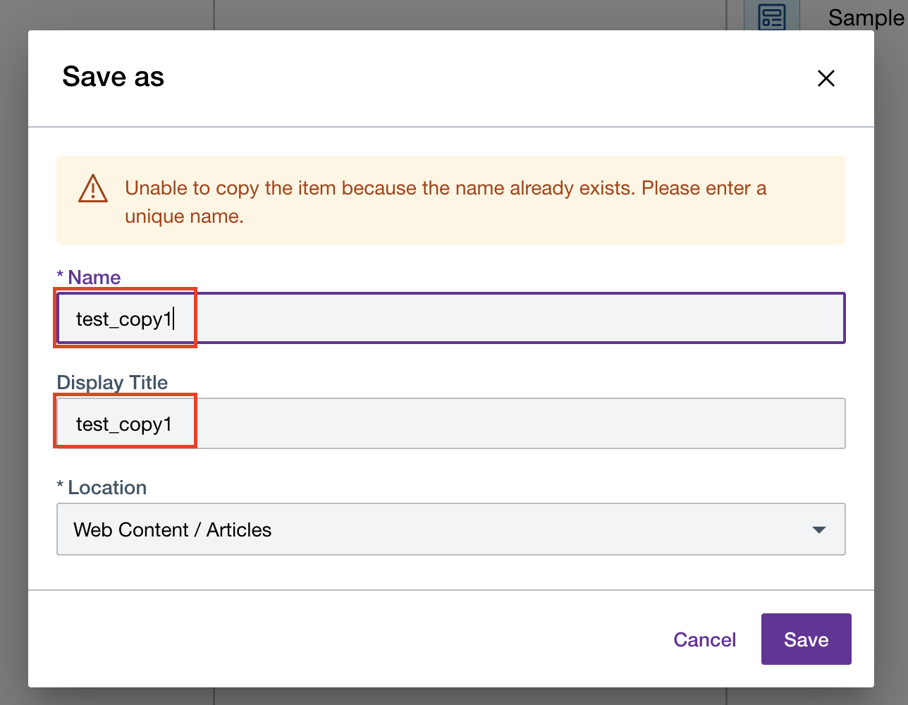

2.  Click **See All Site Areas** under **Location** to change the preferred location to move or copy the content item. A location selector appears where you can select the site area you want to save the content to.

    

3.  After finalizing the name, display title, and site area location, click the **Save** button to save the content item in the selected location.

    

## Add Comments

!!!note
    Content authors can only add comments if they have already added a workflow in the Content.

1.  Follow the steps in creating new content from HCL Content Composer, then set a workflow that allows adding comments in the Content, for example the Three Stage Workflow. After adding the workflow, click the save and close button.

    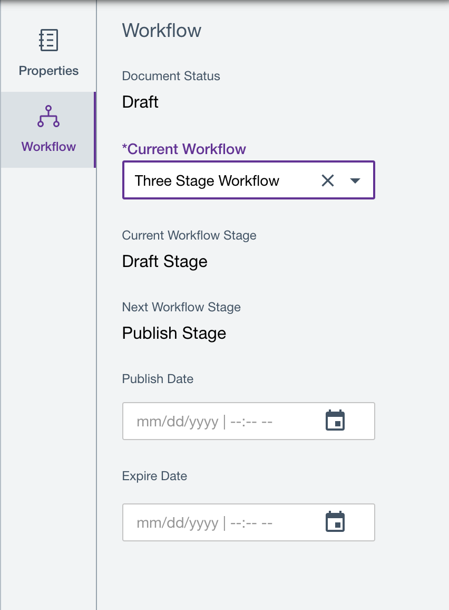

2.  Open the content that has been created and click the **Comments** tab located on the right side navigation.

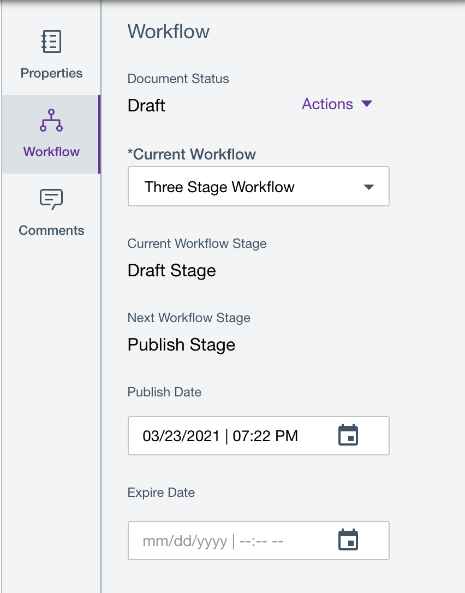

3.  Add a comment in the text field box as shown below. Click **Send** to submit your comment. Note that the **Comments** text field box does not have any text and character limit.

4.  The newly added comment will be displayed at the top.

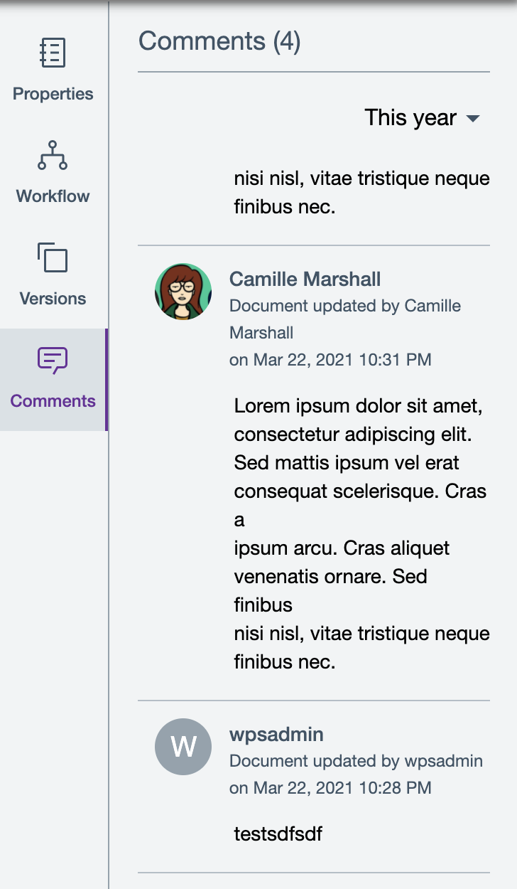

Please note that other content authors can also add comments in the newly-created content.

## View and filter a Content's workflow comments

Content authors will be able to view and filter comments in HCL Content Composer once content has been moved through workflow stages and **Enter comment on approval** is enabled.

1.  Follow the steps in creating new content from HCL Content Composer, then set a workflow in which entering comment on approval is enabled. In the example below, the **Three Stage Workflow** is selected.

2.  Open the content and move the workflow to the preferred stage and add a comment. In the example below, **Next stage - Publish** is selected and a comment is added.

    

3.  Once the action is completed, the **Comments** icon will now be available on the right-side navigation. Click **Comments** to see the workflow comments.

    

4.  Click the dropdown button to filter the workflow comments according to time period as shown below. In this example, selecting **Today** will display all comments made on the current date.

    

    

## Save updates of a Content item as a new Content item

Content authors can save the updates of a content item as a new content item in the current location or in a different location.

1. Access the content item you want to save as a new content item. In this example, the content item example below \(**Image**\) is obtained from **Web Content \> Content \> Articles** site area location. Click the icon to select the content item. Once selected, click the **Edit** icon on the header.

    

2. Select **Save As** to save the content as a new content item. 

    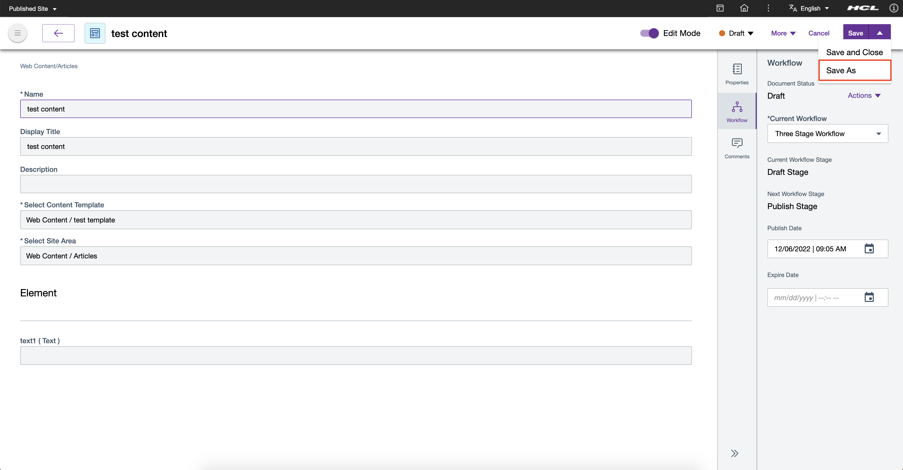

3. A dialog appears to show the generated name, display title, and the current location. You can edit the name, display title, or select a different location.

    

4. Click the **Save** button to save the content as a new content item.

    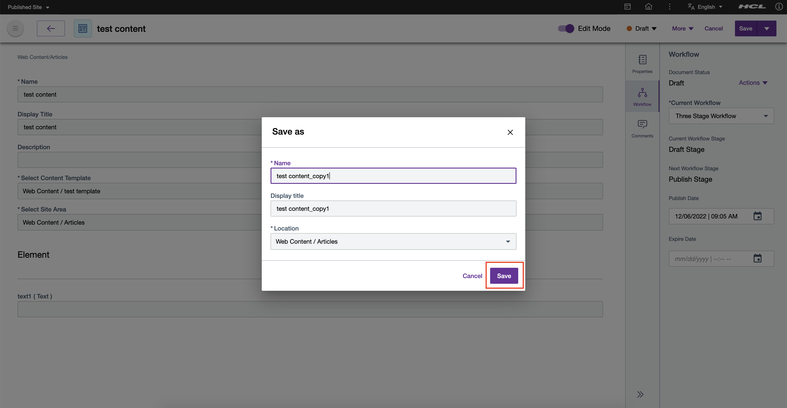

5. The editor loads the new content item.

    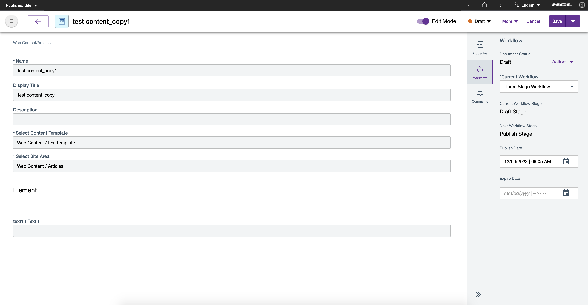

<!--
## HCL Digital Experience Solution Feedback

HCL Digital Experience is interested in your experience and feedback working with HCL Digital Experience 9.5 release software. To offer comments or issues on your findings, please access the [HCL Digital Experience 9.5 Feedback Reporting application](https://www.hclleap.com/apps/secure/org/app/158bbc7c-f357-4ef0-8023-654dd90780d4/launch/index.html?form=F_Form1){:target="_blank"}.-->

