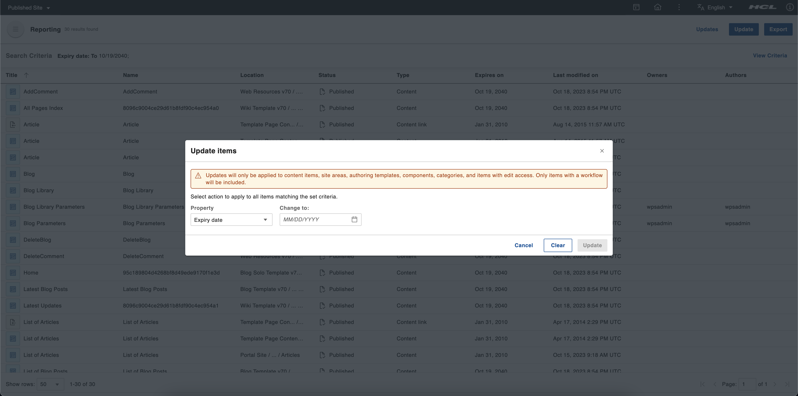
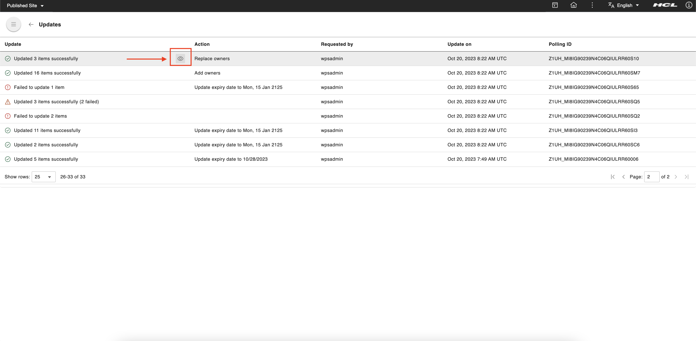

# Content Reporting Bulk Update

This section details how to use the bulk update to update the expiration date of content items in HCL Content Reporting.

## Prerequisite

Content Reporting should be installed and configured in HCL Digital Experience 9.5 release update CF213 or higher. See instructions to install to supported container environments to the [Install HCL Digital Experience 9.5 Content Reporting](../installation/install_content_reporting.md) topic.

## Bulk Update

Content managers can trigger bulk updates to update all queried items' expiration dates.

1.  Log in to your HCL Digital Experience 9.5 platform and select **Web Content**, then select **Content Reporting** from the Practitioner Studio navigator.

    

2. Generate a report on items you want to update. See [Generate Content Report](../usage/generate_content_report.md) for further instructions.

3. When you have already generated a report, the **Update** button will appear in the application header if there are results. Click the **Update** button. A dialog box will appear.

    

3. On the dialog box, we have three options: **Action**, **Property**, and **Change to**. For CF213, **Action** and **Property** will only have one option, which is **Update** and **Expiry date**, respectively. For **Change to**, we have a date picker. Enter the date for the expiry date on the selected items. After entering the date, the **Update** button will be enabled. If you click the **Update** button, a confirmation dialog will appear.

    

    We also have **Cancel** and **Clear** options in the dialog box. **Cancel** will close the dialog box, and **Clear** will remove all selected options from the dialog box.

    !!!note
        Bulk updates for expiry dates will only be applied to content items, site areas, authoring templates, components, categories, and items with edit access. Items assigned to a workflow will also be included.

4. On the confirmation dialog, check the number of items you want to update and if you entered the correct expiration date. If you already verified the values, you can now click the **Update** button; otherwise, you can click **Cancel** and return to the previous dialog where you can change the incorrect values.

    

5. When a bulk update is triggered, a snackbar should appear. The snackbar can tell if the bulk update is still *ongoing* or *completed*. For the ongoing process, it shows how many items have already been processed and the total number of items. For the completed process, it will tell how many items ware successfully updated and how many items failed to update.

    

## Track Bulk Updates and View Bulk Update Results

There are two ways to track the bulk update: the first is the snackbar mentioned above, and the other is the **Updates** page.

### Snackbar

1. The snackbar that appears when a bulk update is triggered will track up to five bulk update processes.

    This is the snackbar for the ongoing process
    

    This is the snackbar if every item was successfully updated.
    

    This is the snackbar if some item failed to update.
    

    This is the snackbar if all items failed to update.
    

2. On the snackbar, there is an option to view the items that have been processed only when the bulk update process is completed. Click **View item(s)** to check the details of each item that has been processed; a dialog box for the reports should appear.

    

3. On the dialog box, in the header, we can see the total number of items that was successfully updated and the number of failed items. On the alert part, we can see the number of failed items. We have five columns on the table inside the body of the dialog box, and they are as follows:

    - **Title**: This column shows the title of the item we processed.
    - **Item type**: This column shows the type of item we processed.
    - **Update Status**: This column tells whether the item was successfully updated (denoted as "OK") or failed to update (denoted as "Failed").
    - **Error**: This column tells why the item failed to update; if blank, it means the item was successfully updated.
    - **Created by**: This column shows who triggered this bulk update process.

    
   
### Updates Page

1. We can access the **Updates** page via the button on the application header; upon clicking the **Updates** button, it will redirect you to the **Updates** page. The **Updates** button also contains the total number of bulk update operations triggered.

    

2. On the updates page, we see a table that contains the bulk updates that were triggered. We have four columns, which are as follows:

    - **Update**: This column tells if the bulk update is ongoing or completed; once complete, we will have a summary of items that are processed. We will know how many items were successfully updated and how many failed. This column also contains a button to show the report dialog to check the details of each item that has been processed.
    - **Action**: This column shows actions that were taken on the bulk update.
    - **Requested by**: This column shows who triggered this bulk update process.
    - **Updated on**: This column shows when the bulk update was triggered.

    

    We have a *back button* on the app header to return to the landing page of Content Reporting.

3. On the table, in the **Update** column, there is a button that will appear upon hover when a bulk update is **completed**. This button will show a dialog to check the details of each item that has been processed.

    

3. On the dialog box, in the header, we can see the total number of items that was successfully updated and the number of failed items. On the alert part, we can see the number of failed items. We have five columns on the table inside the body of the dialog box, and they are as follows:

    - **Title**: This column shows the title of the item we processed.
    - **Item type**: This column shows the type of item we processed.
    - **Update Status**: This column tells whether the item was successfully updated (denoted as "OK") or failed to update (denoted as "Failed").
    - **Error**: This column tells why the item failed to update; if blank, it means the item was successfully updated.
    - **Created by**: This column shows who triggered this bulk update process.

    