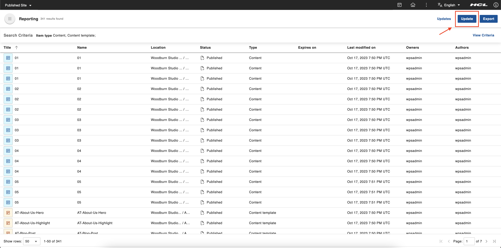
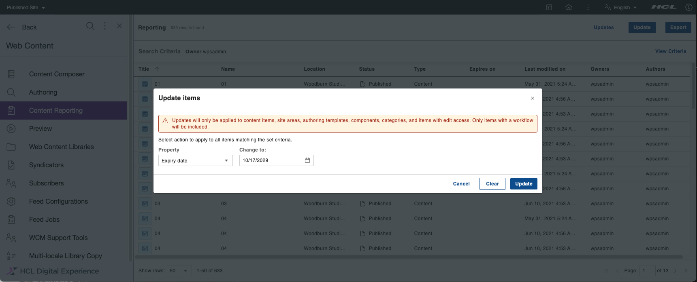
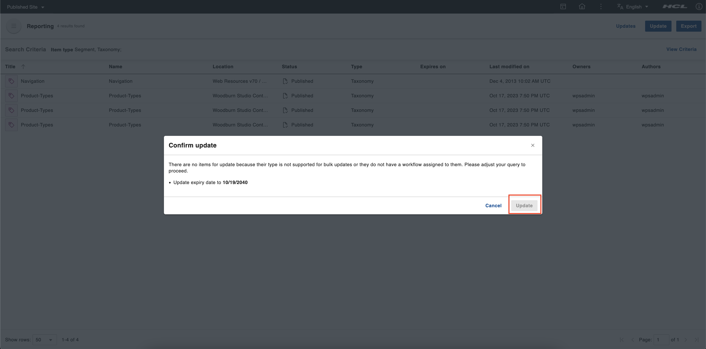
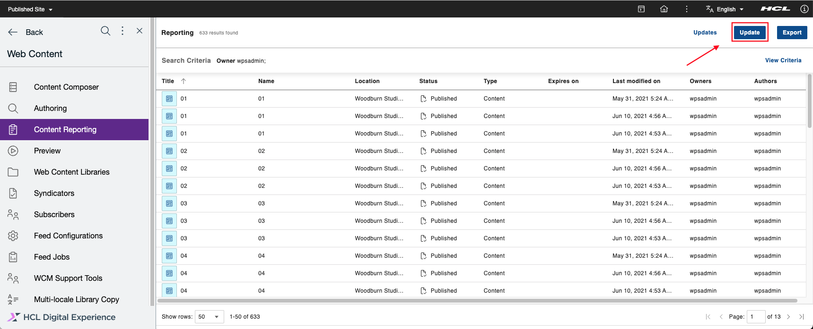
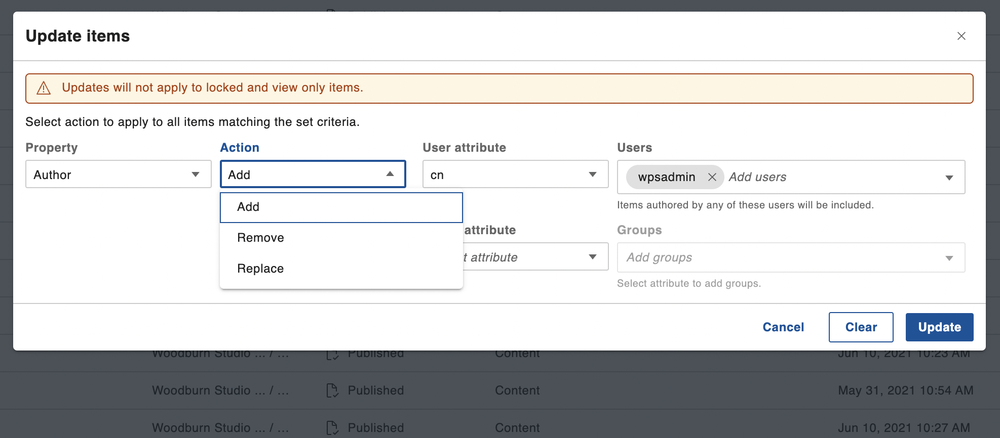
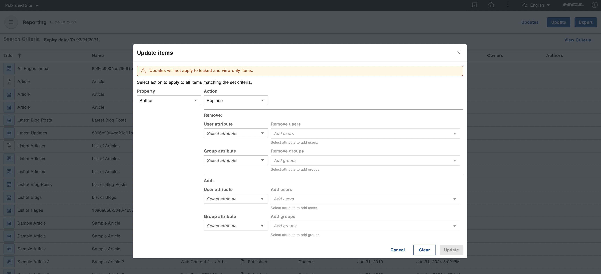
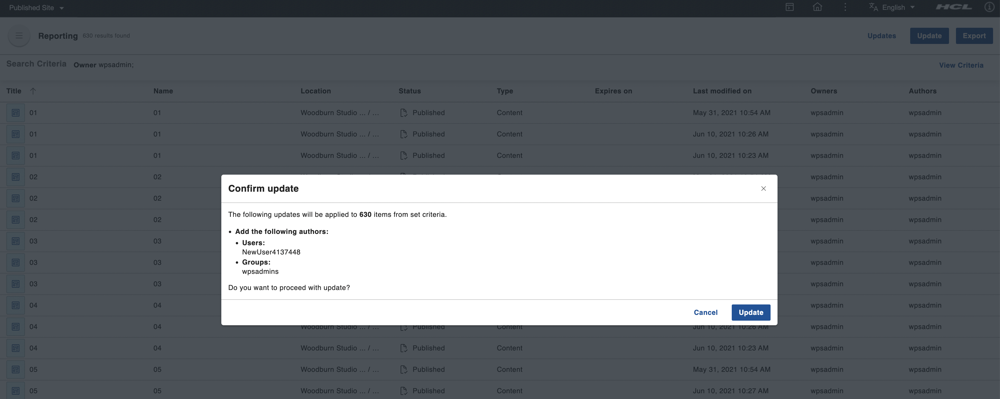

# Content Reporting Bulk Update

Currently, Content Reporting Bulk Update feature supports the following actions: 

- Update expiration date
- Add an owner or author
- Remove an owner or author
- Replace an owner or author

You can execute these actions on content items returned in a report generated through HCL Content Reporting search.

!!!note
    Bulk updates for owners or authors can only be applied to content items, site areas, authoring templates, components, categories, folders, projects, segments, workflow actions, portal pages and items to which you have edit access. To date, adding up to 100 users and updating up to 7000 items have been tested successfully.

Starting CF218, if a bulk update process is running and the server gets restarted, the system pauses the update process. When the server is available again, you can resume the paused bulk update process through the **Updates** page. For more information, see [Resuming a paused bulk update process](#resuming-a-paused-bulk-update-process).

## Prerequisite

Beginning with HCL Digital Experience 9.5 release update CF214, Content Reporting is enabled by default. For HCL Digital Experience 9.5 release update CF213, Content Reporting should be installed and configured. For instructions on installing Content Reporting on supported environments, see the [Install HCL Digital Experience 9.5 Content Reporting](../installation/index.md) topic.

To update items in bulk, you must have edit access to the content items selected. If you kick off the bulk update operation without having the required access to the items, the update will fail with the error message `Unauthorized access`. 

## Using the Content Reporting Bulk Update feature

1.  Log in to your HCL Digital Experience 9.5 platform and select **Web Content**. Select **Content Reporting** from the Practitioner Studio navigator. The following image shows the Content Reporting landing page.

    

2. Generate a report on items you want to update. See [Generating a content report](../usage/generate_content_report.md) for instructions.

3. [Export the report](./export_content_report) or execute one of the following supported bulk update operations: [UpdateExpiry](#using-the-content-reporting-bulk-update-updateexpiry-feature) or [Update Owners/Authors](#using-the-content-reporting-bulk-update-ownersauthors-feature).

## Using the Content Reporting Bulk Update UpdateExpiry feature

Content managers can trigger bulk updates to update the expiration dates of all queried items. This section provides steps on how to update the expiration date of content items in a report generated through HCL Content Reporting.

1. After you have generated a report and if there are results, the **Update** button appears in the application header. Click the **Update** button.

    

2. In the **Update items** dialog box, there are two options: **Property**, and **Change to**.  In the **Property** field, choose **Expiry date**. In the **Change to** field, enter the new expiry date of the selected items. After entering the date, the **Update** button is enabled. Click the **Update** button.

    

    There are also **Cancel** and **Clear** buttons in the dialog box. Click **Cancel** to close the dialog box. Click **Clear** to remove all selected options.

    !!!note
        For CF213, there are three fields: **Action**, **Property**, and **Change to**. The **Action** and **Property** fields each have one option: **Update** and **Expiry date** respectively. Bulk updates for expiry dates can only be applied to content items, site areas, authoring templates, components, categories, and items to which you have edit access. Only items with a workflow are included.

3. After clicking the **Update** button, a confirmation dialog appears. Verify the number of items you want to update and if you entered the correct expiration date. If the values are correct, click the **Update** button. Otherwise, you can click **Cancel** and return to the previous dialog where you can change the incorrect values.

    

    !!!note
        If there are no items to update because their type is not supported for bulk updates or they do not have a workflow assigned to them, the **Update** button is disabled.

        

You can [track the bulk update](#tracking-bulk-updates-and-viewing-bulk-update-results) through the snackbar or through the **Updates** page. Reports are automatically updated after the bulk update process is complete.

## Using the Content Reporting Bulk Update Owners/Authors feature

Content managers can trigger bulk updates to update the owners and/or authors of all queried items. This section provides steps on how to update the owners or authors of content items in a report generated through HCL Content Reporting.

1. After you have generated a report and if there are results, the **Update** button appears in the application header. Click the **Update** button.

    

2. In the **Update items** dialog box, there are three options: **Property**, **Action**, and **User**. In the **Property** field, select the property to be updated, either **Author** or **Owner**. In the **Action** field, select the action to be taken on the selected items, either **Add**, **Remove**, or **Replace**. In the **User** field, enter the name of the user to be involved in the selected action. This field is a type-ahead input field that displays a list of suggested users according to the input. Only suggested users are considered valid. After filling out all the fields, click the **Update** button.

    

    !!!note
        For the **Replace** action, there are two fields for the users involved in the action: **Add User** and **Remove User**. In the **Add User** field, enter the name of the user you want to add. In the **Remove User** field, enter the name of the user you want to replace with the name you added in the **Add User** field. 
        

3. After clicking the **Update** button, a confirmation dialog appears. Verify the number of items you want to update and that you entered the correct user information. If the values are correct, click the **Update** button. Otherwise, you can click **Cancel** and return to the previous dialog where you can change the incorrect values.

    

    There are also **Cancel** and **Clear** buttons in the dialog box. Click **Cancel** to close the dialog box. Click **Clear** to remove all selected options.

You can [track the bulk update](#tracking-bulk-updates-and-viewing-bulk-update-results) through the snackbar or through the **Updates** page.

## Tracking Bulk Updates and viewing Bulk Update results

When a bulk update is triggered, a snackbar appears in the bottom right corner of the screen. The snackbar displays the status of the update. If the process is still ongoing, it shows how many items have already been processed against the total number of items. If the process has been completed, it shows how many items were updated and how many items were not.

There are two ways to track the bulk update: through the snackbar and through the **Updates** page.

### Using the snackbar

The snackbar that appears when a bulk update is triggered tracks up to five bulk update processes.

   This is the snackbar for an ongoing process.
   

   This is the snackbar if every item was successfully updated.
   

   This is the snackbar if some items were not updated.
   

   This is the snackbar if all items were not updated.
   

1. On the snackbar, there is an option to view the items that have been processed only when the bulk update process is completed. Click **View items** to check the details of each item that has been processed. A dialog box for the reports appears.

    

2. In the header of the dialog box, you can see the total number of items that was updated and the number of failed items. There are four columns on the dialog box:

    - **Title** - This column shows the title of the item processed.
    - **Item type** - This column shows the type of item processed.
    - **Update Status** - This column tells whether the item was successfully updated (shown as **OK**) or not (an error message containing why the update failed is displayed).
    - **Created by** - This column shows the creator of the item.

    
   
### Using the Updates page

1. You can access the **Updates** page through the button on the application header. Click the **Updates** button to go to the **Updates** page. The **Updates** button also contains the total number of bulk update operations triggered.

    

2. In the **Updates** page, there is a table showing the bulk updates that were triggered. This table has five columns:

    - **Update** - This column indicates whether the bulk update is ongoing or completed. Once complete, there is a summary of items that have been processed. This summary shows how many items were updated and how many failed. This column also contains a button to show the report dialog where you can check the details of each item that has been processed.
    - **Action** - This column shows actions that were taken during the bulk update.
    - **Requested by** - This column shows who triggered the bulk update process.
    - **Updated on** - This column shows when the bulk update was triggered.
    - **Polling ID** - This column shows a unique identifier for the bulk process.

    

    To return to the **Content Reporting** landing page, click the back button found on the upper left corner of the **Updates** page.

3. In the **Updates** page table, hover over a row of a completed bulk update to display the view action button. Click this button to display the dialog for the list of items processed and their details.

    

4. In the header of the dialog box, the number of updated items and the number of failed items are displayed. There are four columns on the dialog box:

    - **Title** - This column shows the title of the item processed.
    - **Item type** - This column shows the type of item processed.
    - **Update Status** - This column tells whether the item was successfully updated (shown as **OK**) or not (an error message containing why the update failed is displayed).
    - **Created by** - This column shows the creator of the item.

    
    
#### Resuming a paused bulk update process

To continue a paused bulk update process, refer to the following steps:

1. Access the **Updates** page through the button on the application header. Click the **Updates** button to go to the **Updates** page.

    

2. In the **Updates** page table, hover over a row of a paused update process to display the resume update button. Click this button to display the confirmation dialog box to resume the bulk update process.

    

3. The **Confirm resume update** dialog box appears. Verify the items you want to update and click **Resume** to continue. Otherwise, you can click **Cancel**.

    

After resuming the update, you can track the progress in the **Updates** page.

!!!note
    You can only resume a paused bulk update process for owners and authors if the update involves a limited number of users. Currently, there is a size limitation in the database column that stores the action string that specifies the owners or authors used in an update. If the action string exceeds 255 characters, you cannot resume the paused bulk update process. The operation fails and you must start the bulk update process again.
