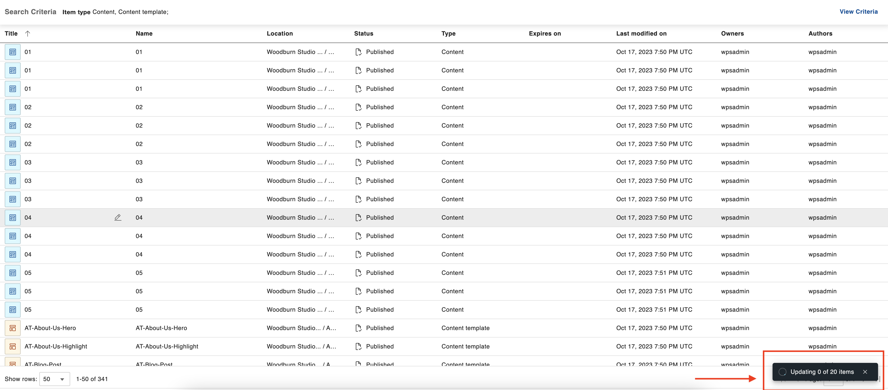
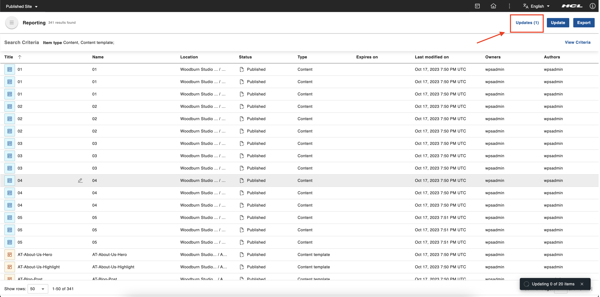

# Content Reporting Bulk Update

This section details how to use the bulk update for updating the expiry date of content items in HCL Content Reporting

## Prerequisite

Content Repporting should be installed and configured to HCL Digital Experience 9.5 release update CF213 or higher. See instructions to install to supported container environments in the [Install HCL Digital Experience 9.5 Content Reporting](../installation/install_content_reporting.md) topic.

## Bulk Update

Content managers can trigger bulk updates to update all queried items' expiration dates.

1.  Log in to your HCL Digital Experience 9.5 platform and select **Web Content** then select **Content Reporting** from the Practitioner Studio navigator.

    

2. Generate report on items you want to update. See [Generate Content Report](../installation/generate_content_report.md) for futher instruction.

3. When you already genearted a report. The **Update** button will appear on the application header. Click the **Update** button. A dialog box will appear.

    

3. On the dialog box, we have three options here: **Action**, **Property** and **Change to**. For this release **Action** and **Property** will only have one option it is **Update** and **Expiry date** respectively. For **Change to** we have a date picker, enter the date for the expiry date on the selected items. After entering the date the **Update** button will be enable. Click **Update** button, a confirmation dialog will appear.

    

    We also have **Cancel** and **Clear** option on the dialog box. **Cancel** will close the dialog box and **Clear** will remove all selected options in the dialog box.

    !!!note
        Bulk update for expiry date will only be applied to content items, site areas, authoring templates, components, categories, and items with edit access. Items assigned with a workflow will also be included.

4. On the confirmation dialog, Check the number of items you want to update and if you entered the correct expiry date. If you already verified the values, you can now click **Update** button otherwise you can click **Cancel** and return to previous dialog where you can change the incorrect values.

    

5. When bulk update is triggered a snackbar should appear. The snackbar can tell if the bulk update is still **ongoing* and **completed*, For the ongoing process it show many items are already processed and the total item. For the completed process it will tell how many items was successfuly updated and how many items was failed to update.

    

## Track Bulk Update and View Bulk Update Results

There are two ways to track the bulk update: the first is the snackbar mentioned above and, the other  is the **Updates** page

### Snackbar

1. The snackbar that appear when a bulk update is triggered will track up to five the bulk update process. 

    This is the snackbar for ongoing.
    

    This is the snackbar if every item was successfully updated.
    

    This is the snackbar if some item failed to update.
    

    This is the snackbar if all item failed to update.
    

2. On the snackbar, there is option to view the items that has been processed only when the bulk update process is completed. Click **View Item/s** to check the details of each item that has been processed, a dialog box for the reports should appear.

    

3. On the dialog box, on the header we can see total item was successfully updated and number of failed item. On the alert part we can see the number of failed items. We five columns on the table inside body of the dialog box and they are as follow:

    - **Title** - this column shows the title of the item we processed.
    - **Item type** - this column shows the type of the item we processed.
    - **Update Status** - this column tells whether the item was successfully updated denoted as "OK" or the item failed to update denoted as "Failed".
    - **Error** - this column tells why the item failed to update, if blank it means the item was successfully updated.
    - **Created by** - this column shows who triggered this bulk updated process.

    
   
### Updates Page

1. We can access the **Updates** page via the button on the application header, upon clicking the **Updates** button it will redirect you to **Updates** page. The **Updates** button also contain the total bulk update triggered.

    

2. From the updates page, we see a table that contains the bulk updates that was triggered. We have four columns, they are as follow:

    - **Update** - this column tells if the bulk update is ongoing or completed, once complete we will have a summary on items that process. We will how many items was successfully updated and how many failed. This column also contain a button to show the report dialog to check the details of each item that has been processed.
    - **Action** - this column shows action that was done on the bulk update.
    - **Requested by** - this column shows who triggered this bulk updated process.
    - **Updated on** - this column shows when the bulk update was triggered.

    

    We have a *back button* on the app header to return to the landing page of Content Reporting.

3. On the table, on the **Update** column, there is a button that will appear on hovered when bulk update was completed. This button will show dialog to check the details of each item that has been processed.

    

3. On the dialog box, on the header we can see total item was successfully updated and number of failed item. On the alert part we can see the number of failed items. We five columns on the table inside body of the dialog box and they are as follow:

    - **Title** - this column shows the title of the item we processed.
    - **Item type** - this column shows the type of the item we processed.
    - **Update Status** - this column tells whether the item was successfully updated denoted as "OK" or the item failed to update denoted as "Failed".
    - **Error** - this column tells why the item failed to update, if blank it means the item was successfully updated.
    - **Created by** - this column shows who triggered this bulk updated process.

    
   