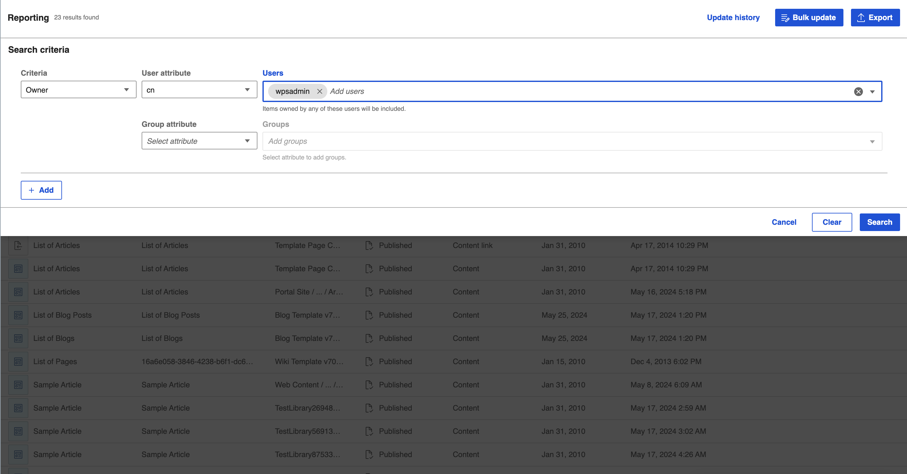
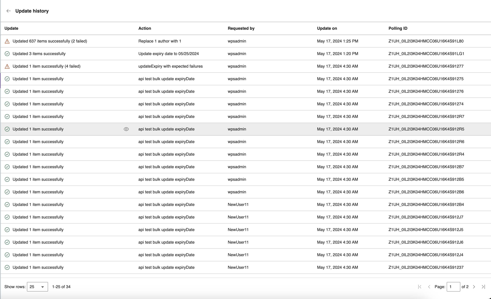
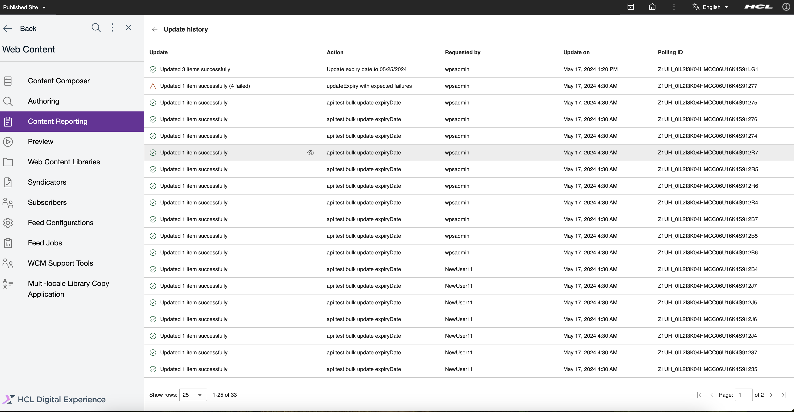
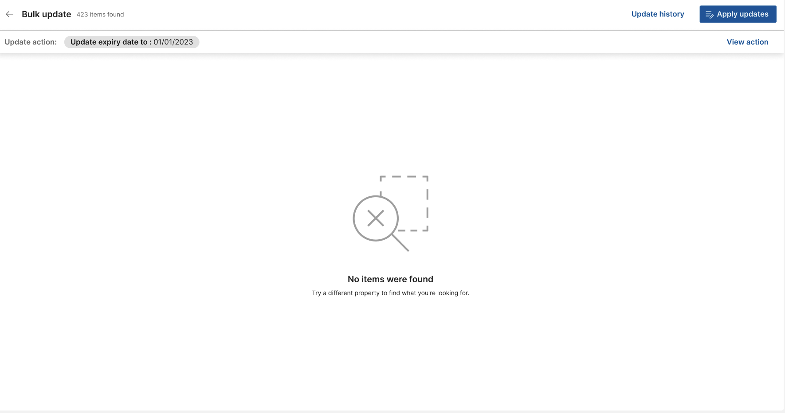

# Cherry picking items for bulk update

After generating a report through HCL Content Reporting, you can select all or just a number of items when performing a bulk update operation.

!!!note
    Bulk updates for owners or authors can only be applied to content items, site areas, authoring templates, components, categories, folders, projects, segments, workflow actions, portal pages and items to which you have edit access. To date, adding up to 100 users and updating up to 7000 items have been tested successfully.

Starting CF218, if a bulk update process is running and the server restarts, the system pauses the update process. When the server is available again, you can resume the paused bulk update process through the **Updates** page. For more information, see [Resuming a paused bulk update process](#resuming-a-paused-bulk-update-process).

## Prerequisite

Beginning with HCL Digital Experience 9.5 release update CF214, Content Reporting is enabled by default. For HCL Digital Experience 9.5 release update CF213, Content Reporting should be installed and configured. For instructions on installing Content Reporting on supported environments, see the [Install HCL Digital Experience 9.5 Content Reporting](../installation/index.md) topic.

To cherry pick an items in bulk for update, you must have edit access to the content items selected. If you kick off the bulk update operation without having the required access to the items, the update will fail with the error message `Unauthorized access`.

To start cherry picking process, you must need to follow the process of 

## Using the Cherry picking items for bulk update

1.  Log in to your HCL Digital Experience 9.5 platform and select **Web Content**. Select **Content Reporting** from the Practitioner Studio navigator. The following image shows the Content Reporting landing page.

    

3. Choose a criteria (Expiry Date, Author, Owner) to be generated.

    

3. Generate a report on items you want to update. See [Generating a content report](../usage/generate_content_report.md) for instructions.

    

## Using the Content Reporting Cherry Picking for Bulk Update feature

1. Click the "Bulk update" button in the sub-header.

    

2. Bulk update dialog box will appear.
    - The dialog will display a message to inform the user to enter actions needed for the update.

    

3. Defining action properties for the update.
    - Click the "View item list" button to start searching valid items.

    

4. Displaying the results based on the update action and applying the update.
    - User may proceed to update all from the list or specifically select the items for update.
    - Click the "Apply updates" button to open the confirmation dialog.

    

5. Displaying the confirmation update dialog.
    - The confirmation dialog will contain the number of items to be updated and the update action.
    - Click "Update" to send the bulk update request.

    

## Updating selected items

1. Selecting items to be updated manually.
    - Items for update can be manually selected via the checkbox that appears on hover over a list item.
    - Click on the "Apply updates" button to proceed with the request.

    

2. Displaying the confirmation update dialog.
    - The confirmation dialog will contain the number of items to be updated and the update action.
    - Cick "Update" to send the bulk update request.

    

3. Send request and display progress bar while still on the bulk update page.

    

### Viewing / changing actions

1. Viewing the update action thru the bulk update dialog.
    - Click the "View action" button to access the buld update dialog.

    

2. Displaying the bulk update dialog.
    - Upon display, the dialog has the current action displayed and the user can change the properties or action as needed.
    - Click the "View item list" to trigger the search of valid items.

    

3. Displaying the valid items to be updated.

    

### Viewing the update history

1. Viewing the updates thru the update history page.
    - Click the "Update history" button to go to the update history page.
    - A counter indicator at the button to show ongoing update that is processing at the moment.

    

2. Loading the update history page.
    - The activity page will display all updates whether it is a successful update, failed update or an ongoing update.
    - Click the "Back" button to go back to previous page.

    

    

### Empty results

1. Displaying empty results.
    - The page will display the message "No items were found".

    

