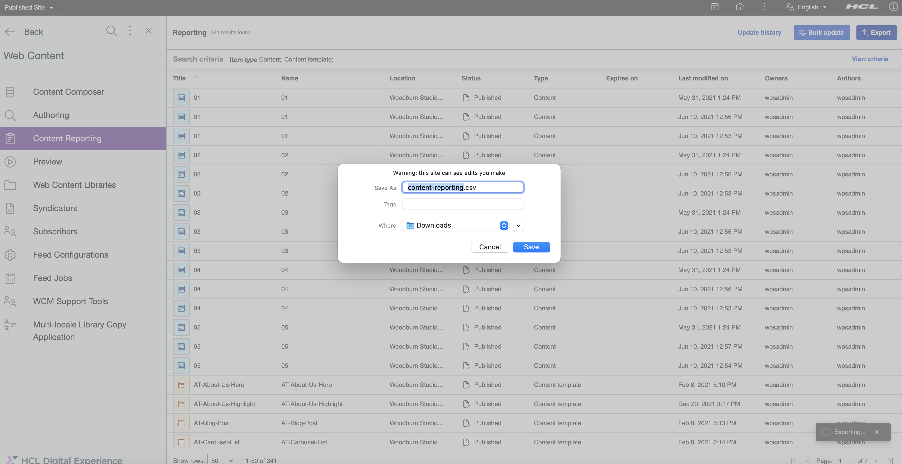

# Using the Content Reporting Export feature

This section provides steps on how to export the generated report in HCL Content Reporting.

## Prerequisite

Content Reporting should be installed and configured in HCL Digital Experience 9.5 release update CF213 or higher. For instructions on installing Content Reporting on supported environments, see the [Install HCL Digital Experience 9.5 Content Reporting](../installation/index.md) topic.

## Exporting reports

Content managers can export generated reports in HCL Content Reporting.

1.  Log in to your HCL Digital Experience 9.5 platform and select **Web Content**. Select **Content Reporting** from the Practitioner Studio navigator.

    

2. Generate a report on the items you want to export. See [Generating a content report](../usage/generate_content_report.md) for instructions.

3. After generating a report, the **Export** button appears in the application header. Click the **Export** button. The snackbar showing the export progress appears in the lower right corner. 

    

4. When exporting is successful, you can find and check downloaded CSV file in your local filesystem.

    
