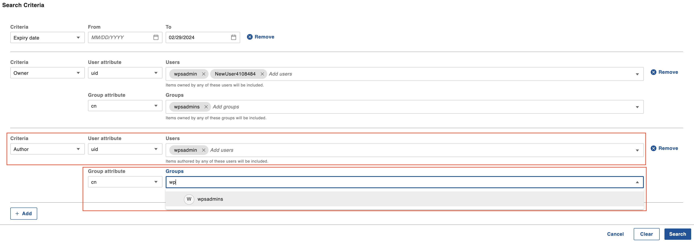
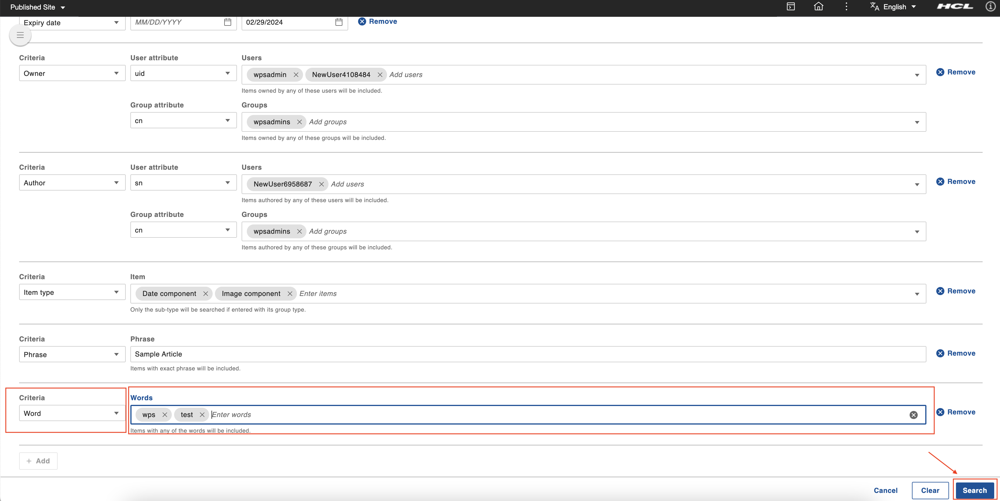
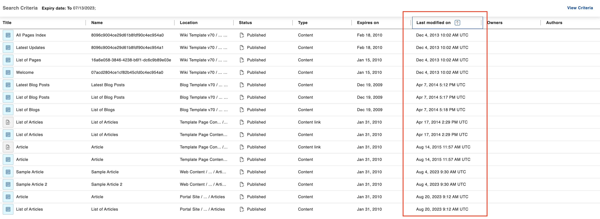
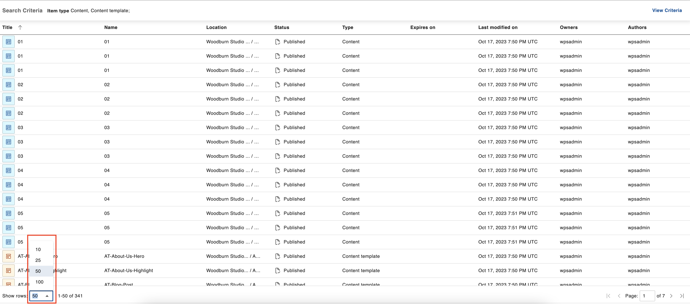
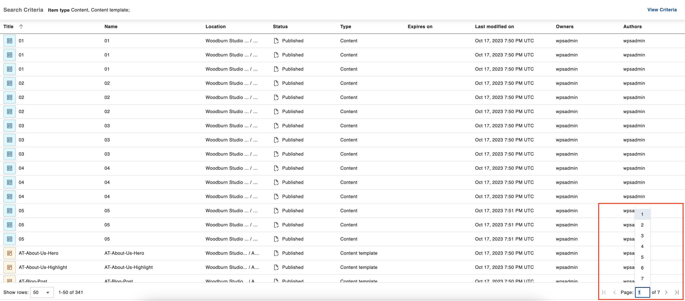

# Generating a content report

This section details how to generate a content report in HCL Content Reporting.

## Prerequisites

- Beginning with HCL Digital Experience 9.5 release update CF214, Content Reporting is enabled by default. For HCL Digital Experience 9.5 release update CF213, Content Reporting should be installed and configured. For instructions on installing Content Reporting manually on supported environments, see the [Installing HCL Digital Experience 9.5 Content Reporting](../installation/index.md) topic.

- Configure a JCR search collection to get valid search results. When you create a content item and then try to generate a report using the **Phrase** or **Word** criterion without running the seedlist crawler manually or waiting for its next scheduled crawl, the generated report will not include the item you created. Refer to [Setting up a JCR search collection](../../../../build_sites/search/portal_search/administer_portal_search/setup_search_collections/jcr_search_collections/index.md) for more information.

## Generating a report

A report is a list of items that matches a set or combined sets of criteria. Content managers generate reports of content items that they are planning to analyze or update. They have a set of criteria that the content items have to match. In this feature, content managers can combine the required criteria into a single report to get the list of items that need updating.

1.  Log in to your HCL Digital Experience 9.5 platform and select **Web Content**, then select **Content Reporting** from the Practitioner Studio navigator.

2.  Close the sidebar. On the **Search Criteria** section, select the appropriate criteria to generate a report of matching contents.
    

    !!!note
        The dynamic fields of each criterion are displayed upon selection. You can generate a content report by any or all of these search criteria.

    In the **Criteria** dropdown, you can select any of the following:

    - **Expiry date**

        When you select the **Expiry date** criterion, two date input fields appear: **From** and **To**.

        

        Click the calender icon in the **From** or **To** fields to display the calendar. Select the **From** date and the **To** date from calendar and click **Search**.
        
        

        !!!note
            Filling up both date fields is not mandatory and only one is needed to proceed. Entering only the **From** date searches items that expire from that date onwards. Entering only the **To** date searches items that expire on or before that date.
            
        !!!important "Invalid date range"
            Using an invalid date range (for example, from a future date to a past date) causes the generated report to be empty.

    - **Owner**

        When you select the **Owner** criterion, four input fields appear: **User attribute**, **Users**, **Group attribute** and **Groups**.

        Selecting any attribute from user or group attributes enables the **Users** or **Groups** field respectively. **Users** and **Groups** are type-ahead input fields where you can select the users or groups as owner of the items you want included in your report. The list of matched users or groups is displayed as auto-suggested options depending on the selected user or group attribute and the input value as you type. Only suggested users or groups are valid values.

        You must select at least one of the suggested users or groups to finish setting up the criteria. A checkmark appears to the left of the selected user and group to indicate that it has been selected.

        
    
    - **Author**

        When you select the **Author** criterion, four input fields appear: **User attribute**, **Users**, **Group attribute** and **Groups**.

        Selecting any attribute from user or group attributes enables the **Users** or **Groups** field respectively. **Users** and **Groups** are a type-ahead input field where you can select the users or groups as author of the items you want included in your report. The list of matched users or groups is displayed as auto-suggested options depending on the selected user or group attribute and the input value as you type. Only the suggested users or groups validvalues.

        You must select at least one of the suggested users or groups to finish setting up the criteria. A checkmark appears to the left of the selected user and group to indicate that it has been selected.

        

    - **Item type**

        Selecting the **Item type** criterion adds the **Item** field, a multi-select dropdown input field where you can select the item type of the items you want included in your report. You can also type in the input field to get an auto-suggested list of matching item types.
        
        

        Select one or more item types from the **Item** dropdown list.

        
        
        !!!note
            In case you select both a grouped item type (for example, *All Authoring Templates*) and one or more of its sub-types (for example, *Content Template*), the system only fulfills the search for the sub-types. The most specific search criteria of the sub-type is recognized because searching for the grouped item type nullifies the specific search.

    - **Phrase**

        Selecting the **Phrase** criterion adds the **Phrase** field, a text input field where you can enter a phrase that would match the items you want included in your report. Enter a phrase (for example, *Sample Article*) in the **Phrase** field. Only one phrase can be searched per criteria line. 
        
        

    - **Word**

        Selecting the **Word** criterion adds the **Words** field, a multiple text input field where you can enter words that would match the items you want included in your report. Enter a few words (for example, *wps*, *test*) in the **Words** field. This searches for words within attributes such as titles, description, name, and keywords.
        
        !!!note
            Any of the words entered will be searched. All words entered do not have to be present in an item.
        
        

    !!!note
        After you select a criterion, it will not be available for selection again in the **Criteria** dropdown menu. 

3. After you have selected the search criteria, click **Search**.

    The system displays a set of search results that fit the selected criteria. The total number of results is shown at the top (for example, *341 results found*). The number of matching results helps the user make more informed query reformulations. The applied search criteria information is also displayed at the **Search Criteria** bar (for example, *Item type: Content, Content Template;*).

    On the top right corner, the **View Criteria** opens the top drawer and displays the applied search criteria.

    
    
### Other actions available

- To sort the search results, hover over the column header of the field with which you want to sort. An Arrow icon appears with a tooltip indicating that this icon is used to sort the results. Click the Arrow icon to sort the search results according to your preference. This icon remains visible to indicate the last sort used.
    
    

    

- To change the number of rows per page of the search results, select from the options in the **Show rows:** dropdown menu.
    
    

- To change the current page of the search results, select from the options in the **Page:** dropdown menu. You can also click the buttons beside the dropdown menu to go to the first page, previous page, next page, and last page of the results. 
    
    

- To add more criteria to your search, click **View Criteria**. Click the **+ Add** button to add another search criteria.
    
    

- To remove already added search criteria, click the **Remove** button. Clicking the **Remove** button removes the criterion and makes it available in the **Criteria** dropdown menu again.
    
    

- To remove multiple selected criteria, click the **Clear** button.
    
    
