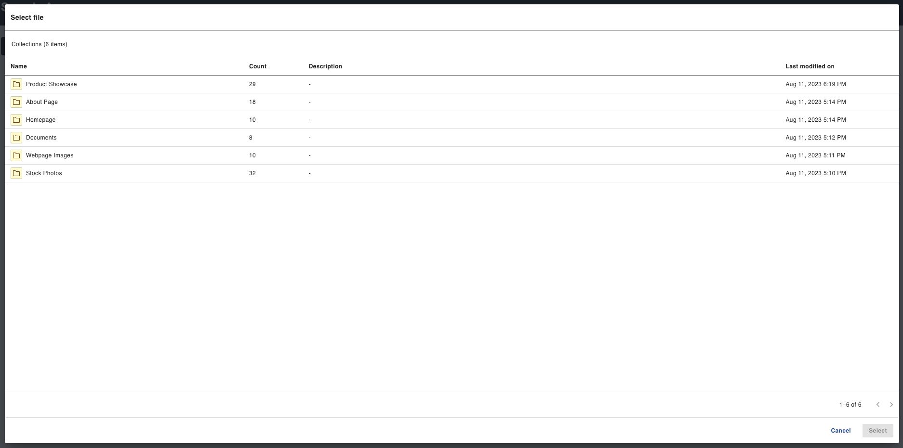
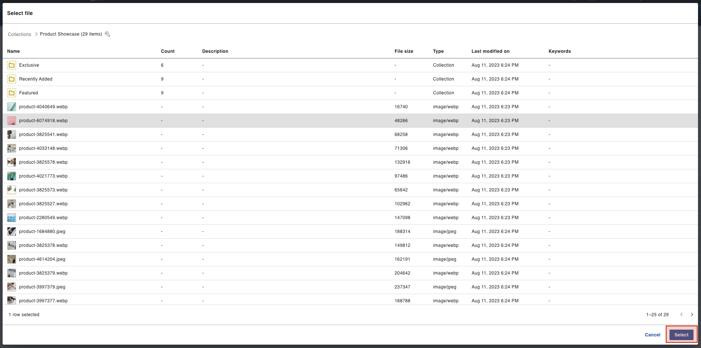
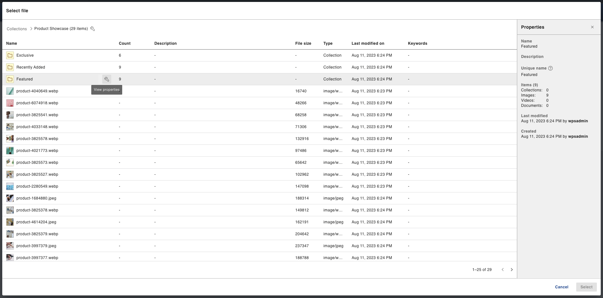

# Usage

This section details the basic usage of the HCL DX Picker.

## Prerequisite

DX Picker should be installed and configured in HCL Digital Experience 9.5 release update CF214 or higher. For instructions on installing DX Picker on supported environments, see the [DX Picker Installation](../installation/index.md) topic.

## Using DX Picker

Upon opening the DX Picker, users will be shown a list of collections that is from the Digital Asset Management.

  

The details that will be shown are the following:

- Name - Name of the collection.
- Count - How many items are inside a particular collection.
- Description - Text describing the collection.
- Last modified date - Date on which the collection is updated.

### Navigating Collections

Clicking on a collection row will navigate the user inside that collection and will be shown the list of items inside.

  

Additional details will be shown when inside a collection:

- File Size - Size of an asset.
- Type - Type of item shown.
- Keywords - Keywords associated with an asset.
 
### Selecting an asset

Clicking on an asset row will enable the select button on the lower right which will allow users to select the particular asset.

  

    Selecting an asset will trigger the following event:

    HCL-DX-PICKER-SELECT

### Display Properties

Clicking on the wrench icon alongside the name of a collection/asset or in the breadcrumbs will display the Properties Panel of that item.

For the Collection:

  

For the Asset:

  
