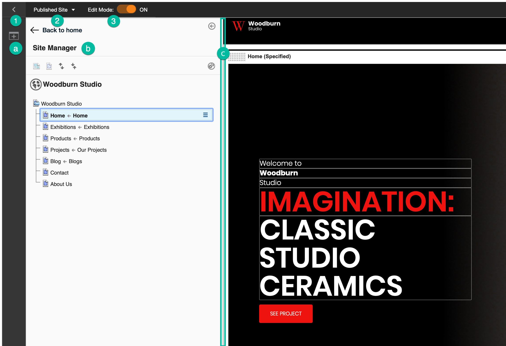
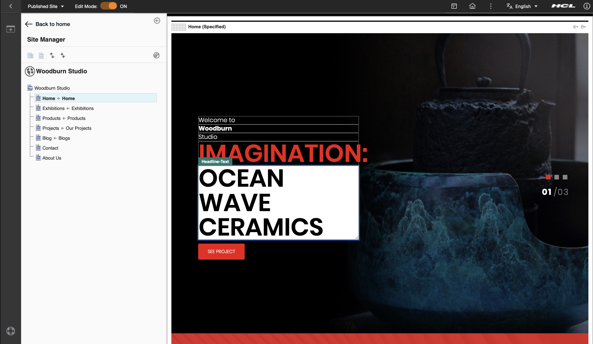
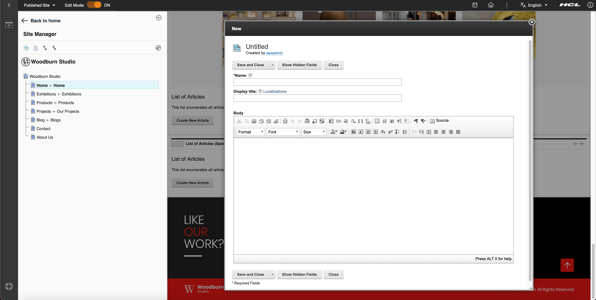
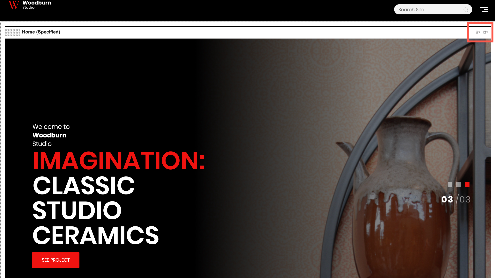

# Site Manager

The Site Manager provides access to common content authoring tools and shows a complete view of the the site’s navigation. Without leaving the context of the website, content authors can access a customization shelf that contains applications and content that can be added to the page, as well as access to configuration options. The same interface provides access to workflow and project capabilities.

If you want to author web content with the Site Manager, you must add a page component that uses web content or add the Web Content Viewer portlet with the site toolbar. For more information, see [Adding reusable page components to your page](../../../build_sites/create_sites/adding_pages_content_more/toolbar_add_comp.md) and [Displaying Content with Web Content Viewers](../../wcm_delivery/deliver_webcontent_on_dx/displaying_content/index.md). 

The Site Manager has the following editing options:

- Using the site toolbar
- In-place editing
- Inline editing
- Editing using the web content viewer 

These options are further discussed in this section.

## Site toolbar

The following image shows you the different parts of the site toolbar. 

1. Use this toggle to open and close the site toolbar. By default, the toolbar provides access to page components and applications to add to your page. After clicking this icon, the following items are displayed:

    1. Click this **Add page components and applications** icon to add page components and applications. 

    2. The Site Manager shows a comprehensive view of a website's hierarchy and navigation. To view a page in your website, click the name of that page in the hierarchy. The page loads in the page view frame. 
    
        In the Site Manager, you can:

        - Show content items in the tree view.
        - Show hidden pages in the tree view.
        - Expand the tree view.
        - Collapse the tree view.
        - For every item on the tree, you can click the **Context menu** icon to open the Context menu. This menu shows you more available actions for your selected page. 

    For more information, see [Adding reusable page components to your page](../../../build_sites/create_sites/adding_pages_content_more/toolbar_add_comp.md).

2. Click this icon to open the **Project menu**. In a project, you can group content and page edits together to make managing and publishing related changes easier. From the **Projects menu**, you can create a new project or manage existing projects. For more information, see [Projects: Organizing and coordinating changes to your site](../../../build_sites/create_sites/adding_pages_content_more/projects_organizing_coord_chgs_site/index.md).

3. Toggle this switch to go on or off Edit mode. Edit mode must be on to edit pages and content items in the website. When you turn on Edit mode, the site toolbar and Site Manager open automatically.

For more information, see [Site toolbar and site manager](../../../build_sites/create_sites/authoring_tools/site_site_toolbar.md) and [Preparing the site toolbar](../../../build_sites/create_sites/site_prep_content_author/prep_site_toolbar/index.md).

## In-place editing

In-place editing enables users with edit access to a content item to edit that item directly on the web page. This feature is called What You See Is What You Get (WYSIWYG) editing, allowing any user to contribute with web content. In the example below, the **Headline-Text** box becomes editable when you select it. 

In-place editing is available in two modes: 

- `embed` - enables embedded editing of an element
- `dialog` - enables editing in a pop-up dialog

Developers can choose which mode to use. To set the in-place editing mode, see [Default in-place editing mode](../../wcm_configuration/cfg_webcontent_auth_env/wcm_config_prop_authoring.md#default-in-place-editing-mode).

The in-place editing feature requires:

-   HCL Portal version 8.0.0.1 or later, or Web Content Manager version 8.0.0.1 or later.
-   A theme that supports Dojo. The themes that are included with HCL Portal are enabled for Dojo.

    If you create a custom theme, in addition to supporting Dojo, the new theme must reference the `wcm_inplaceEdit` theme module. For information about creating themes that support Dojo, see [Dojo Toolkit](../../../extend_dx/development_tools/dojo/dojo_overview.md).

-   When using in-place editing with page components, users must have Editor access to the Portal Site library.

!!! important
    This feature can be enabled or disabled by enabling or disabling the content targeting feature and application objects. For more information, see *Installing content targeting features and application objects*.

!!! note
    When a user tabs between in-place editing enabled fields, users need to click each field in turn to access in-place editing for each field.
    
## Inline editing

Inline editing enables users with edit access to work with a content item. They can create, read, edit, approve, reject, and delete content. When creating or editing, it shows the content form shown in the following example. 

Inline item creation can be enabled using authoring tool components so that users can create a new content item without having to access the authoring interface. For more information about authoring tools, see [Create an Authoring tools element](../../../manage_content/wcm_authoring/authoring_portlet/content_management_artifacts/elements/authoringtools_element/index.md) and [What is an Authoring tools element?](../../../manage_content/wcm_authoring/authoring_portlet/content_management_artifacts/elements/authoringtools_element/wcm_dev_elements_authoring-tools.md).

## Web content viewer

On the upper right corner of a page, you can find the Content menu and Portlet menu buttons:

### Editing content using the Content menu

Click the **Content menu** icon to display the following actions:

- **Configure Spot** - Allows you to select the type of content to display in a web content viewer. For more information, see [Configure your content spot](../../../build_sites/create_sites/content_spot/index.md).
- **Open Read Form** - Opens a read-only form of the selected page's properties.
- **Open Edit Form** - Opens an editable form where you can modify the selected page's properties. 
- **Delete** - Deletes the page.

For more information about the Content menu, see [Moving, copying, and pasting pages and content items](../../../build_sites/create_sites/adding_pages_content_more/toolbar_pages_move.md).

### Configuring your website using the Portlet menu

Click the **Portlet menu** icon to show the following actions:

- **Edit Shared Settings** - Opens the Web Content Viewer where you can manage the page's properties, portlet settings, and several advanced options such as adding or receiving links and adding plug-ins.
- **Maximize** - Maximizes the page.
- **Minimize** - Minimizes the page.
- **Help** - Opens a new window containing a help topic. 
- **Site Promotions** - Allows you to manage site promotions. For more information on site promotions for developers, see [Site promotions](../../../deployment/manage/monitoring/analyze_portal_usage/user_behavior_by_asa/analytics_tags_site_promo/site_promo/index.md).
- **Analytics Tags** - Allows you to manage analytics tags. For more information on analytics tags for developers, see [Analytics tags](../../../deployment/manage/monitoring/analyze_portal_usage/user_behavior_by_asa/analytics_tags_site_promo/analytics_tags/index.md).
- **Delete** - Deletes the page. 
- **Hide** - Hides the page.

Refer to the following pages for more information:

-   **[Examples of using the Site Manager in Woodburn Studio](site_manager_samples.md)**  
This topic provides examples of how you can use the Site Manager through the Woodburn Studio demo site. You can perform the same actions in your own site.
-   **[Updating sample template items for inline editing after an upgrade installation | HCL Web Content Manager](wcm_dev_inline_upgrade.md)**  
HCL Web Content Manager includes sample content such as web content template pages and predefined portlets that you can add to pages to render content. If you upgrade, these sample web content template items continue to use the editing method of the earlier release. To use the inline editing method with the earlier template items, you must complete several manual steps.
-   **[Enabling inline editing for content items](wcm_dev_inline_tags.md)**  
You can enable inline editing for content item fields in your site design.

## HCLSoftware U learning materials

For an introduction and a demo on how to use the Site Manager, go to [Site Manager](https://hclsoftwareu.hcltechsw.com/component/axs/?view=sso_config&id=3&forward=https%3A%2F%2Fhclsoftwareu.hcltechsw.com%2Fcourses%2Flesson%2F%3Fid%3D291). To try it out yourself, refer to [Site Manager Lab](https://hclsoftwareu.hcltechsw.com/images/Lc4sMQCcN5uxXmL13gSlsxClNTU3Mjc3NTc4MTc2/DS_Academy/DX/Introduction/HCL_Digital_Experience_Getting_Started_Lab.pdf) and corresponding [Site Manager Lab Resources](https://hclsoftwareu.hcltechsw.com/images/Lc4sMQCcN5uxXmL13gSlsxClNTU3Mjc3NTc4MTc2/DS_Academy/DX/Business_User/HDX-BU-100_Web_Content_-_Content_Composer_Lab.pdf).

???+ info "Related information"
    - [Authoring tools](../../../build_sites/create_sites/authoring_tools/index.md)
    - [Preparing for content authors](../../../build_sites/create_sites/site_prep_content_author/index.md)
    - [Adding pages, content, and more](../../../build_sites/create_sites/adding_pages_content_more/index.md)
    - [Configure your content spot](../../../build_sites/create_sites/content_spot/index.md)
    - [Developing and managing content](../../../build_sites/create_sites/developing_managing_content/index.md)
    - [Creating an editable property tag](../../wcm_authoring/authoring_portlet/content_management_artifacts/tags/creating_web_content_tags/wcm_dev_item-details_property_edit.md)
    - [Creating an editable element tag](../../wcm_authoring/authoring_portlet/content_management_artifacts/tags/creating_web_content_tags/wcm_dev_referencing_elements_edit.md)
    - [Creating an If Edit Mode tag](../../wcm_authoring/authoring_portlet/content_management_artifacts/tags/creating_web_content_tags/wcm_dev_tag_ifeditmode.md)
    - [Creating an authoring tools element](../../wcm_authoring/authoring_portlet/content_management_artifacts/elements/authoringtools_element/index.md)

