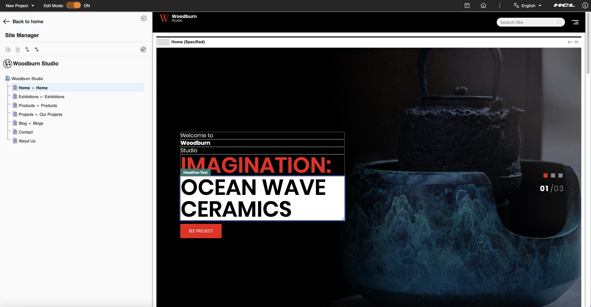
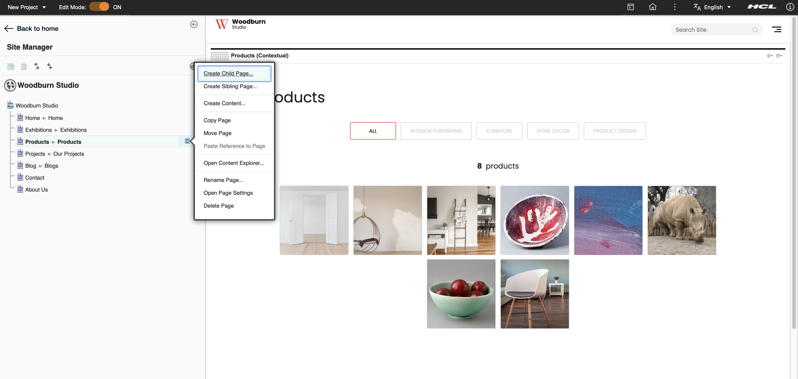
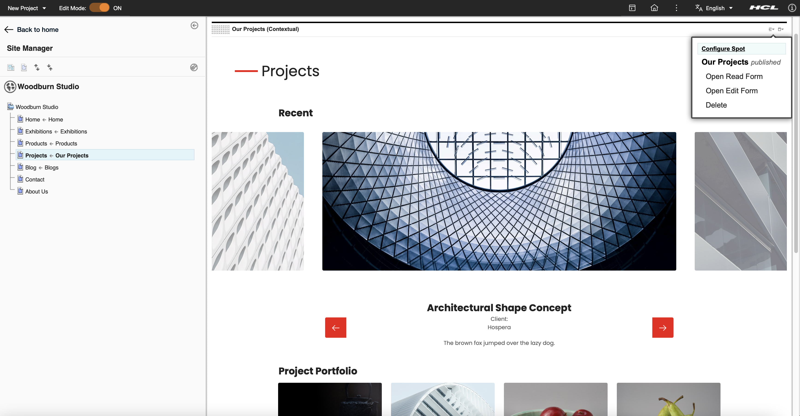
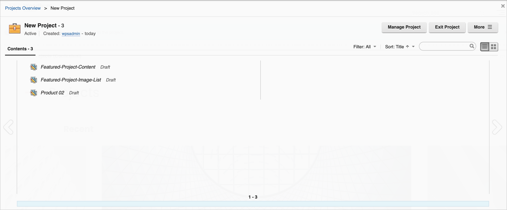

# Understanding inline editing using Woodburn Studio

This topic provides an example of how you can use inline editing through the Woodburn Studio demo site. You can perform the same actions in your own site. 

## Editing content in Woodburn Studio
Through inline editing, users with edit access can modify the content of a webpage.

1. Go to Woodburn Studio.

2. On the upper left corner, switch the Edit Mode toggle button to **ON**. 

    Going into Edit mode allows you to create and modify content.

3. Make your changes.
    
    !!!important
        If you did not create a project before editing, all changes made are automatically live in the external website. For more information about creating a project, see [(Optional) Creating a new project in Woodburn Studio](#optional-creating-a-new-project-in-woodburn-studio). 

    With inline editing, you can:

    - Change the content of text boxes. You can click on a text box and it switches to an editable text box. In the example below, you can change the content of the **Headline-Text** box.
        

    - Use buttons to follow links to other pages. 

    - Change images. Click on an image and a window appears. You can upload or remove an image, modify the image attributes, and control the different renditions of an image. Click **Save** to save your changes.
        

    - Add and modify pages as needed. On the left side of the screen, you can see the Site Manager and the pages available for Woodburn Studio. If you want to modify pages, click the corresponding menu icon for the page. A list of actions available is displayed. You can:
        - Create a child page.
        - Create a sibling page.
        - Create content.
        - Copy or move the page.
        - Open Content Explorer.
        - Rename the page.
        - Open Page Settings.
        - Delete the page. 

        These actions are shown in the following example:

        

    In addition to inline editing, you can also perform inplace editing in Woodburn Studio. 
    
    1. Go to the page you want to edit and click the Configure Spot icon on the upper right corner. 
        

    2. Click **Open Edit Form**. A new window appears where you can modify the properties of the page you are working on. 
        

    3. Click **Save and Close** to save your changes. 

4. After applying the changes needed, close your project. 

    In the following example, the changes done are listed under a specific project. Click **Exit Project** to close your project. 

    

## (Optional) Creating a new project in Woodburn Studio
Creating a new project before editing allows you to prepare several changes that you can then publish together.

1. Click the **Published Site** dropdown menu.

2. Select **New Project**.
    This opens the **Projects Overview** window. 

3. Under **New Project**, enter the name of your project.

4. Click **Create**. 

### Reviewing and approving content in Woodburn Studio
After making changes under a project, changes must be approved before they are published.

1. Open the project by clicking the dropdown menu on the upper left corner and selecting **Open Overview**.

2. Click **Manage Project**. The **Manage Project** window appears.

3. Select the checkbox of the change you want to approve. Click **More** and select approve.

    

### Publishing changes in Woodburn Studio
After changes are approved, you can publish the changes by opening the **Manage Project** window. Click **Publish Project**. 

???+ info "Related information"
    - [The Woodburn Studio demo site](../../../build_sites/woodburn_studio/index.md)
    

    
