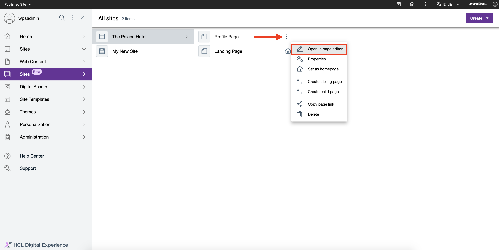
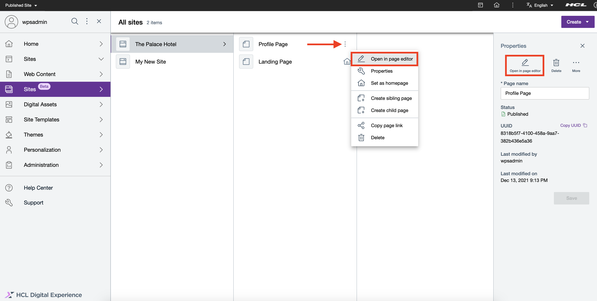
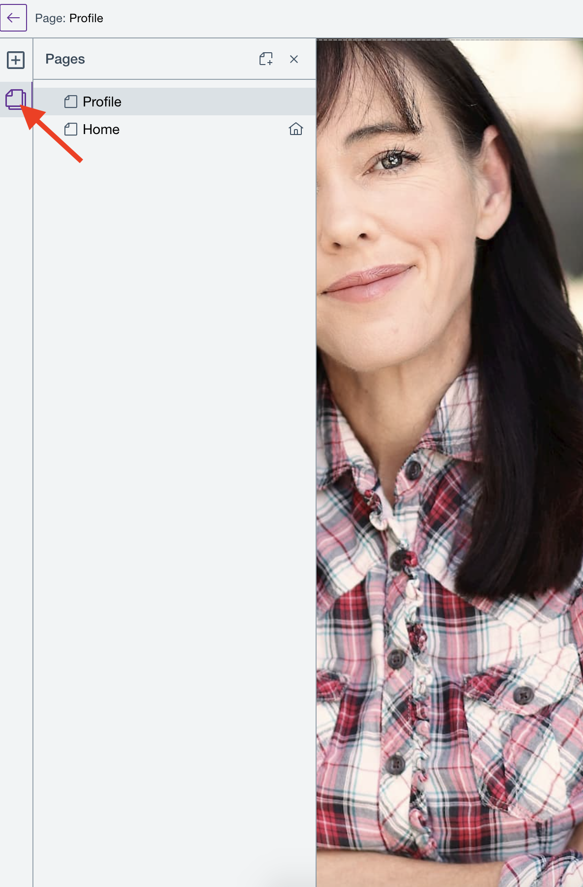
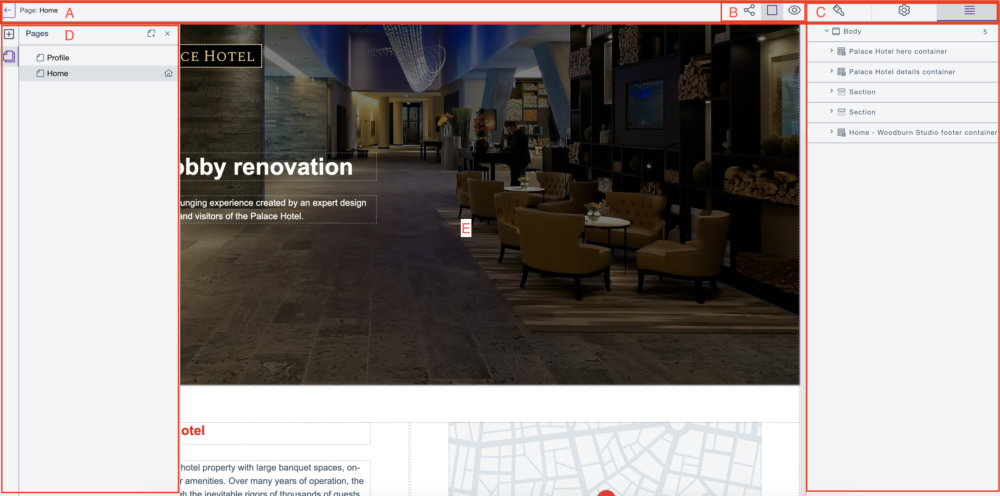

# Author pages in Design Studio (Beta)

This section details how you can use content items on pages created and managed with HCL Design Studio (Beta). 

## Edit content of your site's page

To start, you need to be in the Page editor view of a new or existing site page. Then, you need to lay out and style the page content for desktop, tablet, and mobile devices.

There are three ways to open a selected page in the Page editor to edit the content:

### Via the library overflow menu in Sites overview
1. From the Design Studio (Beta) **Sites** overview, select the site, then the site page you want to edit.
2. Click the page overflow menu, and select **Edit** to open the page in Page editor.

### Via the Page Properties panel
1. Access the **Properties** panel of a selected page as described in [Get information about a site page](../creating_sites_and_pages.md#get-information-about-a-page).

2. On the **Information** panel, locate and click the **Edit** icon to open the page in Page editor.

### By switching between pages in Page editor mode

!!! note
    You need to be in the Page editor first in order to perform this action.

1. On the Design Studio (Beta) Page editor view of your selected page, navigate your cursor to the left and click the **Pages** icon to open the **Pages** panel. The **Pages** panel lists all pages under the site you are working on. 

To edit a different page, click the desired page apart from the page you are already working on.

## The HCL Design Studio (Beta) Page editor

HCL Design Studio (Beta) current supports two options for content authors to apply their design styles to the sites and pages:

- Page editor; and
- Site Baseline Stylesheet

The HCL Design Studio (Beta) Page editor offers tools for styling HTML elements in a WYSIWYG manner. The Page editor handles the creation of the necessary stylesheet components and updates that has to be made to them in reaction to style changes.

For CF196 and higher releases, the HCL Design Studio (Beta) Page editor exists within Practitioner Studio, with both the top toolbar (A) and the Practitioner Studio navigation on display. 

The Page editor has the following components:

- On the top toolbar, users are able to determine which page they are working on **(A)** and can click the **Back** (arrow) icon to return to **Sites** overview.
- The top toolbar is also integrated with selected [Site toolbar and Site Manager](https://help.hcltechsw.com/digital-experience/8.5/site/site_site_toolbar.html) actions such as:
    - **(B)** Copy page link, view page element layout, and page preview
    - **(C)** open and edit page style, **Add elements** settings, and **Layers**
- The **Layers** panel **(C)** serves as an alternative view to the canvas that displays all of the elements in a page. The content elements are organized to mirror how they are structured in the resulting rendered HTML page. Users can also select elements by clicking on individual layers. This makes it easier to select elements that are harder to click on in the Page editor. 
The layers can also be reorganized through the **Layers** panel. This can be done by clicking on the desired element within the panel and then dragging it to the desired new location. After dropping the element to the desired location, the Page editor will follow and update with the new content structure accordingly.
- The side navigation panel **(D)** allows users to access shortcuts to the following features:
    - Add WCM elements using the **Add elements** panel
    - Switch from one page to another without exiting Page Editor view
- Inline editing via the Page editor field **(E)** is available in HCL Design Studio (Beta) 9.5. Users with content author or editing access to a content item can edit a content item of a selected site page.

## How to present your feedback on HCL Design Studio (Beta)
HCL Digital Experience welcomes your feedback and suggestions on Design Studio (Beta), and encourages you to present your input through cases and discussions with HCL Support DX leaders. 